# <a name="section0">01. ゲノム情報解析入門の準備</a>
　次世代シークエンサーで研究対象の生物のゲノム配列を読んだ場合、シークエンサーからは大量のデータが得られます。そのデータを扱うためには、UNIXと呼ばれるパソコン操作やプログラミングがどうしても必要になってきます。本講義の演習では、各自のパソコンを使って、ゲノム解析の基盤となる知識や技術を勉強していきます。これから学ぶこと（とくにプログラミング）は、研究などの様々な場面でも、みなさんを助けてくれるでしょう。  

　はじめに、演習で使う解析環境を準備していきます。

Windows  
（Windows 7以降を想定しています）
1. [パソコンの情報確認](#section1)
1. [パソコンの設定変更](#section2)
1. [テキストエディタのインストール](#section3)  
1. [Pythonのインストール](#section4)  
1. [Rのインストール](#section5)
1. [UNIX風環境のインストール](#section6)

Mac
1. [パソコンの情報確認](#section7)
1. [パソコンの設定変更](#section8)
1. [テキストエディタのインストール](#section9)  
1. [Pythonのインストール](#section10)  
1. [Rのインストール](#section11)

---
## Windowsの場合
### <a name="section1">1. パソコンの情報確認</a>
　自身のパソコンの情報を確認しましょう。

パソコン情報の確認

[Windows 10 / 8.1 / 8]  
<ol>
<li>スタートボタン（左下のWindowsロゴ）</li>
<li>設定</li>
<li>システム</li>
<li>バージョン情報</li>
</ol>

[Windows 7]  
<ol>
<li>スタートボタン（左下のWindowsロゴ）</li>
<li>コンピュータを右クリック</li>
<li>プロパティ</li>
</ol>

パソコンの情報画面が開いたら、次の項目を確認しましょう。
<ul>
<li>Windowsのエディション：Windows 10 / 8.1 / 8 / 7 など</li>
<li>システムの種類：32ビット / 64ビット</li>
<li>メモリ（RAM）：？GB</li>
</ul>

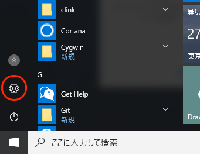

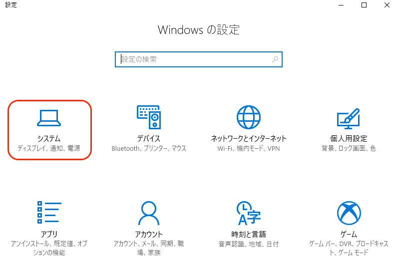

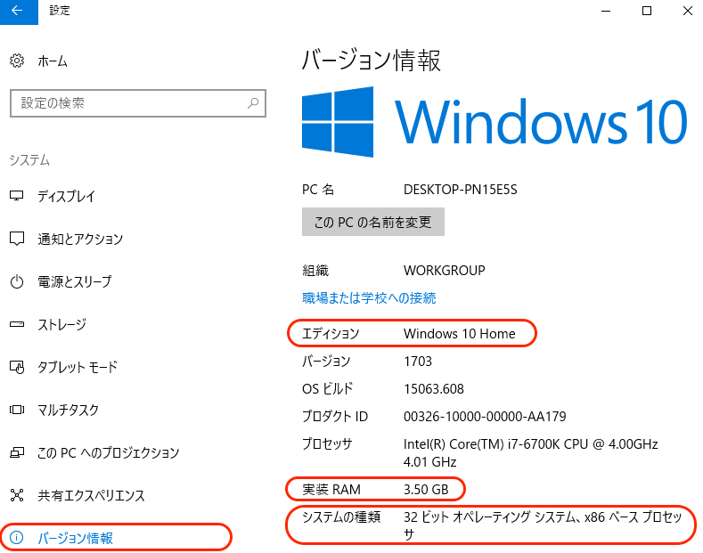

### <a name="section2">2. パソコンの設定変更</a>
　パソコンの設定を一部変更します。

ファイル拡張子（.txtなど）の表示設定

[Windows 10 / 8.1 / 8]  
<ol>
<li>適当なフォルダを開きます。</li>
<li>上部にある「表示」タブ</li>
<li>ファイル名拡張子にチェックを入れます</li>
</ol>

[Windows 7]
<ol>
<li>適当なフォルダを開きます</li>
<li>左上付近にある「整理」</li>
<li>フォルダと検索のオプション</li>
<li>表示</li>
<li>「登録されている拡張子は表示しない」のチェックを外します</li>
</ol>

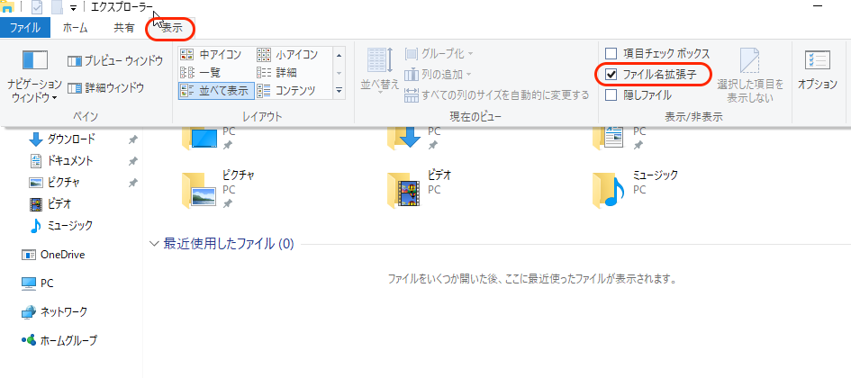

### <a name="section3">3. テキストエディタのインストール</a>
　テキストエディタとは、文字を書くことに特化したソフトウェアです。プログラムを書く時に使います。すでに何らかのエディタをインストール済みの場合は、慣れているエディタを使ってください  
* Microsoft Wordやメモ帳、ワードパッドはプログラミングには不向きです。それらしかない場合、ここでテキストエディタをインストールしてください。  

サクラエディタのインストール

<ol>
<li>サクラエディタ公式ページ（[http://sakura-editor.sourceforge.net/download.html](http://sakura-editor.sourceforge.net/download.html)）へ</li>
<li>V2(Unicode版)をダウンロード</li>
<li>ダウンロードしたファイル（.exe）をダブルクリック</li>
<li>特に何も変更せず進み、インストール</li>
※「追加タスクの選択」で "デスクトップにアイコンを追加"と"「SAKURAで開く」メニューの追加"にチェックを入れておくと便利です。
<li>完了</li>
</ol>

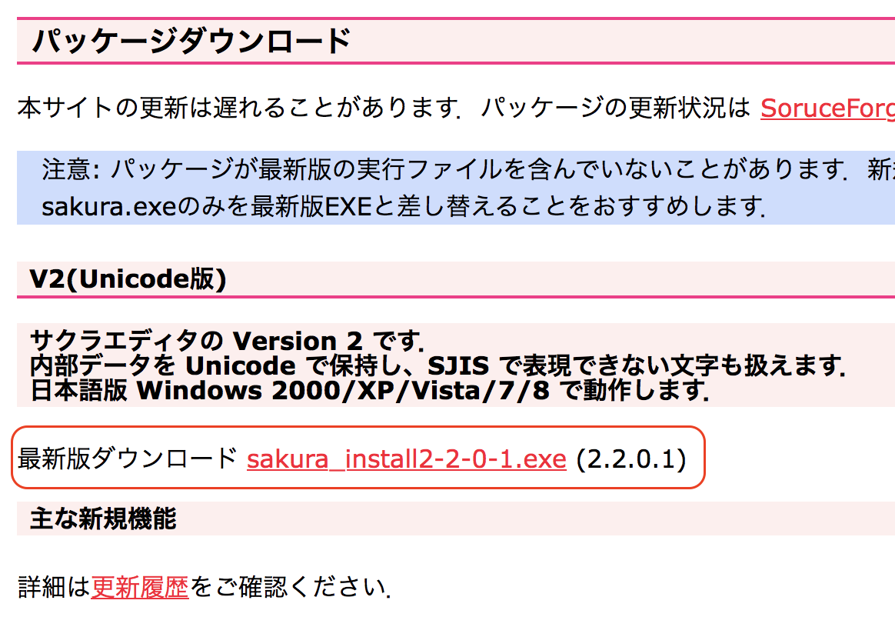

サクラエディタ以外のテキストエディタ
<li> TeraPad（[http://www5f.biglobe.ne.jp/~t-susumu/library/tpad.html](http://www5f.biglobe.ne.jp/~t-susumu/library/tpad.html)）</li>
<li> Notepad++（[https://notepad-plus-plus.org/](https://notepad-plus-plus.org/)）</li>
<li> Atom（[https://atom.io/](https://atom.io/)）※ 動作は重いが高機能</li>

### <a name="section4">4. Pythonのインストール</a>
　講義では、プログラミング言語として「Python」を使います。  
　ここではAnacondaとよばれるツールを使って、Pythonをインストールします。

Pythonのインストール

<ol>
<li>Anacondaのダウンロードページ（[https://www.anaconda.com/download/](https://www.anaconda.com/download/)）へ</li>
<li>「Python 3.6 version」をダウンロード</li>
※ [1. パソコンの情報確認]で調べたシステムの種類（32ビット or 64ビット）に合うものをダウンロードしてください。
<li>ダウンロードしたファイル（.exe）をダブルクリック</li>
<li>Advanced Optionの1箇所以外、特に変更せず進み、インストール</li>
※「Add Anaconda to my PATH environment variable」にチェックを入れてください
<li>完了</li>
</ol>

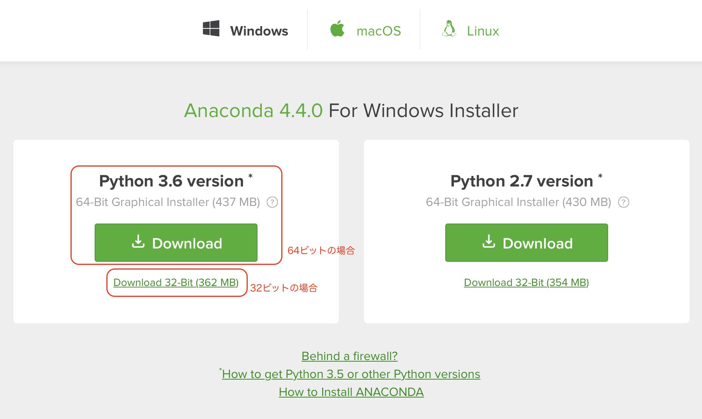

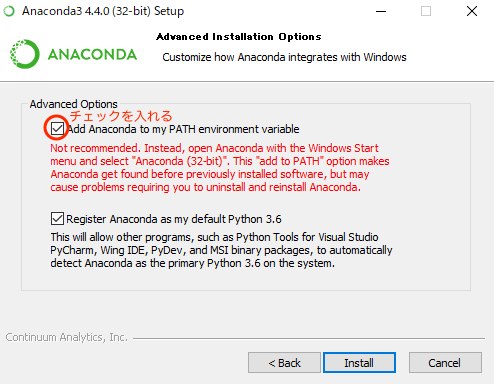
  

### <a name="section5">5. Rのインストール</a>
　「R」は統計解析によく使われるソフトウェアおよびプログラミング言語です。

Rのインストール

<ol>
<li>Rのダウンロードページ（[https://cloud.r-project.org/](https://cloud.r-project.org/)）へ</li>
<li>「Download R for Windows」>「base」>「Download R 3.4.1 for Windows」</li>
<li>ダウンロードしたファイルをダブルクリック</li>
<li>特に何も変更せず進み、インストール</li>
<li>完了</li>
</ol>

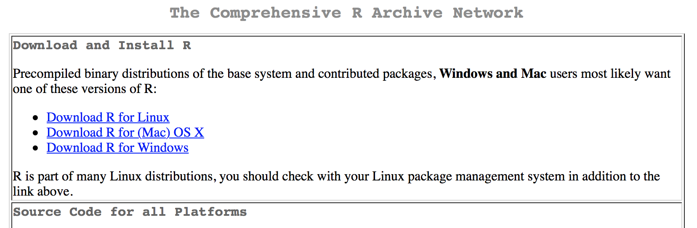
  

### <a name="section6">6. UNIX風環境のインストール</a>
　UNIXコマンド練習用に、UNIX風の環境を準備します。  
　UNIX風環境を準備するために、Gitというソフトをインストールします。  
　

UNIX風環境のインストール

<ol>
<li>Gitのダウンロードページ（[https://github.com/git-for-windows/git/releases/tag/v2.14.1.windows.1](https://github.com/git-for-windows/git/releases/tag/v2.14.1.windows.1)）へ</li>
<li>「Git-X.YY.Z-32-bit.exe」または「Git-X.YY.Z-32-bit.exe」をダウンロード</li>
※ [1. パソコンの情報確認]で調べたシステムの種類（32ビット or 64ビット）に合うものをダウンロードしてください。
<li>ダウンロードしたファイルをダブルクリック</li>
<li>以下を選択してインストール</li>

    <ul>[Adjusting your PATH environment]  
    - Use Git from the Windows Command Prompt（中央の選択肢）</ul>

    <ul>[Configuring the line ending conversions]  
    - Checkout as-is, commit Unix-style line endings（中央の選択肢）</ul>

    <ul>[Configuring the terminal emulator to use with Git Bash]  
    - Use Windows's default console window（下の選択肢）</ul>

    <ul>* その他の選択肢は変更しなくても良い</ul>

<li>完了</li>
</ol>

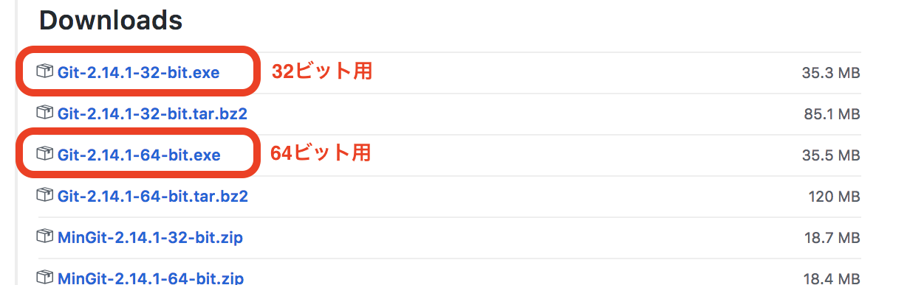

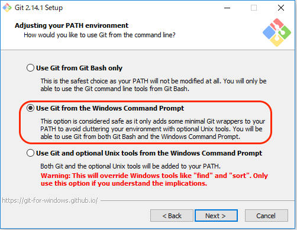

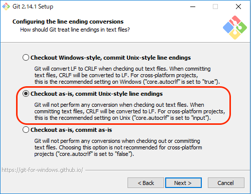

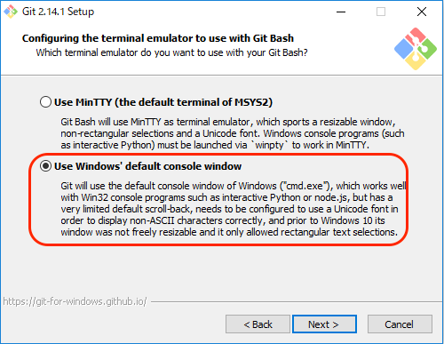

[ページの先頭へ](#section0)

---

## Macの場合

### <a name="section7">1. パソコンの情報確認</a>

パソコン情報の確認

<ol>
<li>メニューバーのアップルロゴ > このMacについて</li>
</ol>

情報画面が開いたら、次の項目を確認しましょう。
<ul>
<li>macOS：Sierra / El Capitan / Yosemite など</li>
<li>バージョン：XX.YY.ZZ</li>
</ul>

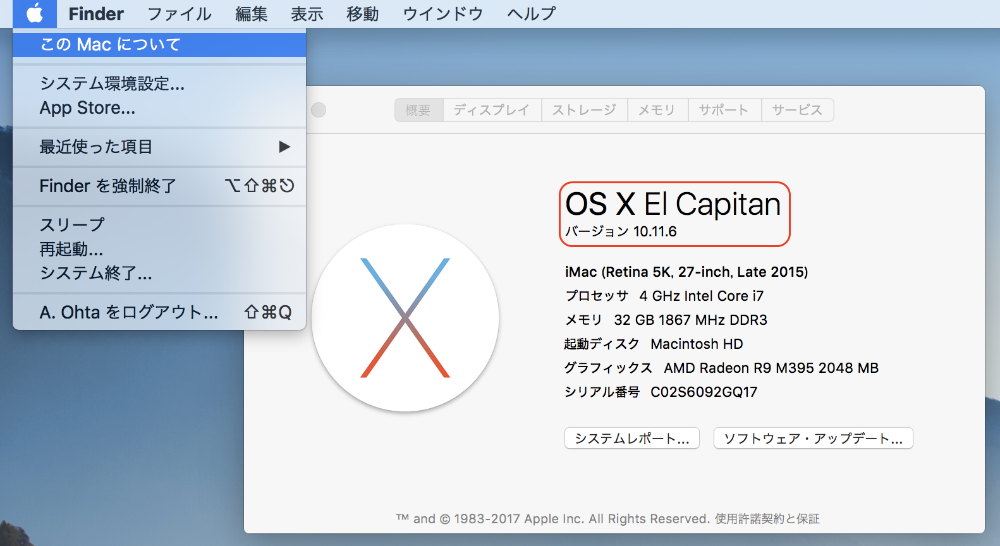

### <a name="section8">2. パソコンの設定変更</a>

ターミナルのカーソル移動速度の変更

<ol>
<li>システム環境設定 > キーボード > 以下のように変更（6）</li>
<ul>- 「キーのリピート」を"速い"</ul>
<ul>- 「リピート入力認識までの時間」を"短い"</ul>
</ol>

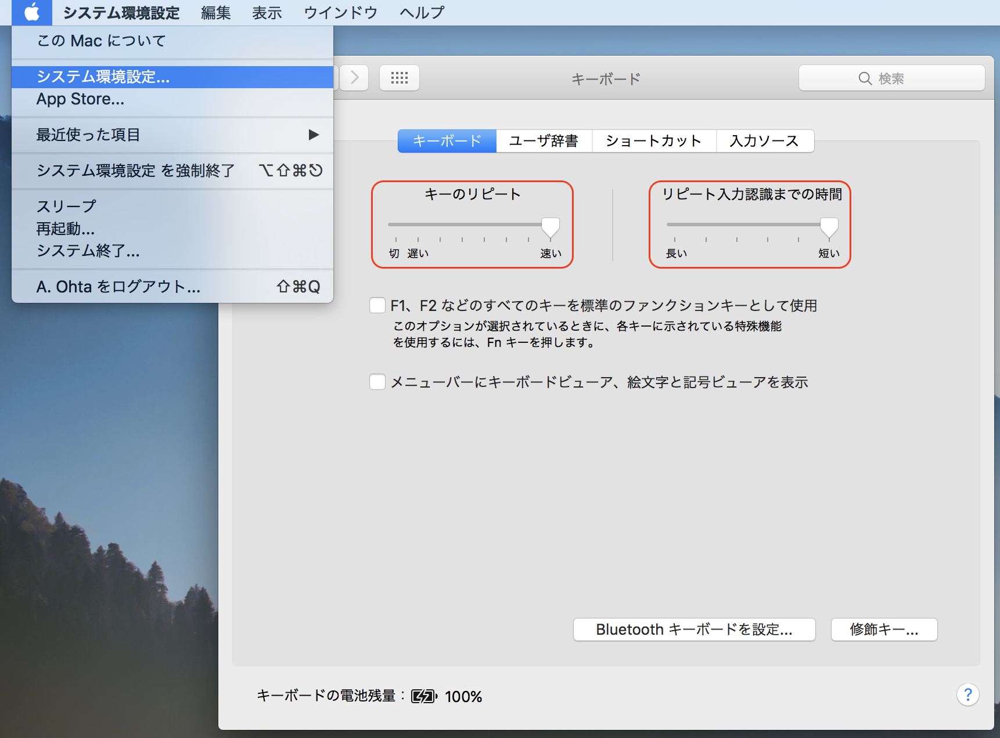

### <a name="section9">3. テキストエディタのインストール</a>

miのインストール

<ol>
<li>miのダウンロードページ（[https://www.mimikaki.net/download/index.html](https://www.mimikaki.net/download/index.html)）へ</li>
<li>最新版をダウンロード</li>
<li>ダウンロードしたファイルをダブルクリック</li>
<li>miアイコンをApplicationsにドラッグ</li>
</ol>

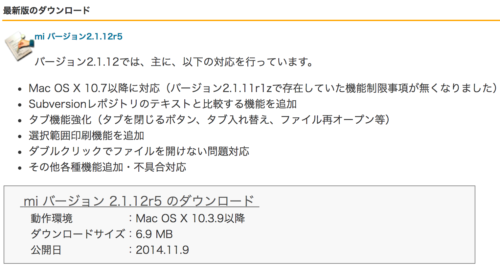  

mi以外のテキストエディタ
<li>Sublime Text（[http://www.sublimetext.com/](http://www.sublimetext.com/)）</li>
<li>CotEditor（[https://coteditor.com/](https://coteditor.com/)）</li>
<li>Atom（[https://atom.io/](https://atom.io/)）</li>

### <a name="section10">4. Pythonのインストール</a>

Pythonのインストール

<ol>
<li>Anacondaのダウンロードページ（[https://www.anaconda.com/download/](https://www.anaconda.com/download/)）へ</li>
<li>「Python 3.6 version（64-Bit Graphical Installer）」をダウンロード</li>
<li>ダウンロードしたファイルをダブルクリック</li>
<li>特に何も変更せず進み、インストール</li>
<li>完了</li>
</ol>

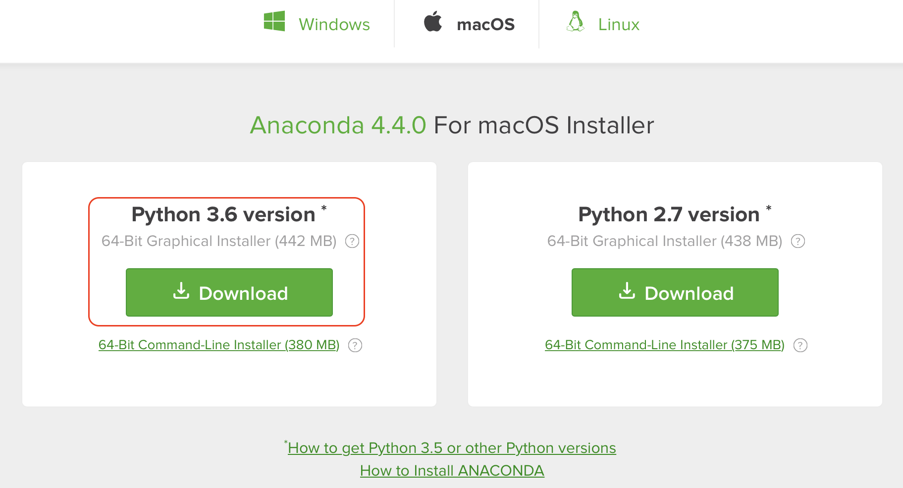  

### <a name="section11">4. Rのインストール</a>

Pythonのインストール

<ol>
<li>Rのダウンロードページ（[https://cloud.r-project.org/](https://cloud.r-project.org/)）へ</li>
<li>「Download R for (Mac) OS X」> 最新版の「R-X.Y.Z.pkg」</li>
※ 2017年9月10日現在ではR-3.4.1が最新版
<li>ダウンロードしたファイルをダブルクリック</li>
<li>特に何も変更せず進み、インストール</li>
<li>完了</li>
</ol>

  

[ページの先頭へ](#section0)
