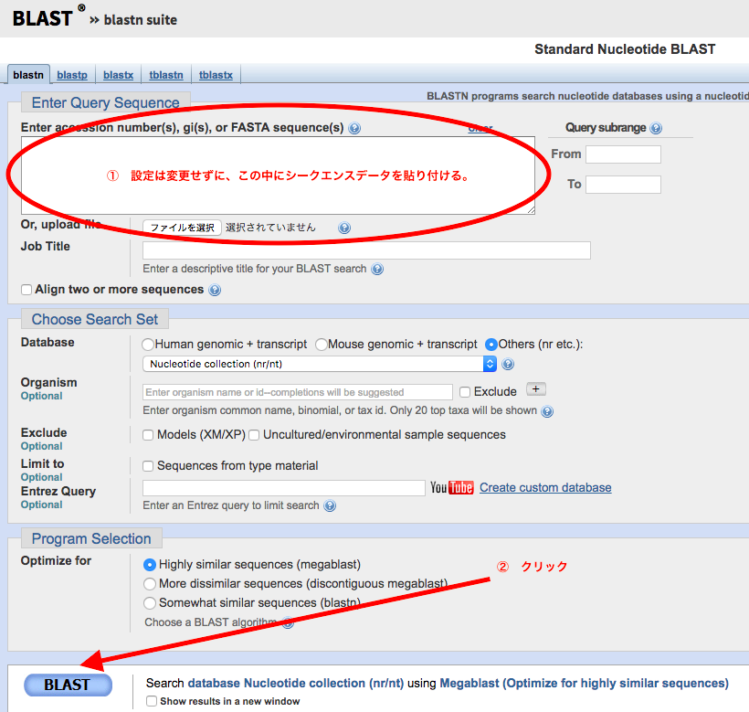

# Python入門編 課題

### Problem 1
与えられたシークエンスデータ（ATGCの文字列）の長さを数えなさい。

```
CGAGAAAAGGAAAAAAAAAAATAGAAAGAGAAAACGCTTAGTATCTCCGGCGACTTGAACCCAAACCTGAGGATCAAATTAGGGCACAAAGCCCTCTCGGAGAGAAGCCATGGGAAGAAAAAAACTAGAAATCAAGCGAATTGAGAACAAAAGTAGCCGACAAGTCACCTTCTCCAAACGTCGCAACGGTCTCATCGAGAAAGCTCGTCAGCTTTCTGTTCTCTGTGACGCATCCGTCGCTCTTCTCGTCGTCTCCGCCTCCGGCAAGCTCTACAGCTTCTCCTCCGGCGATAAGTACGCCTTTTCCTTACCTGGGTTTTCATTTGTTCCCCCTTTTATCTTCTGTTTTGTGCTCTTTTACTTTTCTGAGAAAATAAAAATAAAAAAACAATTAATATACCGTTTGGTTTTTTTCCGGCGGATCTCTTGTTGTTTCTCGGTTCTGTGTTTGTTTGTGTTTTTTTCTGCGACCATGATAGATACATGAGATAACCAAATTTAAGGAAGAACAATGTCGTGAAGAAGCTTTTTAGCTTCTTACTTTTGTTCATTTCTCTCTCTATTTCTTAAAAAAAAAAATTCTGCATGGATTTCATTATTTCCTTGGAAAAAAATTGCATGTCATTCACGATTTGTTTGATACGATCTGATGCGTGCTCGATGTTGTTGAGTGAAGTTTCAAGCCATCTTTGATTGTTTCTTACCTTTAGAGATTCCTTAAGTTTTTGAAGAGTTAATTATATATCACAAGACTAATGATTAATGTCTCTTTTCAGAGTGATTAAAATTCATTGGATCTCTCGGATTTGTATGCAATGCACTTACGGGAGATCTATAGAGTTGCTATGGGGTTAATGCTGAACAATGTATATATACCACATTGTGCAGCTATTGACTATATAAGACTATTGTTAATCTTCTATGAATTCCTATCTTTGCTGTGGACCTATTACTTGGTGATTATCCAAATTAGTGTTTTTAATTGATTCATATTTTTCATACACAGTAGTTTTGAATTTTGGTAGCTTCAAAAAACTCAGCCTCACAATTAGTACTTACCGCACATATGCTACTTCAGTAACATAATCTGGTTATCGATTGCGATTCTTTGAATCACAATCGTCGTGTGCTATATATATAACACCTTTTGCTGTACATAAACTGGTCTAATTTTAGACTAATTAAATTTCATTGTTCTCTTGGATTTGTATATGCACGTCCGGGAGATTTATAAATAAAATTAGTATGAGGTTAATGGTAAAAAGGATCAAGAAGTTTGGTTTTAAATGTAAGCCACATTAATTGGGAAACTATGACTAAAAGATGAATTGGTAATATATACATAATATTTTTAACGAATTTCTCTCCTTTTTATGGGATATGCTATTTAAAGATTGTCCAAAGGTTTATAGTTTCCCACTCTTGCAGTTACACACATAGATTTGCCTCATATTTATGTGATTGTATATCAATTATCGCCCTTAATCTTATCATCGTTGTGTTCATTTATGACTTTGTTCCTATTCGTTAAAATTGACAATCCACAACCTCAATCTTTTGTTGTGAAAATCGACAATCACACAACCTTTGTATCTTGTGTCTTTTGTCACACAACCTTTGTATCTTGTGTCTTTTGTCATGGAAATTGTCATTCACACAGCCTTGTTTCTTTGGTGCCTCTAGGAAATTGAAAATCCCACAACACTTGTCTTCATGTAAGAAATACCAACCTCTTTGGTACGGATCTATAATGAATCAATATAATCCTATATATAAGTTGTCAAAATTGAATCTGGTGTAGTGTCTACTACAACCCTCCAATATAATAACCAAATGGTTGTAGTAGTTTGGCCATGTTGGTCAAGATCGCTGGCCGATTCTCACTTGATGCATACTTTGTTAGGATTTGTTCACCCCTAGTTAGGTCCAGCCTTGGAATTGTCGAGACACCTGACTAGAACTCCTGGTCTTAATTATGATTTAATAAAGAAGAAGCCTTTTAGAACGTGGAACCCTTAGTTACTCAGTTACTCTTTTTGCATACTTAGGTTGATGCAAAGAGCTTAACTTCACAATAGGACTGATATCTATTAACAAAACAAATTAAGTGAAGTTTTGTCAAAATTGTTGGATCTTCTAGGTCAATATGTAGTTTAGTTTTTATCTGTCTTAGTCGCTTCCTTCTATGGAAGATATATTTATAGATATGTGTGATAAGTTTCCTACTAATATTAGTTAGTGTAACTTCAAGGGCAGAAAACTCTTTACTTTTATTGCTTGATTAATTTGGGGTTTAAATATAGGAAATTGGAACCTCACAGTTTCTATAAACGAGTAAGTAATTGAATGTGAAATAACAAAATGGAAGACCGGCTTCCTATTCTTAGGAGTCTTTTGATATTTGCAAAAAAAACATATACAATAGAAATATGAGTTTTGTCTAAGACTCGGTCCATGTATTTGGAGTTTGGCTTCCTCATACTTATGGTTATCTGGTTACCGCCACATCATCATTATCATCTTATGGGTCATCAATACTAGCTCTATCGCTGGAAAAAACCTTGTCCTCAAGGTTCATTGAAAAATCCGAAAAGTTTTCTCGTATATGTTGATATGGTATTACTTACAAACAAAGAGCTGATGTTACCAATTTTGACACGAGATTACTAATGAACTCATGAAAGAGGCGTTTTTAAAAAATTCTTTTTAAAACTGGGATACAAAAAGAAAAGAGGTAACTAATAATTTGATACCATTGTTCGTAGTCCTGATCAAATGTTATAAGGGTAAACATGATAGAAAATAGAGGGTAAATAGGTTTTGTTCTTATAATGGTTTTGATAACACGCTTTGTAAAGGATATAGGTGTTTTTTGATGCTAAAAGTTGTGGTATGGATCAAAACCAAAATGGAAGCTCTGAATCTCTGATAGAGGTTGCAATTAGAATTATATAAGTTAATTTGCAAATGAATTGGAAGCAGTCTTCCACTATTTGCTATTGTTAGGGAAGTCTTTCAGTTAATTTCAGAAAATTAAGAGAAATATGACTTTCTAGACTCAGTCTGTGTACTTGGAATTTTACTTCGGTTTACTTCCATGTCATCACATTGTGGCTCATCAATATATGTGTGTATATACATTCATGAGTATATATGATTTCTGGAAAAATAAAAATTGCTTGTTTGCATTTAAGATTGGGGCTGCGTTTACATTTTATATTGCATCAATTATTTCAACATAGATTCACAAACATAAATGCATAGAAACAATCTGGACAGTAGAGGCTTATGTTTAGGGTTCTTATGTACCTTAACTAGTTTGACTTTAAGTTAATCAAAGCCAGCGCTATCACTAAACTTTATCTGTATGCCTTTGTATGACTTTTCTTTGAGGGAAAATGTCATTTTCAATCTGCCGAAATATATAATAAATACATGTTAGCCCACATAATTCATTGGATAACTAATCTTTGAGCAATTTTTGGTAAATGTTTTGGTTCTTTTCTTTTCTTGAGAGAGAAAAAAAATATCAGATATTATTAAATATTGCTTACAAAGCTAAGAACAAGTTAAAACTTTTTTGAAAAAGTGGAAATTCAGATGTGCTACTGCTTAAACATGAATATTAAGATTATTGTTTTTCTGAAATGTTACGAATACTAGCGTGTTATATATATGTAAAAGGTAAGGTGTTCTCTCAATGTTTCATAGTTTCCAGTGGCCTTTTCAAGGGTTAGCTAGTAGTTTTGATCCTAACATATTTTTATTTTTTTTGTCATCTCTCCAGCCTGGTCAAGATCCTTGATCGATATGGGAAACAGCATGCTGATGATCTTAAAGCCTTGGTAATACAAACATTTTGAATCTTTTCCCTGATGGAGTTTTATAAGGCGTAAATTTACTATTAGTTTGCCGAGTGATCCTAAATATAAAATGAGGTGGTGGCTCCACATGCATTATGCATACCGCAATTTTCATAGCCCTTGTCTTTTACCGCTTCTTCTGTCCCTTTTTCATGGGCAGGATCATCAGTCAAAAGCTCTGAACTATGGTTCACACTATGAGCTACTTGAACTTGTGGATAGGTTAGTACTACTAACTAAGACTATATTTGCTCTCCACCTTTGATTACAAAGGAATTAGTTTTTTTTTTGTCAAACTATGAATATATGCAGCAAGCTTGTGGGATCAAATGTCAAAAATGTGAGTATCGATGCTCTTGTTCAACTGGAGGAACACCTTGAGACTGCCCTCTCCGTGACTAGAGCCAAGAAGGTAAGTTGATTTCGTAATGTCTACTCCTTTCTGAATTTTGTTTGCTGAGAACAACCGTGCTGCTTTTGTTTGTTGCAGACCGAACTCATGTTGAAGCTTGTTGAGAATCTTAAAGAAAAGGTCAGATATTTGCTACCAATTTTATTGTACATCAGATATATCCTCTTCTGTGTTGTCTCTGTTACTTTAAGTCTGCTTAACGAGCTTGCACACATATTTGCAACTTTCTTCATATGTTTTGGATTCCAAATTCTGAAGTTGTTAGGTTTAGAAACTTGATCGGTAATTGCTGAACATTTTGATCTTTAAATCAGGAGAAAATGCTGAAAGAAGAGAACCAGGTTTTGGCTAGCCAGGTAACGAAAGCTACATTTCCTAAAAATATATATGCATAACTAATAAGCACTGCGTGTTGTGTGTCCAATGTCCATGTACATGGACATAGATACACACTCTTATGCTTGCAGATATATATATATATATATATAGTCAGTGCATTTCAATCATTCACTAGTTAGCACTTTCCTGTCTTGTATAGTTGTATTCTAGACAATTCTTCTCAAGATTAGGGCATTTTGGTTGTTGGTAGTTTGGTTTATTAGGGTTAGTGAGATTATTACTGAATAAGAACAGAATTTTGATAACGGCTGGTTAGAGTTAAGGGAAATCAGATGAAGTTATTTTTTTATTTTTTATCGAGTATAAATTACATGATTGCTATATCATTTTACTAAATTAAGAAAAAAAAATTCCGGTTGTTGGACATAACTAGGTTTTGGTTCTTCTTCTTCGTTTTTTTCATGTTAAAGTGTTTAATTAGGTTTTGGTTCATTTGGAGATTTATGAACCTTTTATAGTCTGGTTAAGTCTGGGTTTGGTAGAGATTCAATAAGATTTCTTGATTCTCTTTCAGGTTATGGTCTGGTTCAGTCTAGTTTAGTTCAATATTGGTTTCCTTGAAGGTTGTGTAAACGTTGTCTATATTTAAGTTAATCACCTTTTAACCAAAAAAAAAAGTTTATGGACCGATTAGTTTTTTTTTTTTTGTTTTTTTTGTTATGGTTAGGTTTGGATCCGAGTGGCTCAGTTCCAACTCCAAGTGTCTAGAAGTAGTGCTACTTTTACATGCTATATATAGGTTAGATTATAAATTATAAACTGGTAAAAGATTATAGATACTGCTTCCAAACTTAAAAGCTTAAACATAAAGAACACACAAATTATGAGAAACATAACCTTCTGTAGTGTTTTTTAATGGTTGTTATTTGGTGGTGTGAAAAAGATATTCCTTGGATAGAAGACAAAAAGAGAAAGTGAATAGTGATTTTGACCTATGATTATCGTACAGATGGAGAATAATCATCATGTGGGAGCAGAAGCTGAGATGGAGATGTCACCTGCTGGACAAATCTCCGACAATCTTCCGGTGACTCTCCCACTACTTAATTAGCCACCTTAAATCGGCGGTTGAAATCAAAATCCAAAACATATATAATTATGAAGAAAAAAAAAATAAGATATGTAATTATTCCGCTGATAAGGGCGAGCGTTTGTATATCTTAATACTCTCTCTTTGGCCAAGAGACTTTGTGTGTGATACTTAAGTAGACGGAACTAAGTCAATACTATCTGTTTTAAGACAAAAGGTTGATGAACTTTGTACCTTATTCGTGTGAGAATTGCATCGAGATCTTGAGTGTATGTGTTCTTCACTTCTGTCAAAAACTTGTGTTTGCTTCACAGTGAAGAAGCCTACGGCTTATTTTGCAACAGGGACGTGGCTCTCTCTCTC
```

こちらにコピーしやすいページはこちら用意しています。  
[https://raw.githubusercontent.com/CropEvol/lecture/master/example/03_sequence.txt](https://raw.githubusercontent.com/CropEvol/lecture/master/example/03_sequence.txt)

###### <ヒント>
```python
seq = list("ATGC")
for n in seq:
    print(n)
```
すると以下のようになる。
```
A
T
G
C
```
つまりlistという機能に文字列を入れると、データの塊となり、for文で一文字ずつnに入れて出力してくれる。
### Problem 2
先ほどのシークエンスデータの中に含まれるA、T、G、Cの数をそれぞれ数えなさい。
###### <ヒント>
```python
seq = list("ATGC")
a = 0
t = 0
g = 0
c = 0
for n in seq:
    if n == "A":
        a = a + 1
    elif n == "T":
        .
        .
print("A : ", a)
.
.
```

### Problem 3
先ほどのシークエンスデータに対する相補鎖を作成しろ。すなわち、AはTへ、TはAへ、GはCへ、CはGへ変換した文字列を作成しなさい。
###### <ヒント>
```python
seq = list("ATGC")
for n in seq:
    if n == "A":
        .....
    elif n == "T":
        .....

```
上記のような条件分岐を設定し、それに対する相補的な塩基をファイルへ改行せずに書き込むのが良い。
### Problem 4
相補鎖を作成するための関数を作成しなさい。なお、引数はシークエンスの文字列をとることとする。
```python
seq = "ATGC"
def function_name(seq):
    .
    .
    .
```

### Problem 5
このシークエンスデータが何に関わる遺伝子なのかをNCBIのNucleotide BLASTを用いて検索しなさい。

<div style="margin-bottom: 5px;"></div>

来週、これらの問題の解説をします。
