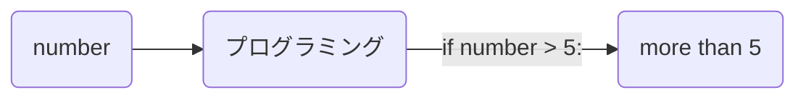
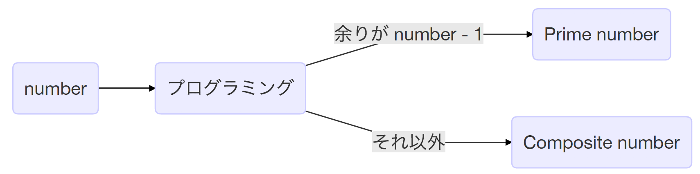
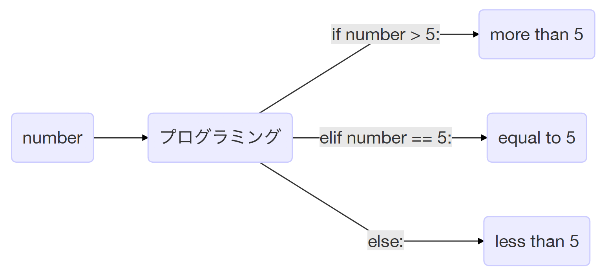
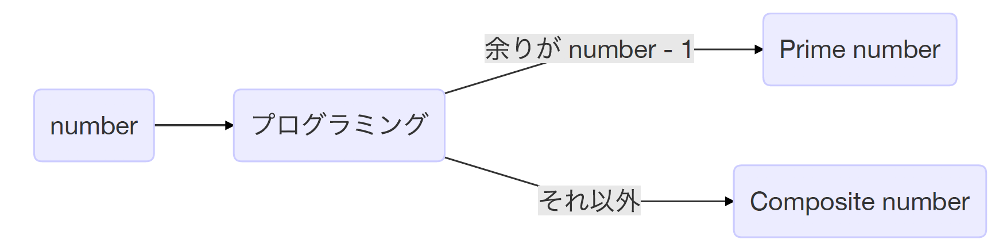
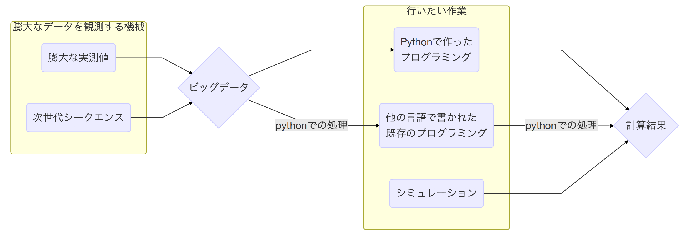

# Python入門
______
### 0. 目次

1. はじめに
1. print
1. 変数の宣言
1. 四則演算
1. for文
1. if文
1. 関数
1. ファイルからの読み込み
1. ファイルへの書き込み
1. おわりに

### 1. はじめに
このPython入門ではPythonの一般的なコマンドを習得してもらい、一人でプログラミングを作成できるようになることが目標です。データ解析をする際、エクセルなどの便利なソフトも存在しますが、それらはビッグデータ解析を目的に作られていません。なので、そのようなソフトにビッグデータを入れるとフリーズして動かなくなります。このような問題を解決するのに必要なプログラミングの知識は、場合にもよりますが、必ずしも高度なものではなく、一度習得すればとても便利です。また、Pythonは既存のパッケージ（拡張パックのようなもの）が充実しており、それらを駆使することで、簡単なプログラミングから高度なことができることもあります。知識で”巨人の肩の上に立つ”だけでなく、解析技術でも”巨人の肩の上に立つ”ことができるのがプログラミングです。  

この演習では、ある数が素数かどうかをウィルソンの定理で判定するプログラミングを作りながら、Pythonの基本を学ぶ流れになっています。まずは、最も基本的なprintから勉強していきましょう。

### 2. print
printは最も初歩的なコマンドで、ある文字列や数字を画面に表示するためのコマンドです。以下のように書きます。
```python
print("gene")
```
すると
```
gene
```
と表示されます。

Pythonは、この（）の中を理解して、処理しています。  
printには他の書き方もあります。
```python
print("gene","ration")
```
すると
```
gene ration
```
と表示されます。

一見、generationと表示されているように見えますが、geneとrationの間には半角スペースが入っています。このときPythonは（）の中の二つのキーワードをそれぞれ理解して、処理しています。そして、"gene"の方を第一引数、"ration"の方を第二引数と言います。さらに（）の中のキーワードを増やしていくと、それぞれ第三引数、第四引数...というようにPythonは理解し、処理します。

### 3. 変数の宣言
次はprintでエラーが出る例を見てみましょう。
```python
print(gene)
```
すると
```
NameError: name 'gene' is not defined
```
と表示されます。

"geneは定義されていません"というエラーが出ました。ここでいう"定義"とはどういう意味なのかを考えます。"gene"とgeneをPythonは別物として理解しているので、このようなエラーが出ています。前者の" "で挟まれた文字列は、いわば固有名詞のようなものです。後者の" "で挟まれていない文字列は一時的に与えられた仮の箱、プログラミング用語では変数と言います。後者は、一時的な仮の箱だけが存在し、中身が何もないのでエラーが出たということです。では、中身を入れてあげましょう。
```python
gene = "selfish"
print(gene)
```
すると
```
selfish
```
と表示されます。geneという変数の箱に"selfish"という固有名詞が入りました。ここで、printは"print"と書いていないのにもかかわらず、なぜエラーが出ないのかという疑問が生じるかもしれませんが、実はprintも仮の箱のようなものなのです。すなわち、このような箱の中には文字列だけでなく、より複雑なプログラミングを入れることも可能なのです。このような箱は自分で作って他人に配布することが可能なだけでなく、他人の作ったプログラミングの箱をダウンロードして使うことも可能です。次に、別の例を見てみましょう。
```python
print(1)
```
```
1
```
この場合、1は"1"と表記されていないのにもかかわらず、エラーが出ていません。なぜかというと、ここの1は文字列ではなく、数字としてPythonが理解しているからです。文字列や数字という性質の違いをデータ型と言います。以下のようなコマンドでデータ型を確認できます。
```python
print(type(1))
print(type("1"))
print(type(1.0))
```
結果、
```
<class 'int'>
<class 'str'>
<class 'float'>
```
となります。  
classという概念に触れると長くなるので、今回は触れませんが、上記のclassはPythonというプログラミング言語を構成している根本的なパーツのようなものです。それぞれ、
- 'int'　→　整数
- 'str'　→　文字列
- 'float'　→　少数を含む数

意味しています。データ型は他にもあるのですが、今は基本的なこの三つだけを押さえておくことにしましょう。

このような性質の違いがどのように影響してくるのか、具体例を元に確認してみましょう。例えば、TEL:123-456-7890という電話番号があったとしましょう。これをTELという変数に入れてprintしたいとします。まずは""で挟まれた場合を試してみましょう。

```python
TEL = "123-456-7890"
print(TEL)
```
すると、
```
123-456-7890
```
というように、電話番号が表示されました。では、""で挟まなかった場合はどうなるのか見てみましょう。

```python
TEL = 123-456-7890
print(TEL)
```
すると、
```
-8223
```
と表示されました。これは123、456、7890がそれぞれ数字として認識されて、"-"の記号が引き算として認識されたことが原因です。このように、データ型を把握していないと生じる不備がしばしばあります。

最後に、変数を宣言する際のルールを学びましょう。Pythonの変数の名前には
- aからzのまでのアルファベット（大文字と小文字の両方可）
- 数字
- _ （アンダースコア、他の言い方ではアンダーバー）

の三種類を文字いることが可能です。しかし、以下のような制約があります。
- 最初の文字に数字を用いることはできない。例えば、0_TELなど。
- Pythonで設定されているコマンドを用いることはできない。例えば、printなど。
- 数字のみで変数を構成することはできない。例えば、123など。

また、注意が必要なのはアンダーバーで始まる変数です。アンダーバーで始まる文字列で、特殊な意味を持つものがすでにPythonに登録されているからです。上記の制約を守る限り、どのような文字列でも変数として設定することができます。字数制限はないので、１００文字の変数なども設定することが可能です。その他、注意すべきこととして、すでに用いた変数の文字列を新しい変数として宣言する際は、変数の中身が上書きされてしまうので注意が必要です。変数の宣言に関する注意事項は以上です。

Pythonでの数字の扱い方を覚えたので、徐々に具体的な計算に触れていきましょう。

### 4. 四則演算
Pythonで四則演算の計算をしてみましょう。これを覚えれば、Pythonを電卓代わりに使うことができるようになります。
```python
a = 3+2      #足し算
b = 3-2      #引き算
c = 3*2      #掛け算
d = 3/2      #割り算
e = 3%2      #割り算の余り
f = 3**2     #累乗

print("a : ", a)
print("b : ", b)
print("c : ", c)
print("d : ", d)
print("e : ", e)
print("f : ", f)
```
上記のように書くと、
```
a :  5
b :  1
c :  6
d :  1.5
e :  1
f :  9
```
と表示されます。

ここで、見たことのない記号が出てきました。この#はコメントアウトというもので、その行の、この記号以降はプログラミングではないので無視してください、という記号です。この#を上手く利用して、プログラミング内にメモを残すのがオススメです。プログラミング内にメモを残すことで、そのプログラミングを見返したときに理解しやすくなりますし、それだけでなく、他の人が見たときにも、理解してもらいやすくなります。優れたプログラマーはコメントアウトの使い方も上手です。

それでは本題に入ります。まず、ウィルソンの定理とはどのような定理なのかを説明します。

<div style="padding: 10px; margin-bottom: 10px; border: 1px solid #333333; border-radius: 10px;">

<u>ウィルソンの定理</u>  

2以上の整数pについて、  
<div style="text-align: center;">pが素数 ⇔ (p-1)! ≡ -1(mod p)</div>
</div>

上記の定理がウィルソンの定理です。高校数学では見慣れない記号も含まれているので、噛み砕いて説明します。素数pでは次の性質を満たすということをウィルソンの定理は述べています。もしpが素数であるならば、(p-1)!をpで割ると、余りがp-1である、という性質です。上の式では余りが-1となっていて、少し分かりにくいですが、これは具体例で示すと、6÷7を商が0で余りが6であるとも、また、商が1で余りが-1であるとも表現できるということです。以下、実際に素数はウィルソンの定理を満たして、余りが-1になるのかを確認してみようと思います。

| p    | (p-1)! | 余り | 素数 |
| ---- | -------------------------------------------- | ---- | ---- |
| 2    | 1                                          | 1  | ○    |
| 3  | 2                                          | 2  | ○    |
| 4  | 6                                          | 2  | ×    |
| 5  | 24                                         | 4  | ○    |
| 6  | 120                                        | 0  | ×    |
| ...  | ...                                          | ...  | ...  |
| 36 | 10333147966386144929666651337523200000000  | 0  | ×    |
| 37 | 371993326789901217467999448150835200000000 | 36  | ○    |
| ...  | ...                                          | ...  | ...  |

確かに素数は余りが-1になっています。証明方法は少し難しいので、今回は省略します。実際に、当時（１８世紀）、この定理を発見したJohn Wilsonと、彼の師匠はこの定理を証明できませんでした。

なんだこれなら関数電卓で計算できるじゃないか、と思う方もいると思います。しかし、例えば、200000までの全ての素数を紙に印刷してくる課題があったとすると、関数電卓で済ますことができるでしょうか。ここに、プログラミングの意義と強みがあります。

では、ウィルソンの定理で7が素数であることを示してみましょう。
```python
number = 1*2*3*4*5*6
print(number)

remainder = number%7
print(remainder)
```
すると、
```
720
6
```
と表示され、6!が720だと分かり、また、それを7で割った余りが7より1だけ小さい6となったので、7は素数であるとわかりました。

次に、1001は素数なのか、という問いを考えてみたいと思います。では、1から1000まで掛け算するプログラミングを書いてください。書けない人は、次のfor文という項目を勉強する必要があります。

### 5. for文
ここで学ぶfor文は、プログラミングを最もパワフルにしているコマンドです。for文を用いることで、ある作業を繰り返すことができます。実例を見てみましょう。
```python
for n in range(10):
    print("Mozume is great!")
```
すると、
```
Mozume is great!
Mozume is great!
Mozume is great!
Mozume is great!
Mozume is great!
Mozume is great!
Mozume is great!
Mozume is great!
Mozume is great!
Mozume is great!
```
と表示されます。ここで注意すべき書き方は主に二つあります。まず一つに、"for"と書いてある行の末尾には":"(コロン)が必要です。これを忘れるとエラーが出ます。そして二つ目が、for文で繰り返したい内容の部分をインデントするということです。インデントとは、キーボードのtabを押して段落わけすることを言います。この段落に外にある行は繰り返しの作業には含まれません。

例えば、
```python
for n in range(10):
    print("Mozume is great!")
print("Mozume is far from the main campus.")
```
すると、
```
Mozume is great!
Mozume is great!
Mozume is great!
Mozume is great!
Mozume is great!
Mozume is great!
Mozume is great!
Mozume is great!
Mozume is great!
Mozume is great!
Mozume is far from the main campus.
```
となるように、インデントの外は繰り返されません。また、見てすぐに分かるように、
```
range(繰り返したい回数)
```
となっています。これを用いて(1001-1)!を計算する前に、
```python
for n in range(10):
```
の行に含まれている"n"について考えてみましょう。実はここに書いてある"n"は他の文字でも構いませんし、一文字である必要もありません。変数を入れることが可能な文字列なら何でも構いません。この"for"と"in"の間に挟まれた文字列の性質を理解するために以下のコードを見てみましょう。
```python
for n in range(10):
    print(n)
```
すると、
```
0
1
2
3
4
5
6
7
8
9
```
と表示されます。しかし、"n"を変数として宣言した覚えはありません。これがどういうことなのかを説明します。"in"以降の文字列では、繰り返したい回数と等しい数の、あるデータの塊を生成しています。その塊の中から、一つずつデータを吐き出していき、吐き出すものがなくなり次第、繰り返しが止まるというシステムになっています。
```python
for n in range(10):
    print("Mozume is great!")
```
でも
```python
for n in range(10):
    print(n)
```
と同様に"in"の後の
```
range(10)
```
で０〜９の１０個のデータの塊を生成しています。前者のように、吐き出したデータを何かに使わなくても問題ありません。

ここで、ウィルソンの定理に戻りましょう。ウィルソンの定理に関して言えば、吐き出したデータを使いながら計算するのが妥当だと思われます。まずは練習として5!を計算してみましょう。注意すべきは、吐き出すデータが０からであるということです。

```python
for n in range(5):
    print(n+1)
```
として、
```
1
2
3
4
5
```
となります。これらの数を順番に掛け合わせることで、5!を計算できます。では計算してみましょう。
```python
a = 1 #初項を与える
for n in range(5):
    a = a*(n+1) # <-
    print(a)
```
すると、
```
1
2
6
24
120
```
という結果が表示されます。ここで、数学では考えられない数式(コード内で <- の印がある行)が繰り返しの中に含まれています。これは右辺のaを計算して、新しい左辺のaに上書きしています。プログラミングではよく見かける方法です。

この繰り返しの数を変えて、1000!を計算する前に、printのインデントをやめて、最後の項のみをprintするように変えておきましょう。なぜならPythonは、大量にprintを行うのが得意ではないからです。筆者がprintを含めて繰り返した時は、しばらくフリーズしました。
```python
a = 1 #初項を与える
for n in range(1000):
    a = a*(n+1)
print(a) #インデントをやめる
```
このコードに対する結果はここに載せません。みなさんで計算してみて下さい。ここに載せることができない理由、そしてprintを繰り返しに含めるとフリーズする理由が分かると思います。

では、みなさんが表示した値を1001で割った余りがいくらになるのか計算してみましょう。
```python
a = 1 #初項を与える
for n in range(1000):
    a = a*(n+1)
b = a%1001 #　aを1001で割った余りをbとする。
print(b)
```
みなさんの画面で結果を確認してみて下さい。

ウィルソンの定理を使った素数判定プログラミングもほどんど完成しました。ここからは、このプログラミングを洗練していきましょう。

### 6. if文
もしあなたが、先ほど作った素数判定プログラミングを他の人にあげるとするならば、まだ完成とは言えません。例えば、入れた数字に対して、自ら余りを見て、素数かどうかを判断しなくてはならないあたりなどは改良したいものです。その改良を加える時に役立つのが、if文です。if文を使った例を見てみましょう。
```python
number = 10
if number > 5:
    print("more than 5")
```
これに対する表示は
```
more than 5
```
となります。では次のコードはどのようになるのでしょうか？
```python
number = 3
if number > 5:
    print("more than 5")
```
```
```
何も表示されませんでした。すなわち、文頭のifに続く式を満たした場合にのみ、その下のインデントした段落が実行されるのです。

if文を使う場合、文頭にifがある行の末尾に":"(コロン)を忘れないことと、if文の条件を満たした場合に実行されるコードをインデントするのを忘れないようにしましょう。このif文により、状況に応じて実行されるコードが異なることを条件分岐と言います。条件分岐は他にも以下のようなものがあります。
+ X == Y  
XとYが等しい場合（文字でも数字でも可能）
+ X != Y
XとYが異なる場合（文字でも数字でも可能）
+ X < Y
XよりYが大きい場合（数字のみ）
+ X <= Y
XはY以下
+ X > Y
XよりYが小さい場合（数字のみ）
+ X >= Y
XはY以上

また、if文には以下のような書き方もあります。
```python
number = 3
if number > 5:
    print("more than 5")
else:
    print("less than 5")
```
すると、
```
less than 5
```
と表示されました。文頭の"else"の後ろには式がないことに注目してください。これはすなわち、"if"の後ろに続く式を満たさない場合は"else"に続くインデントされた段落を実行することを命令しています。

<div style="margin-bottom: 5px;"></div>

すると実は、このプログラミングには誤りがあることが分かります。以下のような場合です。
```python
number = 5
if number > 5:
    print("more than 5")
else:
    print("less than 5")
```

```
less than 5
```
numberは５と等しいにも関わらず、５より小さいことを示しています。このように、条件が３つ以上に分岐する場合は、elifというコマンドを使います。
```python
number = 5
if number > 5:
    print("more than 5")
elif number == 5:
    print("equal to 5")
else:
    print("less than 5")
```
```
equal to 5
```
以下のように、numberが5と等しい場合の条件を付け加えました。

<div style="margin-bottom: 5px;"></div>

条件が3つ以上に分岐する場合ということは条件が４つに分岐する場合は、"if"と"else"以外に"elif"を二つ用いるということです。

ここから再び素数判定プログミングに戻ります。以下のような条件分岐を行うことで素数かどうかの判定を見やすくします。

<div style="margin-bottom: 5px;"></div>

Prime numberとは素数の英語です。また、素数でない数を合成数というのですが、その英語のComposite numberを素数でない場合に表示しましょう。以下、そのコードを示します。
```python
number = 1001 # 判定したい数字

a = 1 # 初項を与える
for n in range(number-1): # (number-1)回の繰り返し
    a = a*(n+1)

b = a%number # aをnumberで割った余りをbとする。

if b==number-1:
    print(number, "is Prime number")
else:
    print(number, "is Composite number")
```
これを動かすと、
```
1001 is Composite number
```
と表示されます。上記のコードのnumberに入れる数を変えることで、好きな数の素数判定を行うことができます。かなりプログラミングらしくなりました。では、このプログラミングを使って、7639、9153、9839の３つの数字が素数かどうか判定してみましょう。
```python
#--------１つめ--------------------
number = 7639 # 判定したい数字

a = 1
for n in range(number-1):
    a = a*(n+1)

b = a%number

if b==number-1:
    print(number, "is Prime number")
else:
    print(number, "is Composite number")

#--------２つめ--------------------
number = 9153 # 判定したい数字

a = 1
for n in range(number-1):
    a = a*(n+1)

b = a%number

if b==number-1:
    print(number, "is Prime number")
else:
    print(number, "is Composite number")

#--------３つめ--------------------
number = 9839 # 判定したい数字

a = 1
for n in range(number-1):
    a = a*(n+1)

b = a%number

if b==number-1:
    print(number, "is Prime number")
else:
    print(number, "is Composite number")  

```
変数は上書きしているので、それぞれの変数の名前を変更する必要はありません。  
そしてその結果が以下のようになります。
```
7639 is Prime number
9153 is Composite number
9839 is Prime number
```
同じことを重複している部分が多く、無駄が多いように感じるのではないかと思います。そこで、次に関数という考え方を学びましょう。

### 7. 関数
実のところ、ここで学ぶ関数という考え方を学ばなくても、プログラミングはできます。しかし、関数はPythonの非常に重要な機能のうちの一つです。関数を使うメリットは数え切れませんが、皆さんがすぐに感じることができるメリットを述べます。まず第一に、関数を学ぶとコードが短くなります。それについては追って確認しましょう。次に、関数を学ぶと他の人が作ったプログラミングやモデュールを使う際に、使い方の理解がはかどります。なぜなら、他の人が作ったPythonのプログラミングは関数の塊になっていることが多いからです。そうは言っても、実物を見ずしての理解は難しいと思われますので、ここでいう関数を使った実例を見て、関数がどういうものなのか確認してみましょう。
```python
# 以下、関数を設ける
def  prime_number_judgementer(number):
    a = 1
    for n in range(number-1):
        a = a*(n+1)

    b = a%number

    if b==number-1:
        print(number, "is Prime number")
    else:
        print(number, "is Composite number")  

# 関数を実行する
prime_number_judgementer(7639)
prime_number_judgementer(9153)
prime_number_judgementer(9839)
```
すると、
```
7639 is Prime number
9153 is Composite number
9839 is Prime number
```
となり、同じ結果が表示されます。

ここで重要なのは、コードがとても短くなっているということです。"def"の後に続くのは関数の名前です。自分で作ったプログラミングなので、自分で好きな名前をつけることができます。関数の名前をつけるときのルールとして、先頭のアルファベットは小文字にする必要があります。今回は"prime_number_judgementer"という名前を関数につけてみました。"def"で一度関数を定義すれば、そのプログラミング内では、関数の名前だけで、その機能を呼び出すことができます。名前の後に数字を入力していますが、これはprintの時と同様に引数と言います。これから分かることとして、他の人が作ったパッケージに（これは関数の塊であると以前に述べましたが、）どんな内容の引数を入力するのかというルールは、設計者が決めているので、設計者が書いた説明書を読むか、もしくはソースコードという関数の中身を見なければ分かりません。今回作った素数判定プログラミングに入れるデータ型が'int'なのか'str'なのかは、設計者が示す必要があります。

ここまででPythonの基本は一通り説明しました。いくつか割愛した重要な考え方がありますが、今期の授業を通して出てくる場面はありません。もし、これからもプログラミングを続けていきたいのであれば、リストやディクショナリーという考え方を学び、そしてモデュールをimportする練習をするのが良いと思います。これ以降は応用編のファイル操作に関して説明します。

### 8. ファイルからの読み込み
Pythonの基本を理解せずに、ファイル操作を理解するのが困難な為、最後に回しましたが、ファイル操作はBioinformaticsの根幹です。

<div style="margin-bottom: 5px;"></div>

シミュレーションを除けば、Bioinformaticsは必ずファイルの読み込みを行い、また、その結果をファイルへ書き込みます。その理由は単純で、Bioinformaticsは現実の世界で生きている生物の特徴を文字にして、その文字の量や違いなどを研究する学問だからです。

Bioinformaticsの手法を用いる場合、そのアプローチは二つあります。一つは、行いたい作業のプログラミングを読み込むファイルの形式に合わせて自分で作る場合です。これには大きなメリットがあり、まず第一に、自分の都合に合わせてプログラミングを作成することができます。さらに、バグなどが発生した場合も、中身を理解しているため、解消が比較的簡単です。しかし、しばしば、自分よりも優れたBioinformaticianが、便利かつ高性能なプログラミングを作って公表しています。その場合、それを使うのも一つの手です。これが先ほど述べた二つ目のアプローチになります。しかし、この場合、バグが発生してしまうと、解消するのが非常に困難です。また、必ずしも自分の都合に合った形式のファイルを入出力してくれなかったりします。その場合は、今手元にあるファイルの形式を書き換えなくてはいけませんが、手作業で行うことはまず不可能です。そのファイルの書き換えを自分が作ったプログラミングで行う必要があります。ここからは、そのようなファイル操作について学びましょう。

今回、皆さんに素数が羅列されたテキストファイルを配布しました。中身を確認してみて下さい。ほとんどは素数ですが、素数でない数もいくつか含まれています。今から、その中から素数でない数を探してもらいます。そのために、先ほど作った関数である"prime_number_judgementer"を利用するのが良いでしょう。しかし素数でない数を探す上で、"prime_number_judgementer"は少し都合が悪いところがあります。それは素数と素数でない数の両方を表示してしまうところです。なので以前作成した関数である"prime_number_judgementer"を少し改良して、以下のような新しい関数を作りましょう。
```python
def  composite_number_searcher(number): # <-(1)
    a = 1
    for n in range(number-1):
        a = a*(n+1)

    b = a%number

    if b!=number-1: # <-(2)
        print(number, "is Composite number") # <-(3)
```
"<-"の印をつけた行が変更した行になります。  
まず(1)についてなのですが、新しい関数なので名前を変えました。名前は何でも良いのですが、今回は"composite_number_searcher"を採用しています。次に(2)は条件分岐の式を変更しました。それによって(3)のように合成数のときのみprintされるようになりました。この関数を読み込めば準備完了です。以下のファイルを読み込むコードを実行しましょう。

```python
# ファイルを読み込む
for number in open("./prime_numbers.txt", "r"):
    composite_number_searcher(int(number))
```
少し難しくなってきました。噛み砕いて説明していきます。まず"for"と"in"の間にある"number"についてなのですが、これは"in"以降に生成したデータの塊を順番に吐き出している変数です。以前学んだfor文における"n"と同じ役割です。"n"でも構わなかったのですが、今まで関数に入れていた引数が"number"だったので統一しました。この吐き出す変数を使っても使わなくも構わないという話を以前にしましたが、今回はこの吐き出される変数を使います。次に"in"以降に生成されるデータの塊についてなのですが、結果から述べると読み込んだファイルの行の数だけデータの塊があり、そのデータの一つ一つが行の文字列を含んでいます。以前練習したfor文では繰り返したい回数が先にあり、それに合わせてデータの塊を用意していました。しかし今回は異なり、繰り返したい回数は分かりません。一行ごとに最後の行まで処理を行いたいので、強いていえば行数分だけfor文を繰り返したいです。それを可能にしているのが、そのテキストデータを行ごとに区切る
```python
open("./prime_numbers.txt", "r")
```
というコマンドです。最初は何が書いてあるのか理解できないと思いますが、まずは引数を二つ入れていることに着目しましょう。これはprintと同様に一つ目の引数と二つ目の引数をPythonが区別して認識しているということを表しています。一つ目の引数はファイルの名前で、二つ目の引数は、そのファイルをどのように扱うのかを指示しています。今回、皆さんに配ったファイルの名前が"prime_numbers.txt"なので、第一引数にはそう書きます。ファイル名の前にある"./"という記号は、ファイルがカレントディレクトリーにあるということを意味しています。平易な言葉で言えば、手元にあるということを意味しています。第二引数に書いてある'r'は読み込み用にファイルを開くということを意味しています。最後にある見たことのない書き方が、
```python
composite_number_searcher(int(number))
```
の行に含まれている"int(number)"です。これは"number"のデータ型を'int'として扱って下さい、ということを指示しています。これはとても不思議です。読み込んだファイルの数字は、例えば、"2"ではなく2と書かれていました。その場合は数字として扱われるということを変数の宣言で学びました。これはPythonの仕様上の性質で、例外に当たります。Pythonの説明書には、"Pythonがファイルを読み込む時、それは全て文字列（'str'）として読み込みます"と書いてあります。なので、文字列ではなく整数です、ということをPythonに教える必要があります。これらをふまえた上で、先ほどのコードを皆さんで動かしてみましょう。素数ではない数が浮び出てくるのではないでしょうか。

### 9. ファイルへの書き込み
最後はファイルへの書き込みを勉強しましょう。
```python
f = open("./text_name.txt",'a') # (ファイルの名前).txt
f.write("ここに書きたい文章を書く\n")
f.close() # ファイルを閉じる
```
Pythonを使ってると、このような書き方（メソッド）がしばしば出てくるのですが、今回の講義で扱う内容にはふさわしくないため省いて説明します。  
```python
f = open("./text_name.txt",'a')
```
まず、上記の行に関してなのですが、先ほどの"open"コマンドとほどんど同じです。'a'は「もし指定したファイルが無ければ作成し書き込む。すでにファイルが存在した場合は、すでにあるテキストに指定した文章を加えて上書き保存する」ということを意味しています。
```python
f.write("ここに書きたい文章を書く\n")
```
次に上記の行に関してなのですが、"f"という変数の後に".write"と書いています。この書き方は一定の条件で行えますが、今回は説明を省きます。この書き方を覚えておいて、コピーアンドペーストで多用できれば十分だと思います。行末にある"\n"は改行記号です。Windowsでは"`¥n"で表すことができます。この記号の意味を理解するために二つのコードを動かした結果を比較してみましょう。まず一つ目のコードは以下の通りです。
```python
f = open("./text_name.txt",'a')
f.write("ここに書きたい文章を書く\n")
f.write("ここに書きたい文章を書く\n")
f.close()
```
これを動かした結果が以下のようになります。
```
ここに書きたい文章を書く
ここに書きたい文章を書く
```
次に二つ目のコードは以下の通りです。
```python
f = open("./text_name.txt",'a')
f.write("ここに書きたい文章を書く") # <- \nがない
f.write("ここに書きたい文章を書く")# <- \nがない
f.close()
```
これを動かした結果が以下のようになります。
```
ここに書きたい文章を書くここに書きたい文章を書く
```
つまり、改行記号が無ければ文章がひと続きになります。この例からも分かるように、改行が必要な場合は、改行記号をつけましょう。

### 10. おわりに

これでPythonの基礎を一通り終えました。今回は時間の都合上、全てのトピックを紹介できませんでしたが、紹介できなかったトピックのうち重要なものには以下のようなものがあります。
- リスト
- ディクショナリー
- モジュールのimport

これからもPythonを学んでいくのであれば、避けられない重要なトピックです。これらのトピックを含め、Pythonなどのプログラミングはネット上に解説がとても多いです。それは、インターネットとプログラミングがとても深い関係にあるからです。何か分からないことがあったり、つまづいたりした時に、質問できる相手がいればそれに越したことはないのですが、いない場合は、インターネット上の情報を利用できるかどうかで問題の解決速度が大きく異なります。インターネット上の情報を利用することのメリットとして、最新のアップデートに対応した情報を得られるということがあります。他の学問のように教科書もありますが、プログラミングは頻繁にアップデートされるため、教科書通りにコードを書いても動かない場合がしばしばあります。多くの学問においてネットの情報に頼ることは良しとされませんが、プログラミングはこのような性質上、ネットから最新の情報を得ることが要求されます。

次世代シークエンサーの登場からBioinformaticsが生物学の主流となってきています。Bioinformaticsが遅れていると言われている日本ではちょうどその過渡期です。ゲノム情報解析入門をきっかけにして、ゲノム解析、さらには生態学的なシミュレーションに至るまで、プログラミングを研究生活に活かしてみて下さい。
