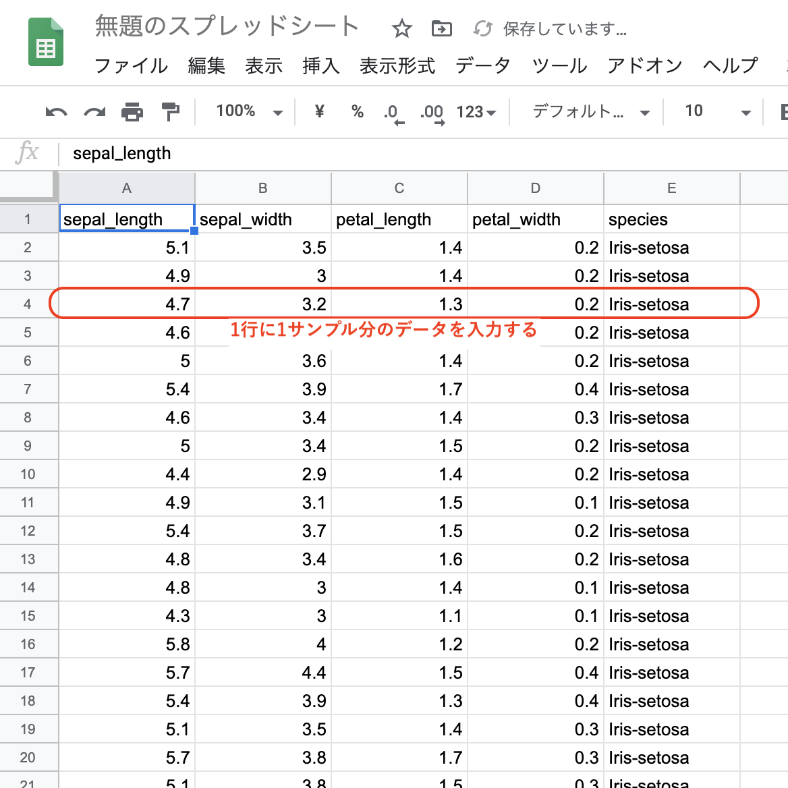
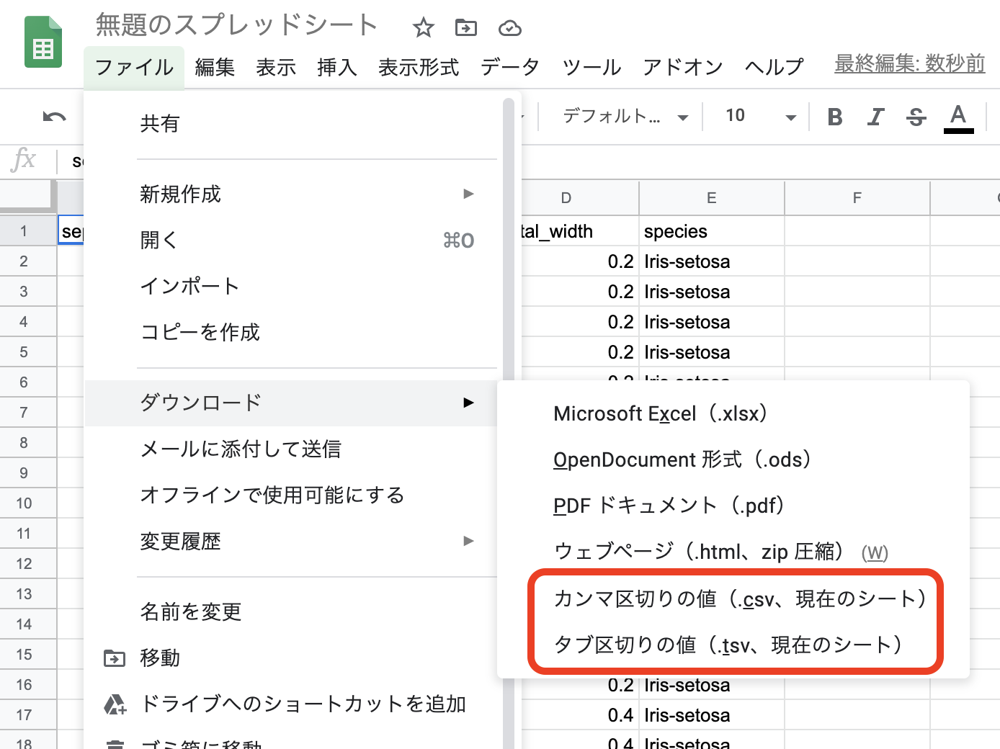
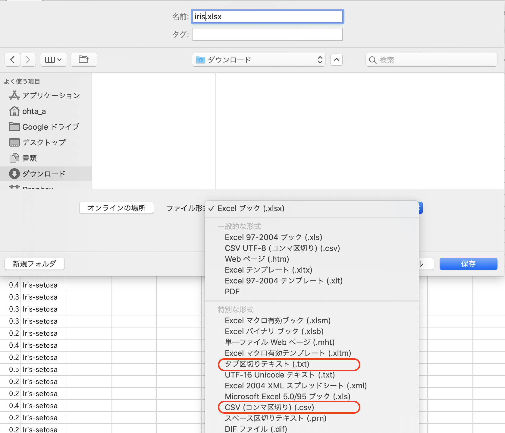
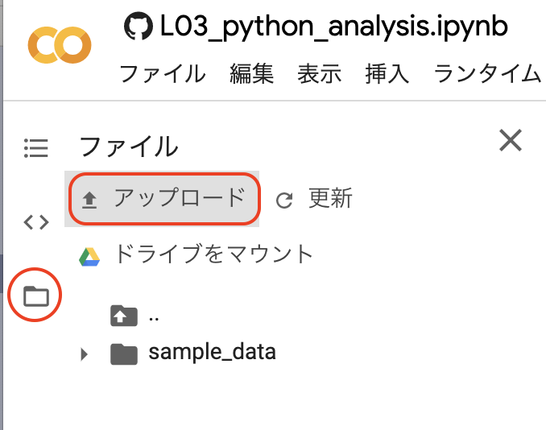

# データセットを用意する

　データセットの用意には、エクセルなどの表計算ソフトを使います。  

　ここでは、Googleアカウントを持っている者なら誰でも利用できるGoogleスプレッドシートを使って、データセットを用意する方法を説明しています（Microsoft Excel等の表計算ソフトでも同様に可能です）。

手順は次の通りです。
1. Googleスプレッドシートを開く
1. Googleスプレッドシートにデータを入力する
1. **カンマ区切りテキストファイル（CSV）** または **タブ区切りテキストファイル（TSV）** として保存する
1. Google Colabにアップロードする

---

## 1. Google Spreadsheetにデータを入力する
1. Google検索ページにある右上アイコン > 「ドライブ」

1. Googleドライブのページで新規の「Google スプレッドシート」を開きます。


## 2. Googleスプレッドシートにデータを入力する
　**1行に1サンプル分** のデータを入力します。


## 3. カンマ区切りテキストファイル（CSV） または タブ区切りテキストファイル（TSV） として保存する
　データをテキストファイル形式で保存します。その際、**カンマ区切り（CSV）** か **タブ区切り (TSV)**を選択してください。


※ Microsoft Excelを使っている場合、「保存」または「名前を付けて保存」で同様にテキストファイルとして保存できます。


## 4. Google Colabにアップロードする
　解析時には、保存したデータをGoogle Colaboratoryにアップロードする必要があります。

1. 画面左にあるフォルダアイコン > 「アップロード」
1. アップロードするテキストファイルを選択する



　データ解析の準備はこれで完了です。Google Colab上にアップロードされたファイルを、pandasの`read_csv`で読み込んでください。
```python
import pandas as pd
# カンマ区切りファイルの場合
データフレーム変数 = pd.read_csv(ファイル名, sep=",", header=ヘッダー行の番号)
# タブ区切りファイルの場合
データフレーム変数 = pd.read_csv(ファイル名, sep="\t", header=ヘッダー行の番号)
```
