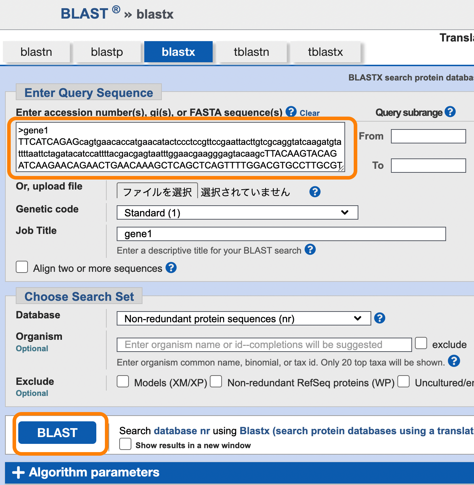

# RNA-seq入門 - 実習 -


## 実習1

　次の塩基配列（ある遺伝子の配列）をコピーして、NCBIのデータベースに対して相同性検索（BLAST検索）をおこなってください。


```
>gene1
TTCATCAGAGcagtgaacaccatgaacatactccctccgttccgaattacttgtcgcaggtatcaagatgtattttaattctagatacatccattttacgacgagtaatttggaacgaagggagtacaagcTTACAAGTACAGATCAAGAACAGAACTGAACAAAGCTCAGCTCAGTTTTGGACGTGCCTTGCGTACAAAATTCATTTCATTCTCATTGGAGCTGCTAACAAAGTCCGGCCCGCGCTTATTTTGATATGAGCGATTGGAGGAATTACACATAGCAATAATAGACATTTAaacatagtagtagtagtagtagtaatagggCTTGGGAGTTTTACGGGTGATCATGGAGGCGGTGGAGAACTGGGGACGAAGAAGGGATTACATTACTACATGCCGGTGGTCGGCCGGCTCGGAGTTCGTCGTCCATCTCTTCACGCCGGACGGACGGAACCACCCGTGACCCGATCGATCGTAGCCGGTCGCTGCAATTCAGCGCTCACTGACATGACAtttagcttcttcttcttcaagtGGGTGCGTGCGTGCGCCGGAGAGCCGGGGCGGCCGCCGGGGTTGTGTCGTCCTCCATGCTCACGATGTGTACTTACAGCGTTCAAAACTCGCGCGATCACGGCGCGGCCAGGCGCCACGCCGAGGTGGCGATCAGCGGGCGCGTGTGCCATCCCAGCGTCAGGCAGCCTTCCTTCTCCTCGACCTTGTACCCGTCGCCGCCGGCGAAGAGCGCCAGCAGCGTGCTCGCCTGCTTGTAGGCATTGGACCCCAGGTGGACGGTCTCGAACCCGGCGTTGCCCAGGCGGTTCCGCCACTGCCCCAGGGTCTCGTGGCGCTCTGTGCGCTCCGCTCCCTCGCAGGCCACCACGTTGCAGATCTGCCGGCCGAGGTACACCTCGGACATGACCTGGTCCGTGCCGGCCGCGGCAGGAGCGGCAGCCGGCCCCGATGAGACTTCGGATGGGCCGCCGCCGGAGCTGCCGCCCTCCAGAGAATCGAACATGGTGGAGTAGTAGTGCAGGGACTCGGTGAAGCGGTCCAGGAATGTGCCGGAGTTGTGGTTGGCCTCCTGCTCCACCACGGTGACGATCCTCGGCCGCACGGCGCGCACGGTGCCCAGGACCTTCTCCAGGGCGCCGGGCTGCGCCAGCAGCCGGTGCATCTCGAAGACTGAGTTGACGGCGATTACCTCCGGCTCCTCGTTCGGGTCCTCCTCGCCCTCCGGCTGCAGCATGAACGGCTCCAGGTCCGCGAGCGTGGCGGCGACGAGGCCGCGGTACTGGAAGTCGACGCGGATGGTGTGCGCGAACTGGGCGAGCTTCCAGCCCACCTGCTGCAGGGCGTCGGTCTCGTCCGGCTGCGGGGGTCCGACGCCGGTGAGGCGGAACGAGGGAGGGCCGCCGGGACGGAGGGCCAGTGCCTGGAGGAGGGCGGGCCACTGCATCCCCTGCTTGATGCCGAAGTCGACGACGTGCACGCGGCGGCAGCCGGCGAAGGCCTCCAGGATGGCCTGGTTGGCGGTGAAGTGGGCGAACTTGAGGTAGGGGCAGGACTCGTAGAAGTGCGCGTGGAGGAGGTCGGCgaaggcggcgtcgaggagggagcTGTCCGGCTGCGGGCGGAAGCGGAAGACGCGGCGGGCGAGGGCCTCGCCGAAGTAGGCGGCGACCTTGCGCATCGCGCCGCCCTGGGACGCGGCCAGCAAGGGTATCTGCTTCACCAGCGCCTCCGCGGCAGAGAAGTTCTCCTGCTGCACGGCCTCAGCGCAGGCGAGCAGCGCGTGCACCAGCCGAATCCCGGCCTCCTGCGTGTCGACCACGACGACCGGCAGCGCGGGCGTCGCGTTGGCCGCGGCGGCCACCGGCGGAGCAGCCTCCACGACAGAGCTCCTGGCGCCCCCACCGagagaggacgacgaggaggatgaCGACGAGGTGCTGCTCCCGCCAGTGCGCATCCGCTTGGGGTCCCGCACGGAGTCGGCGGACAGGTCGGCCGGCGCCACAGCCGGCGAGGGGATCGGCCGCAGCGCGTAGATGCTGCTGGAGGAGTCGACGGAGGGCGGGAGATCGAAGTAGCCGCCGCCCGTGAcggtggaggaggtggaggcgtTGAGCTGCGGGGCGggcgggaggggcggcggcggcgcgttgaGCTCCGACAGCATGCTCTCGACCCAGGAGGAGAGGTCGGTGGGGTTGTAGTGCACGGTGTCCGTGGCGAGGTGGGTG
```

### 手順
1. 塩基配列名と塩基配列全体を選択する
1. キーボードの「Ctrl + C」でコピーする
1. [NCBI BLASTページ](https://blast.ncbi.nlm.nih.gov/Blast.cgi?PROGRAM=blastx&PAGE_TYPE=BlastSearch&BLAST_SPEC=&LINK_LOC=blasttab&LAST_PAGE=blastx){:target="_blank" rel="noopener"} を開く
1. "Enter Query Sequence"のすぐ下のフォームにコピーした塩基配列を貼り付ける（「Ctrl + V」で貼り付け）
1. "BLAST"ボタンを押す




---

## 実習2

　実習1のBLAST検索結果で得られた情報を、Google Scholarで調べてください。

手順
1. [Google Scholar](https://scholar.google.co.jp/){:target="_blank" rel="noopener"} を開く
1. 検索フォームにキーワードを入力する


---

## 実習3

　次のリンク先のページにあるすべての遺伝子配列データをBLAST検索で調べてみてください。

[100個分の遺伝子配列データ](https://raw.githubusercontent.com/CropEvol/lecture/master/data/ILAS_multi.fa){:target="_blank" rel="noopener"}