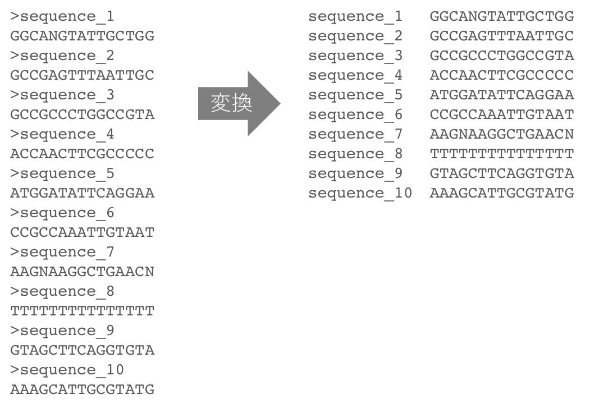

# 大規模データ解析入門1 [練習問題]

## Problem 1
　サンプルデータから、配列の長さに対するグアニン(G)とシトシン(C)の割合（GC含量）が __40%以上60%未満__ のデータとそうでないデータを振り分けるコードを書いてください。  
　この問題のサンプルデータはこちらにあります。
[https://raw.githubusercontent.com/CropEvol/lecture/master/data/P06_1_sequences.txt](https://raw.githubusercontent.com/CropEvol/lecture/master/data/P06_1_sequences.txt)

## Problem 2
　下図のように、奇数行に配列名、偶数行に配列本体が書かれたFASTA形式ファイルを、タブ区切りファイルに変換するコードを書いてください。その際、1列目を配列名、2列目を配列本体にしてください。  

<div style="margin-bottom: 5px;"></div>

　この問題のサンプルデータはこちらにあります。
*1 _これは、FASTA形式のファイルです。実質的にはテキストファイルですが、拡張子を __.fasta__ （または __.fa__ や __.fas__ ）にするのが通例です。_
[https://raw.githubusercontent.com/CropEvol/lecture/master/data/P06_2_sequences.fasta](https://raw.githubusercontent.com/CropEvol/lecture/master/data/P06_2_sequences.fasta)
```

[ヒント]  
各行の先頭文字を調べる。`>`なら配列名、そうでなければ配列本体。  

```python3
### 先頭文字の調べ方 ###
s1 = 'ABC'
s2 = 'DEF'
s3 = 'BAC'
s4 = 'ACC'

moji_list = [s1, s2, s3, s4]

for moji in moji_list:
    if moji[0] == 'A':     # 先頭の文字を調べる
        print(item)

### 配列名の取り出し方 ###
# 例) >abcde の場合、
# '>'は配列名行であることを示す接頭文字で、'abcde'のみが配列名です。
s5 = '>abcde'
print(s5[1:])   # 2文字目以降を表示
```

## Problem 3
　配列本体に改行が含まれるFASTA形式ファイル(*2)を、タブ区切りファイルに変換するコードを書いてください。その際、1列目を配列名、2列目を配列本体にしてください。  

_*2 ゲノム配列のように長い塩基配列が書かれたFASTA形式ファイルでは、配列本体は適度な文字数（80文字程度）で改行されている場合がほとんどです。_

　この問題のサンプルデータはこちらにあります。
[https://raw.githubusercontent.com/CropEvol/lecture/master/data/P06_3_sequences.fasta](https://raw.githubusercontent.com/CropEvol/lecture/master/data/P06_3_sequences.fasta)

## Problem 4
　先頭の文字列を調べるメジャーな方法として、 __正規表現__ と呼ばれるものを使う方法があります。その正規表現について調べてみてください。

[キーワード]  
正規表現、パターンマッチ、reモジュール、後方参照

　以下に正規表現を練習するコードがあります。コードのコメント文にしたがって追記してください。

```python3
# 正規表現を使って(1)〜(3)の処理をおこなう

import re   # 正規表現用モジュール

s1 = 'ABCDEF'
s2 = '123456'
s3 = '7ABCDE'
s4 = 'A8BCDE'
s5 = 'ABCDE9'
s6 = 'GHIJKL'

moji_list = [s1, s2, s3, s4, s5, s6]

# (1)先頭が数字の文字列を表示する
print('--- (1) ---')
p1 = re.compile()           # ←検索パターンをここに追記
for moji in moji_list:
    m1 = p1.search(moji)    # 検索
    if m1:                  # 検索パターンに一致した場合
        print(moji)         # 表示


# (2)最後が数字の文字列を表示する
print('--- (2) ---')
p2 = re.compile()           # ←検索パターンをここに追記
for moji in moji_list:
    m2 = p2.search(moji)    # 検索
    if m2:                  # 検索パターンに一致した場合
        print(moji)         # 表示


# (3)数字を含まない文字列を表示する
print('--- (3) ---')
p3 = re.compile()           # ←検索パターンをここに追記
for moji in moji_list:
    m3 = p3.search(moji)    # 検索
    if m3:                  # 検索パターンに一致した場合
        print(moji)         # 表示
```
