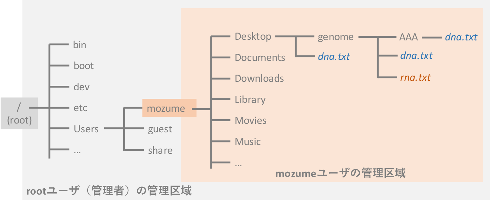

# Unix入門
__このページは現在作成中です。大幅に内容を変更することがあります__
[サンプルデータ](../data/L08_samples.zip)

## Unixとゲノム解析
　パソコンには、**オペレーティング・システム (OS)** というものが入っています。みなさんのパソコンには、Windows10/8.1/8/7やmacOSといったOSが入っています（それ以外のOSをパソコンに入れている方には、この解説は不要でしょう）。OSは、パソコン全体を管理・制御するソフトウェアです。マウスやキーボードなどによる入力を受け取り、解釈し、その情報をCPU（演算装置）で計算させたり、メモリ（短期記憶媒体）に一時保存させたり、ハードディスク（長期記憶媒体）に保存するよう命令しています。キーボードの`A`を押せばモニタに`A`と表示されるのも、キーボードとモニタのあいだの処理をOSがうまく中継しているからです（この中継役は、実際には、OSを構成している __カーネル__ と呼ばれるものがおこなっています）。

<div style="margin-bottom: 5px;"></div>

　UNIXはOSの一種です。UNIXに似たLinuxというOSもあります。その違いについては、ここでは詳しく説明しませんが、UNIXもLinuxも同じような仕組みで動いており、操作するコマンドもほとんどが同じです。以下では、UNIXとLinuxをまとめて、「Unix」と表現しています。

　ここで重要なことは、<u>ゲノム解析で使われるソフトウェアのほとんどがUnixベースOS用に作られており、ターミナル（黒い画面）へのコマンドライン入力で動作する</u>、ということです。また、ゲノム解析ではスーパーコンピュータ（スパコン）を使わなければできないような処理もあり、<u>そのスパコンもUnixベースのOSが使われています</u>。つまり、ゲノム解析には、Unixパソコンの操作がほぼ必須です。難しく思われるかもしれませんが、基本的な操作方法は

## MacやWindowsでゲノム解析
　MacはUNIX系のOSです。ゲノム解析で使うソフトウェアは大抵動くでしょう。
　Windowsは、UnixベースのOSではありません。自作プログラムは動かせても、ゲノム解析用ソフトウェアの多くは使えません。手元のパソコンがWindowsパソコンのみでは、ゲノム解析できないのかというと、そんなことはありません。いくつか方法があります。

1. Windowsパソコン内に、仮想的なマシンを構築して、それにUnixベースのOSをインストールする。  
1. Windowsパソコンに、UnixベースのOSをデュアルブートまたはクリーンインストールする。  
1. スパコンのようなUnixベースシステムで動くマシンにアクセスして使う。  


　どの方法であっても、Unixの使い方を勉強する必要があります。

## ディレクトリ構造とパス

### ディレクトリ構造
　Unixシステムでは、フォルダのことを __ディレクトリ__ と呼んでいます。Unixのディレクトリの構造は、最も根元のディレクトリ（ルートディレクトリ`/`）から枝分かれした、Tree状の階層構造になっています。  

<div style="margin-bottom: 5px;"></div>

　Windowsの場合、CドライブやDドライブなどがルートディレクトリに相当します。こちらも階層構造になっています。  

<div style="margin-bottom: 5px;"></div>

### パス
　パスとは、ファイルやフォルダ（ディレクトリ）の所在地を示すものです。上の図の、デスクトップ上のgenomeフォルダに`test.txt`というファイルがあったとします。そのファイルのパスは、次のように表されます。  
`/home/mozume/Documents/genome/test.txt`  
（Windowsの例: `C:¥Users¥mozume¥Desktop¥genome¥test.txt`）

　プログラムでファイルの読み込みをする場合で、このパスが重要になってきます。ファイルのパスを正しくを指定しないと、プログラムはそのファイルを認識できず読み込めません。  
　これまでの演習では、プログラム（`.ipynb`という拡張子がついたファイル）と読み込みたいファイルを同じフォルダに置いていたため、ファイル名を指定するだけで読み込みができていました。

　もし、プログラムと読み込みファイルが別々のフォルダにあった場合、プログラムにファイルのパスをきちんと指定することで、読み込みが可能です。

　パスを指定したファイル読み込みの練習をしてみましょう。これまでと同じように、デスクトップ上のgenomeフォルダでJupyter Notebookを起動し、`New` > `Python3`で新しいノートブックを開いてください。

　まず、次の文を貼り付けて、一度実行してください。  
_genomeフォルダ内に新しいフォルダを2つ作成し、さらに、現在のフォルダと作成したフォルダに、3つのファイルを同じ名前で作成するコードです。_

```bash
mkdir 'L08_AAA'
mkdir 'L08_BBB'
echo 'I am in working directory.' > 'L08_test.txt'
echo 'I am in L08_AAA.' > 'L08_AAA/L08_test.txt'
echo 'I am in L08_BBB.' > 'L08_BBB/L08_test.txt'
```

　3つのファイルが作成されたはずです。それぞれファイルをダブルクリックし、中身を確認してみてください。
- genomeフォルダ下に`L08_test.txt`
- genome/L08_AAA下に`L08_test.txt`
- genome/L08_BBB下に`L08_test.txt`


　中身が確認できたら、別のセルに次の文を入力し、実行してください。

```python
f = open('L08_test.txt', 'r')

for line in f:
    print(line)

# genome下のL08_test.txtが読まれる
```

　genome/L08_AAA下にある`L08_test.txt`を読みたい場合、どうするか。そのファイルまでのパスを指定します。ルートディレクトリからのパスでも構いませんが、かなり長くなるので、ここでは __相対パス__ というものでファイルを指定します。

```python
f = open('./L08_AAA/L08_test.txt', 'r')

for line in f:
    print(line)

# genome/L08_BBBにあるL08_test.txtも読んでみましょう。
```

　__相対パス__ とは、プログラム本体を起点としたファイル（やフォルダ）までのパスです。プログラムが実行されているフォルダは `.`（ドット） で表されます。 `./L08_AAA` は、プログラムと同じディレクトリにあるL08_AAAフォルダを表しています。 `./L08_AAA/L08_test.txt` は、genome/L08_AAAにあるL08_test.txtを表しています。
　今回は使いませんが、`..`（ドット2個）で1つ上のフォルダ（階層）を表せます。genomeフォルダの一つ上の階層、すなわち、Desktopにあるファイルを読み込みたい場合、`../L08_test.tx0`のように相対パスを書くことで、そのファイルにアクセスできます。

<div style="margin-bottom: 5px;"></div>

　相対パスの他に、 __絶対パス__ と呼ばれるものもあります。ルートディレクトリ`/`（Windowsの場合`C:`など）から始まるパスが絶対パスです。上の方で例に挙げた  
　`/home/mozume/Documents/genome/test.txt`  
は絶対パスです。

<div style="margin-bottom: 5px;"></div>

## Unixコマンド
　Unixシステムを操作するおもなコマンドは次のとおりです。

| コマンド | 使い方 | 動作 |
|:---|:---|:---|
|pwd|`pwd`|現在いるフォルダのパスを表示する|
|ls |`ls`|現在のフォルダにあるファイルやフォルダを表示する|
||`ls -l`|現在のフォルダにあるファイルやフォルダをリスト形式で表示する|
||`ls -a`|現在のフォルダにあるファイルやフォルダの所有者や権限なども一緒に表示する|
||`ls -a -l`|`ls -l`と`ls -a`の併用。`ls -al`でも可|
|cd|`cd フォルダ名`|指定したフォルダに移動する|
||`cd ..`|上のフォルダに移動する|
||`cd`|ホームフォルダ（ホームディレクトリ）に移動する|
|cat|`cat ファイル名`|指定ファイルの中身をすべて出力する|
|head|`head ファイル名`|指定ファイルの最初の10行を出力する|
||`head -n 20 ファイル名`|指定ファイルの最初の20行を出力する|
|tail|`tail ファイル名`|指定ファイルの最後の10行を出力する|
||`tail -n 20 ファイル名`|指定ファイルの最後の20行を出力する|
|grep|`grep '検索ワード' ファイル名`|検索ワードについて、指定ファイルの中身を調べ、ヒットした行を出力する|
|less|`less ファイル名`|指定ファイルの中身を見る（コマンドラインへの出力はしない）<br>__[重要] サイズの大きいファイルの中を確認するときによく使います。__　|
|wc|`wc ファイル名`|指定ファイルの文字数や行数を調べる|
|mv|`mv ファイル名（フォルダ名） フォルダのパス`|指定ファイル・フォルダを、指定パスに移動する|
||`mv 元ファイル名 新規ファイル名`|指定ファイルのコピーを作成し、新しい名前をつける|
|touch|`touch ファイル名`|新規ファイルを作成する|
|rm|`rm ファイル名`|指定ファイルを削除する|
||`rm -R フォルダ名`<br>`rmdir フォルダ名`|指定フォルダを削除する|
|mkdir|`mkdir フォルダ名`|新規フォルダを作成する|
|>|`コマンド > ファイル名`|ファイルに出力結果を書き込む（上書き）|
|>>|`コマンド > ファイル名`|ファイルに出力結果を書き込む（追加書き込み）|
|&#124;|`コマンド1` &#124; `コマンド2`| コマンド1の結果をコマンド2に渡す（ __パイプ__ と呼ばれる機能です）

_他にも多くのコマンドがあるので、興味があれば調べてください。_

　このうちいくつか使ってみましょう。  
　現在開いているJupyter Notebookは閉じて、ターミナル（Windowsの場合、Git Bash）を開いてください。  
　<span style="color: red; ">genomeフォルダで、ターミナル/Git Bashを開いてください。</span>

```bash
pwd                 # 現在いるフォルダ（ディレクトリ）を確認
ls                  # フォルダ内のファイルやフォルダを確認
cd L08_AAA          # L08_AAAフォルダまで移動
cd ..               # ひとつ上のフォルダに移動
cat L08_test.txt    # ファイルの中身を表示する
less L08_test.txt   # ファイルの中身を確認する
mkdir L08_CCC       # フォルダを作成する
mv L08_test.txt example.txt # ファイルのコピーを作成する
mv example.txt L08_CCC      # ファイルを移動させる
ls -l L08_CCC               # 別のフォルダの中身を確認する
cat L08_CCC/example.txt     # 別のフォルダにあるファイルの中身を確認する
ls -l > list.txt            # 出力結果をファイルに書き出す
ls -l | grep                # 出力結果について文字列検索する
# 2つのテキストファイルを続けて出力する
cat L08_test.txt L08_CCC/example.txt
# 2つのテキストファイルをつなげてファイルに保存する
cat L08_test.txt L08_CCC/example.txt > catenate.txt
```

## シェルスクリプト（Bash）
　シェルスクリプトはプログラミング言語のひとつです。特長としては、

- コード内でUnixコマンドが使用可能
- 他のプログラミング言語のプログラムを実行可能  
シェルスクリプトからゲノム解析ソフトウェアや自作プログラムを実行することが可能です。

　ゲノム解析では、1つのファイル内の高度なデータ処理は既存のソフトウェアプログラムやPythonなどで作った自作プログラムでおこない、それらの実行をシェルスクリプトで管理して複数ファイル処理する、という使い方をよくします。

<div style="margin-bottom: 5px;"></div>
