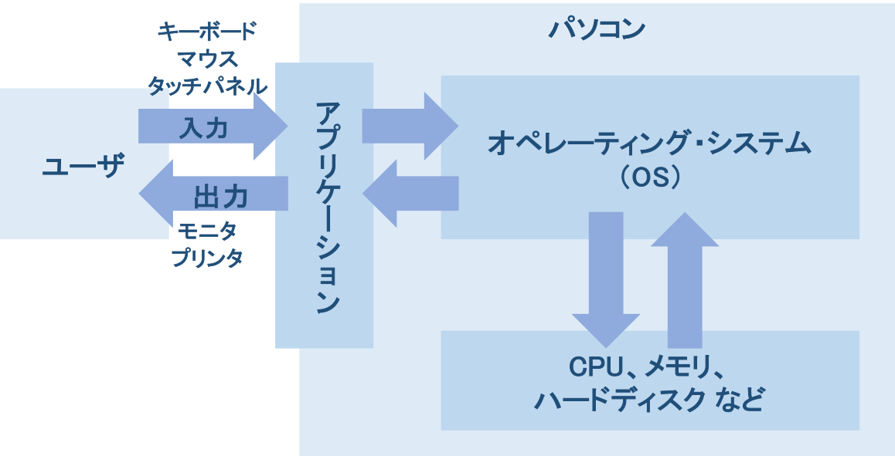
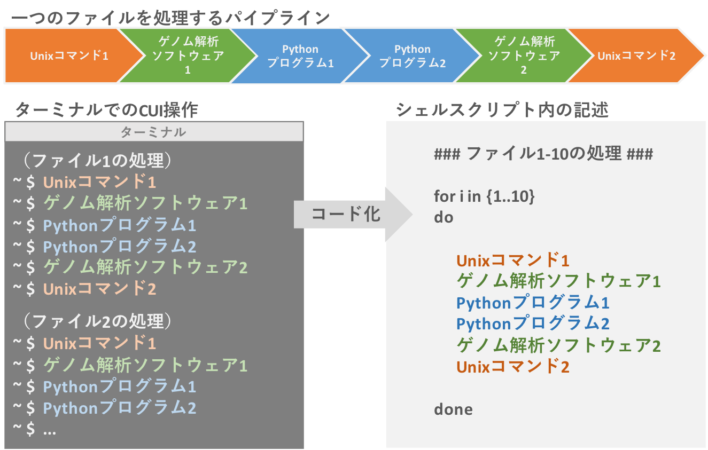

# Unix入門
__このページは現在作成中です。大幅に内容を変更することがあります__
[サンプルデータ](https://github.com/CropEvol/lecture/blob/master/data/L08_samples.zip?raw=true)


## Unixとゲノム解析
　パソコンには、**オペレーティング・システム (OS)** というものが入っています。みなさんのパソコンには、Windows10/8.1/8/7やmacOSといったOSが入っています（それ以外のOSをパソコンに入れている方には、この解説は不要でしょう）。OSは、パソコン全体を管理・制御するソフトウェアです。マウスやキーボードなどによる入力を受け取り、解釈し、その情報をCPU（演算装置）で計算させたり、メモリ（短期記憶媒体）に一時保存させたり、ハードディスク（長期記憶媒体）に保存するよう命令しています。キーボードの`A`を押せばモニタに`A`と表示されるのも、キーボードとモニタのあいだの処理をOSがうまく中継しているからです（この中継役は、実際には、OSを構成している __カーネル__ と呼ばれるものがおこなっています）。

<div style="margin-bottom: 5px;"></div>

　UnixはOSの一種です。Unixに似たLinuxというOSもあります。その違いについては、ここでは詳しく説明しませんが、UnixもLinuxも同じような仕組みで動いており、操作するコマンドもほとんどが同じです。以下では、UnixとLinuxをまとめて、「Unix」と表現しています。

　ここで重要なことは、<u>ゲノム解析で使われる多くのソフトウェアは、UnixベースのOSで動くように作られており、ターミナル（黒い画面）を使ってソフトウェアを実行しなければならない</u>、ということです。また、ゲノム解析にはスーパーコンピュータ（スパコン）を使わなければできないような処理もあり、<u>そのスパコンもUnixベースのOSが使われています</u>。つまり、ゲノム解析には、Unixパソコンの操作がほぼ必須です。

　今回は、演習しながらUnixパソコンについて学んでいきます。

_WindowsはUnix系OSではありませんが、WindowsパソコンでUnixの基本を学べるよう「Git for Windows」というソフトをインストールしてもらいました。_

## ディレクトリ構造とパス

　サンプルデータはこちらにあります。以下をクリックすれば `L08_samples.zip` がダウンロードできます。  
　ダウンロード後、ZIPファイルの解凍（展開）先としてデスクトップ上の `genome`（授業用フォルダ）を指定して、解凍してください。
[https://github.com/CropEvol/lecture/raw/master/data/L08_samples.zip](https://github.com/CropEvol/lecture/raw/master/data/L08_samples.zip)

### ディレクトリ構造
　Unixシステムでは、フォルダのことを __ディレクトリ__ と呼んでいます。Unixのディレクトリの構造は、最も根元のディレクトリ（ __ルートディレクトリ`/`__ ）から枝分かれした、Tree状の階層構造になっています。  

<div style="margin-bottom: 5px;"></div>

　Windowsの場合、CドライブやDドライブなどがルートディレクトリに相当します。こちらも階層構造になっています。  

<div style="margin-bottom: 5px;"></div>

### パス
　パスとは、ファイルやディレクトリ（フォルダ）の所在地を示すものです。上の図の、デスクトップ上のgenomeフォルダに`test.txt`というファイルがあったとします。そのファイルのパスは、次のように表されます。  

```
/Users/mozume/Documents/genome/AAA/abc.txt
/Users/mozume/Documents/genome/AAA/aaa/abc.txt
/Users/mozume/Documents/genome/BBB/abc.txt

/(スラッシュ)はディレクトリの区切りを表します。

========

[Windowsの場合]
C:¥Users¥mozume¥Desktop¥genome¥AAA¥abc.txt
C:¥Users¥mozume¥Desktop¥genome¥AAA¥aaa¥abc.txt
C:¥Users¥mozume¥Desktop¥genome¥BBB¥abc.txt

Windowsの場合、ディレクトリの区切りは¥(円マーク)で表します。
ただし、Pythonプログラムでは、/(スラッシュ)を使います。
```

このように、ルートディレクトリから始まるパスの書き方を __絶対パス__ といいます。

　パスの別の表現方法として __相対パス__というのもあります。こちらは、あるファイルやディレクトリ（フォルダ）を起点とした場合の所在地です。

```
/Users/mozume/Documents/genome/AAAからみたファイルパス

./abc.txt
./aaa/abc.txt
../BBB/abc.txt

.(ピリオド1つ)は、起点となるディレクトリを表します。
..(ピリオド2つ)は、
```

　プログラムでファイルの読み込みをする場合で、このパスが重要になってきます。ファイルのパスを正しくを指定しないと、プログラムはそのファイルを認識できず読み込めません。  
　これまでの演習では、プログラム（`.ipynb`という拡張子がついたファイル）と読み込みたいファイルを同じフォルダに置いていたため、ファイル名を指定するだけで読み込みができていました。もし、プログラムと読み込みファイルが別々のフォルダにあった場合でも、プログラムにファイルのパスをきちんと指定することで、読み込みが可能です。

　パスを指定したファイル読み込みの練習をしてみましょう。Jupyter Notebookを開き、先ほどダウンロードした `L08_samples` フォルダの中の `cddir/LearnPath.ipynb` を開いてください。

　`cddir`内のファイル構造は下記のようになっています。開いたノートブックの指示にしたがい、`iamin.txt` を読み込んでください。

```
─── L08_samples ─── cddir ─── dir1 ─── subdir1 ─── iamin.txt
 │               │         │        │
 │               │         │        ├─ subdir2 ─── iamin.txt
 │               │         │        │
                 │         │        ├─ subdir3 ─── iamin.txt
                 │         │        │
                 │         │        └─ iamin.txt
                 │         │
                 │         ├─ dir2 ─── subdir1 ─── iamin.txt
                 │         │        │
                 │         │        ├─ subdir2 ─── iamin.txt
                 │         │        │
                 │         │        ├─ subdir3 ─── iamin.txt
                 │         │        │
                 │         │        └─ iamin.txt
                 │         │
                 │         ├─ dir3 ─── subdir1 ─── iamin.txt
                 │         │        │
                 │         │        ├─ subdir2 ─── iamin.txt
                 │         │        │
                 │         │        ├─ subdir3 ─── iamin.txt
                 │         │        │
                 │         │        └─ iamin.txt
                 │         │
                 │         ├─ iamin.txt
                 │         │
                 │         └─ LearnPath.ipynb
                 │
                 ├─ iamin.txt
```

## Unixコマンド
　Unixコマンドとは、パソコンを操作するコマンドです。マウスポインタ使って操作していた作業（フォルダを開くなど）を、文字入力（コマンド）でおこなってみましょう。

_マウスポインタを使うような操作を **GUI (Graphical User Interface)** といいます。一方、コマンドでの操作方法を **CUI (Character User Interface)** といいます。_

　現在開いているJupyter Notebookは閉じて、 `genome`フォルダで、ターミナル/Git Bashを開いてください。

```bash
pwd                     # 現在いるフォルダ（ディレクトリ）を確認
ls                      # フォルダ内のファイルやフォルダを確認
cd L08_samples          # L08_samplesまで移動
pwd                     # L08_samplesにいることを確認
cd ..                   # ひとつ上のフォルダに移動
pwd                     # 元のフォルダにいることを確認
cd L08_samples/cddir    # L08_samples/cddirまで移動

########################
# 以下cddirで作業する #
########################
pwd                     # L08_samples/cddirにいることを確認
ls                      # 確認
cat iamin.txt           # ファイルの中身を表示する
ls dir1                 # 別のフォルダのファイルやフォルダを確認
cat dir1/iamin.txt      # 別のフォルダのファイルの中身を表示
cat ../iamin.txt        # 上のフォルダのファイルの中身を表示
ls                      # （ファイルコピー前の確認）
mv iamin.txt example.txt    # ファイルのコピーを作成する
ls                      # （ファイルコピー後の確認）
mkdir dir4              # フォルダを作成する
ls                      # （フォルダ作成後の確認）
ls dir4                 # dir4の中身
mv example.txt dir4     # ファイルを移動
ls                      # （ファイル移動後の確認）
ls dir4                 # dir4/example.txtを確認

cd ../fastadir          # fastadirに移動

########################
# 以下fastadirで作業する #
########################
pwd                     # 現在のフォルダ確認
ls                      # フォルダの中身を確認
cat randseq1.fasta      # ファイルの中身を画面に出力
less randseq1.fasta     # ファイルの中身を見る（qキーで元に戻る）
                        # ターミナルに出力されていないことを確認
grep '>' randseq1.fasta # '>'がある行のみ表示（配列名の行のみ表示）
grep 'CTGCAG' randseq1.fasta    # 検索語がある行のみ表示

# 1回目のgrep出力結果をさらにgrepで文字列検索
grep '>' randseq1.fasta | grep '2'

# 上と同じ出力結果をlessコマンドでで見る
grep '>' randseq1.fasta | grep '2' | less

# 上と同じ出力結果をファイルに保存
grep '>' randseq1.fasta | grep '2' > name.txt
less name.txt           # 中身確認

# 同じファイルに追加書き込み
grep '>' randseq1.fasta | grep '5' >> name.txt
less name.txt           # 中身確認

# 上書き
grep '>' randseq1.fasta | grep '9' > name.txt
less name.txt           # 中身確認

rm name.txt             # ファイル削除

# ファイルを連続して出力（すぐに流れてしまうので、lessで確認）
cat randseq1.fasta randseq2.fasta randseq3.fasta | less
# その出力結果をファイルに保存（3つのファイルを1つにまとめる）
cat randseq1.fasta randseq2.fasta randseq3.fasta > merge.fasta

cd ../lsdir             # lsdirに移動

#####################
# 以下lsdirで作業する #
#####################
pwd                     # 現在のフォルダ確認
ls                      # フォルダの中身を確認
ls -l                   # リスト形式で表示
ls -a                   # .(ドット)から始まるファイルも表示
ls -al                  # 2つのオプションの併用
ls -al | grep '.txt'    # 拡張子が.txtのファイルのみ表示
ls -al | grep '.csv'    # 拡張子が.csvのファイルのみ表示
ls -al | grep '.tsv'    # 拡張子が.tsvのファイルのみ表示
```

　以下には、ゲノム解析でよく使うUnixコマンドをリストアップしています。

| コマンド | 使い方 | 動作 |
|:---|:---|:---|
|pwd|`pwd`|現在いるフォルダのパスを表示する|
|ls |`ls`|現在のフォルダにあるファイルやフォルダを表示する|
||`ls -l`|現在のフォルダにあるファイルやフォルダをリスト形式で表示する|
||`ls -a`|現在のフォルダにあるファイルやフォルダの所有者や権限なども一緒に表示する|
||`ls -a -l`|`ls -l`と`ls -a`の併用。`ls -al`でも可|
|cd|`cd フォルダ名`|指定したフォルダに移動する|
||`cd ..`|上のフォルダに移動する|
||`cd`|ホームフォルダ（ホームディレクトリ）に移動する|
|cat|`cat ファイル名`|指定ファイルの中身をすべて出力する|
|head|`head ファイル名`|指定ファイルの最初の10行を出力する|
||`head -n 20 ファイル名`|指定ファイルの最初の20行を出力する|
|tail|`tail ファイル名`|指定ファイルの最後の10行を出力する|
||`tail -n 20 ファイル名`|指定ファイルの最後の20行を出力する|
|grep|`grep '検索ワード' ファイル名`|検索ワードについて、指定ファイルの中身を調べ、ヒットした行を出力する|
|less|`less ファイル名`|指定ファイルの中身を見る（コマンドラインへの出力はしない）<br>__[重要] サイズの大きいファイルの中を確認するときによく使います。__　|
|wc|`wc ファイル名`|指定ファイルの文字数や行数を調べる|
|mv|`mv ファイル名（フォルダ名） フォルダのパス`|指定ファイル・フォルダを、指定パスに移動する|
||`mv 元ファイル名 新規ファイル名`|指定ファイルのコピーを作成し、新しい名前をつける|
|touch|`touch ファイル名`|新規ファイルを作成する|
|rm|`rm ファイル名`|指定ファイルを削除する|
||`rm -R フォルダ名`<br>`rmdir フォルダ名`|指定フォルダを削除する|
|mkdir|`mkdir フォルダ名`|新規フォルダを作成する|
|>|`コマンド > ファイル名`|ファイルに出力結果を書き込む（上書き）|
|>>|`コマンド > ファイル名`|ファイルに出力結果を書き込む（追加書き込み）|
|&#124;|`コマンド1` &#124; `コマンド2`| コマンド1の結果をコマンド2に渡す（ __パイプ__ と呼ばれる機能です）

_他にも多くのコマンドがあるので、興味があれば調べてください。_

## シェルスクリプト（Bash）
　シェルスクリプトはプログラミング言語のひとつです。特長としては、

- コード内でUnixコマンドが使用可能
- 他のプログラミング言語のプログラムを実行可能  
シェルスクリプトからゲノム解析ソフトウェアや自作プログラムを実行することが可能です。

　ゲノム解析では、1つのファイル内の高度なデータ処理は既存のソフトウェアプログラムやPythonなどで作った自作プログラムでおこない、それらの実行をシェルスクリプトで管理して複数ファイル処理する、という使い方をよくします。

<div style="margin-bottom: 5px;"></div>

　pythonプログラム `count_ATGCN.py` を動かすシェルスクリプトを書いて、3つのFASTAファイルの処理してみましょう。

```bash
F1='randseq1.fasta'
F2='randseq2.fasta'
F3='randseq3.fasta'

touch pythonresult.txt  # 出力ファイル作成

for i in (F1 F2 F3); do
    echo "$i"           # 表示
    python count_ATGCN.py "$i" >> pythonresult.txt
done

### 解説 ###
#################
# 変数=文字列など #
#################
# =の左右に空白を入れてはいけません。
# 変数の中身を取り出すときは、$をつけます。$変数
#
#########
# for文 #
#########
# for 変数 in リストなど; do
#   処理
# done
# Pythonでは、for文の中身であることを表すのにインデントが必要でしたが、
# シェルスクリプトでは、do-doneの間にあるものがfor内部の文を表すため、
# インデントはなくても構いません。
# ただし、見やすさのために、インデントをつけるのが望ましいでしょう。
#
####################
# リスト (F1 F2 F3) #
####################
# Pythonでの list() のようなものです。
# 書き方は(文字列 文字列 文字列)
# カンマは不要です
#
########
# echo #
########
# Pythonでの print() のようなものです。
#
#######################
# python プログラム.py #
#######################
# count_ATGCN.pyの中にpythonプログラムが書かれています。
# 引数にFASTAファイルを1つ指定しなければならないプログラムです。
# 結果はターミナルに出力されますが、上では、
# pythonresult.txtに書き込まれるようにしています。
```
