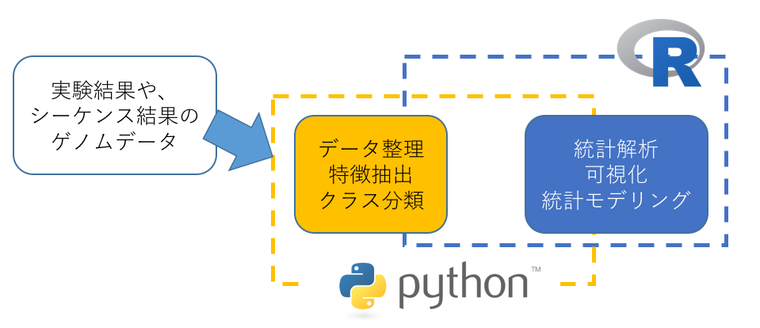
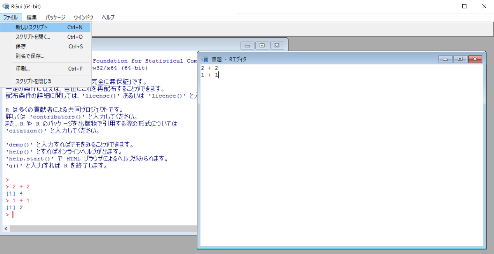
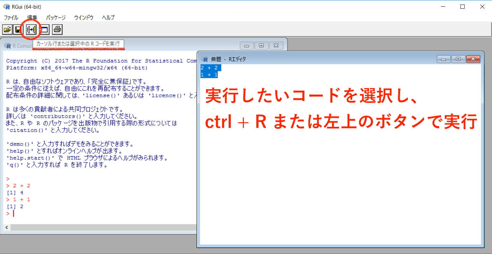
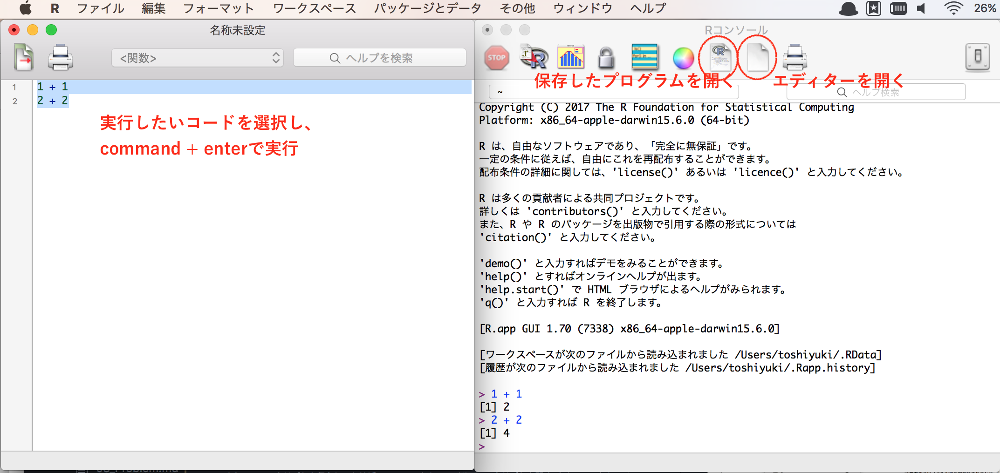
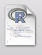
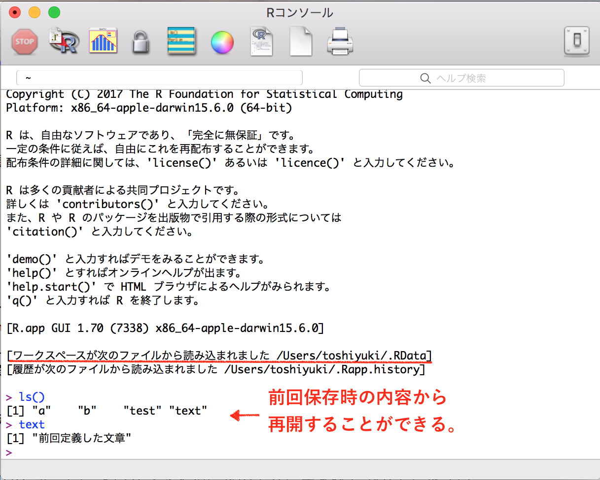

# R入門

## R言語について
　Rは、統計解析でよく利用されるプログラミングないし解析環境です。各種統計検定法や解析法が使えるだけでなく、<br>
発表されて間もないような新しい手法もR用にリリースされているものが多いところが特徴です。<br>
　バイオインフォマティクス、生物統計学に特化した便利なライブラリなども存在しています。

## PythonとRの違い
　統計解析やデータ処理、グラフ描写など、R / Pythonどちらもある程度の科学計算や処理をするには十分な機能を備えていますが、以下それぞれの特徴を簡単に説明します。
### Python
 　バイオインフォマティクスの分野では良くPythonが利用されています。そのため、遺伝子配列やアミノ酸配列、タンパク質の立体構造などを扱う場合に、Pythonで書かれた便利なプログラムが数多く存在しています。<br>
 　プログラミング言語としては、簡単に入門することが可能で、コンピューターサイエンス以外の分野の人でも手軽に扱うことができます。また、機械学習や深層学習などの分野でもPythonはよく利用されており、特に遺伝子配列の解析は文字列処理として扱えるので、自然言語処理などで用いられている技術の恩恵を受けやすいものになっています。

### R
　Rは統計解析とグラフの描写を得意としています。特にグラフの描写機能は充実しており、基本的な統計グラフに加え、系統樹や遺伝子ネットワークなどの描写に役立ちます。<br>
　また、統計解析パッケージが非常に豊富であり、Pythonでは実装されていない発展的な手法であったり、新しい解析手法などもRで探せば大抵見つかり、利用することが出来ます。<br>
　そのため、ゲノム解析等でバイオインフォマティクスを利用する研究室でなくとも、実験結果の統計解析であったり、結果のグラフ化など、Rを使う必要がある研究室は多いです。
<br></div>

"解析ソフトウェアでの結果をRで可視化する"、"Pythonでデータ処理を行いRで統計解析"...etc<br>
といったように柔軟に使えると今後役に立つと思います。

## 実習の前に
### いかにコードを書かないか
　Rに関しては、基本的なプログラムが組めることも大事ですが、便利な関数やパッケージを利用することが前提となってきます。パッケージというのは、世界中のRユーザーが開発したプログラムを誰もが利用できる形にしたものです。<br>
　また、有名な統計解析パッケージや関数は高速に作られています。詳しく説明するとややこしくなるので簡単にしておきますが、PythonやRでプログラムを書くよりも、C言語やFortran、Javaと言ったプログラミング言語で同じ計算をさせた方が、数十倍・数百倍速いことがあります。(その分複雑なプログラムを組むためには、必要な知識が多いなどの欠点はありますが。)<br>
　しかし、多くのRの関数やパッケージは内部がC言語などで実装されているので、速いものが多いです。そのため、for文やif文などを使ってプログラムを組むことも可能ですが、関数やパッケージがあるのであれば、そちらを使う様にしましょう。
```
# 参考
# t検定を自分で実装した場合(長いし、遅い)

nx <- length(x)                             # xの標本の大きさ
  mx <- mean(x)                               # xの標本平均
    vx <- var(x)                                # xの分散の推定値(不偏分散)
    if (is.null(y)) {
    }
    else {
        ny <- length(y)                         # yの標本の大きさ
        my <- mean(y)                           # yの標本平均
        vy <- var(y)                            # yの分散の推定値(不偏分散)
        if (var.equal) {
            df <- nx + ny - 2                   # 自由度
            v <- 0 if (nx > 1)
                v <- v + (nx - 1) * vx if (ny > 1)
                v <- v + (ny - 1) * vy
            v <- v/df
            stderr <- sqrt(v * (1/nx + 1/ny))   # 検定統計量の右辺の分母
        }
        tstat <- (mx - my - mu)/stderr          # 検定統計量

        ...                                     # t分布からp値を求める処理など...

    }

# 用意されているt検定の関数で行う場合(１行で済む、かつ速い)

t.test(x, y, var.equal=T)
```
　小さなプログラムであれば気にならないですが、ある程度の規模の計算になると、数ヶ月単位で時間が変わってきます。<br>
　関数やパッケージを利用出来る形にデータを処理する所はプログラムを作る必要がありますが、パッケージなどに任せられる所は任せた方が基本的には良いです。<br>
　自分でアルゴリズムを考えたり、解析手法を開発する様な研究をする場合には、自分でプログラムを組む必要があります。

#### 実習内容について
　上述した通り、Rに関してはプログラムを組むことよりも自分に必要なパッケージを探して利用する場合が多く、今後皆さんがどの様にRを利用し、どのようなパッケージを利用していくかは人それぞれだと思います。<br>
　そこで本実習では、Rの利用方法や、pythonで学んだfor文やif文などをRで利用する際の書き方の違いなど、基本的な使い方を学んだ後、出来るだけ汎用性が高いものであったり、知識として持っておくと良いと思われる統計解析・グラフ描写などに関するパッケージを実際にいくつか利用してみる。と言った形で進めていきます。
***
## 実習 Part1

#### Rの起動・終了
起動<br>
Windows: デスクトップにあるアイコンをダブルクリックするか、スタートメニューからRの中にある[R 3.x.x]を選択する。<br>
Mac OS X: Finderからアプリケーションフォルダにあるアイコンをダブルクリックする。<br>

終了<br>
ウインドウの`×`ボタンを押しても良いが、`q()`というコマンドでも終了させることができる。<br>
作業スペースを保存するかどうかを聞くダイアログが表示されるので、〔保存〕か〔保存しない〕をクリックする。

#### エディターから動かす
Rでは1つの命令が数行にわたる場合が多いです。<br>
そのため、Rの入力画面に直接入力するのではなく、エディタに命令を書いておいて、まとめて実行すると便利です。
##### Windowsの場合
ファイル → 新しいスクリプト でエディターが開きます。
<br>
このエディタにプログラムを入力します。<br>
動かしたい部分をマウスなどで選択し、`control + R`で実行することができます。


##### Macの場合
ボタンを押すとエディタが開きます。<br>
このエディタにプログラムを入力します。<br>
動かしたい部分をマウスなどで選択し、`command + enter`で実行することができます。<br>
</div><br>

また、このスクリプトを保存しておけば、windowsならファイル → スクリプトを開く から、Macならボタンから、再び利用することができます。<br>


それでは以下基本的な書き方を学んでいきますが、Pythonの基礎を学んだ際の内容と似たような内容の繰り返しが多くなるので、<br>
Pythonとの違いを説明するのみになる場合もありますがご了承ください。
#### 変数・基本演算子
変数の定義・代入は`<-`や`->`を使います。四則演算はPython同様`+ - * /`を使います。<br>
また、`ls()`コマンドで、現在定義されている変数一覧を見ることができます。
```
a <- 10           # 代入
a
# [1] 10

a <- a * 5 + 1
a
# [1] 51

a <- 10
b <- 20
test <- "sample"
ls()
# [1] "a"    "b"    "test"
```
Pythonと少し異なる点としては、整数商に`%/%`、剰余に`%%`、べき乗に`^`を使用するところです。
```
9 %/% 2           # 9割る2の整数解
# [1] 4
9 %% 2            # 9割る2の余り
# [1] 1
9^2               # 9の二乗
# [1] 81
```
#### 数学基本関数
Rでは三角関数や統計量を算出する関数が標準実装されており、そのまま呼び出すことで実行することができます。
```
sin(30 * pi / 180)          # sin関数。角度はラジアン単位。
# [1] 0.5                       # ※30度はラジアンで30 * pi / 180、Rではpi = 3.141592....

acos(0.5) * 180 / pi        # cosの逆関数。
# [1] 30

log(100, 10)                # 常用対数
# [1] 2

x <- c(20, 10, 16, 40, 32, 16, 48)
mean(x)                     # xの値の平均値
# [1] 26

var(x)                      # xの値の不偏分散
# [1] 201.3333
```
| 関数式 | 意味 | 関数式 | 意味 |
|:-----------:|:------------:|:------------:|:------------:|
| sin(x), cos(x), tan(x) | 各種三角関数(角度はラジアン) | asin(x), acos(x), atan(x) | 各種三角関数の逆関数 |
| log(x) | 対数(デフォルトは底をeとした自然対数) | log(x, base=y) | base=yでyを底とした対数 |
| exp(x) | 指数関数 | sqrt(x) | 平方根 |
| max(x) | データxの中で最大値のもの | min(x) | データxの中で最小値のもの |
| mean(x) | データxの算術平均 | median(x) | データxの中央値 |
| sd(x) | データxの標準偏差 | var(x) | データxの不偏分散 |

これらはRで利用できる関数の一部です。<br>
関数全てを紹介することは難しいので、Rでどんなことが出来るのか知りたい方は、<br>
この講義資料の参考の章に、関数を一通り網羅してある参考資料を紹介しているので見てみてください。(※参考2)<br>

#### forやif
pythonと同様、forやif文を使うことができますが、Rでは少し書き方が違います。

```
# Rのfor文
s = 0
for (i in 1:100) {          # { }で囲まれた部分を繰り返す。
  s <- s + 1
}
s
# [1] 100

# Rのif文
a <- 100
if (a < 200) {              # if (条件式) {条件に合うときの処理}
  a <- a + 1
} else {
  a <- a - 1
}
a
# [1] 101
```
`while文`や`switch文`といった繰り返し構文・条件分岐文も存在します。最後の参考資料に載せておきます。(※参考1)<br>
`for`や`if`でも代用できますが、扱えると便利なので興味のある方は見てみてください。

#### 関数の作り方
和や平均など簡単な関数はRに標準実装されているが、自分で何らかの関数を作りたい場合、<br>
関数は、`function (引数) {処理}` を利用して作成します。
```
# 引数の100倍を求める関数をtestと言う名前で作成する。

test <- function(x) {
  ans <- x * 100
  return(ans)               # return(変数)で変数(ここではans)の値を返す
}

test(10)
# [1] 1000
```
#### ベクトルと行列
ベクトルや行列を扱えるというのがRらしい所でしょうか。<br>
R言語はデータの統計処理用言語なので連続したデータを扱うことが多く、基本的にベクトル単位で扱います。<br>
データを`c()`で囲うことでベクトルになります。また、`[]`で各要素へアクセスできます。<br>
注意点は、Pythonの配列ではindexが[0, 1, 2, 3...]だったのに対し、Rでは[1, 2, 3. 4...]と数えていく点です。
```
vec <- c(4, 5, 2, 3)
vec
# [1] 4 5 2 3
vec[2]
# [1] 5
```
Pythonの配列とは違い、ベクトルなので、以下の様な演算が可能です。
```
vec1 <- c(4,5,2,3)
vec2 <- c(1,2,1,2)

vec1 / 2                     # 各要素すべてを2で割る
# [1] 2.0 2.5 1.0 1.5
vec1 - vec2                  # 要素毎に差を求める
# [1] 3 3 1 1
vec1 * vec2                  # 要素毎に積を求める
# [1]  4 10  2  6
vec1 %*% vec2                # 内積
#      [,1]
# [1,]   22
```
数列などのベクトルを作成したい場合、`seq(開始, 終了, length=要素数)`や`rep(開始, 終了, by=増加)`を使います。<br>
また、`1:10`とすると、1~10までのベクトルができます。
```
seq(1, 10, length=5)         #1~10を5分割で
# [1]  1.00  3.25  5.50  7.75 10.00
seq(1, 10, by=2)             #1から2ずつやして10まで
# [1] 1 3 5 7 9

rep(1:3, times=2)            #(1,2,3)を2回
# [1] 1 2 3 1 2 3
rep(1:3, length=5)           #(1,2,3)を5個になるまで繰り返す
# [1] 1 2 3 1 2

# 日付も扱える
seq(as.Date("2017-01-01"),as.Date("2017-01-04"),by="day")
# [1] "2017-01-01" "2017-01-02" "2017-01-03" "2017-01-04"
```

また、Rでは行列を扱うことも可能です。Rの行列は数学の行列とほぼ同じ概念で、行と列からなる、2 次元配置のデータです。<br>
行列は`matrix`関数に行列の要素、列数、行数を指定して作成します。また、ベクトル同様`[]`で各要素へアクセスできます。
```
x <- matrix(1:9, nrow = 3, ncol = 3)          # matrix(1:9, 3, 3)でも可
x
#      [,1] [,2] [,3]
# [1,]    1    4    7
# [2,]    2    5    8
# [3,]    3    6    9

x[3, 2]                 # 3行目の2列目の要素を取得
# [1] 6
x[3, ]                  # 3行目の要素を全て取得              
# [1] 3 6 9
x[c(1, 2), c(1, 2)]     # 1,2行目の1,2列目の要素を取得
#      [,1] [,2]
# [1,]   1    4
# [2,]   2    5

matrix(1:9, nrow = 3, ncol = 3, byrow = T)    # 行を基準に行列を作成
#      [,1] [,2] [,3]
# [1,]    1    2    3
# [2,]    4    5    6
# [3,]    7    8    9
```
行列の計算について、以下の様な計算が可能です。

| 入力式 | 意味 |
|:-----------:|:------------:|
| A * B | 各成分それぞれ個別に積を取る。A行列のi行i列の要素×B行列のi行i列の要素を計算している。 |
| A %*% B | 行列Aと行列Bの内積。|
| A * 2 | 各成分に2をかける。 |
| A + B | 行列Aと行列Bの和。 |
```
A <- matrix(1:9, 3, 3)
B <- matrix(1:9, 3, 3)

A * B                             # 各要素それぞれ個別に積をとる
#      [,1] [,2] [,3]
# [1,]    1   16   49
# [2,]    4   25   64
# [3,]    9   36   81

A %*% B                           # 数学における行列の積
#      [,1] [,2] [,3]
# [1,]   30   66  102
# [2,]   36   81  126
# [3,]   42   96  150
```
また、逆行列や固有ベクトル、内積を求める関数も用意されています。

| 関数式 | 意味 | 関数式 | 意味 |
|:-----------:|:------------:|:------------:|:------------:|
| rowSums(X) | 行列Xの各行の総和 | colSums(X) | 行列Xの各列の総和 |
| rowMeans(X) | 行列Xの各行の平均 | colMeans(X) | 行列Xの各列の平均 |
| t(X) | 行列Xの転置行列 | solve(X) | 行列Xの逆行列 |
| diag(n) | n行n列の単位行列を作成 | diag(A1:An) | 対角成分が(A1,A2...An)の対角行列を作成 |
| eigen(X) | 行列Xの固有値と固有ベクトル | det(X) | 行列Xの行列式 |

```
A <- matrix(c(1,2,3,4,5,6,7,8,10), 3, 3)
solve(A)                          # 逆行列を求める
#            [,1]       [,2] [,3]
# [1,] -0.6666667 -0.6666667    1
# [2,] -1.3333333  3.6666667   -2
# [3,]  1.0000000 -2.0000000    1
```

行列計算に関してもまだまだたくさんの関数が用意されているので、先ほど紹介した参考資料で確認してみてください。(※参考2)<br>

今は線形代数でベクトルや行列の計算を学んだ理由や、ベクトル・行列を扱える利点があまりよくわからないかもしれませんが、<br>
確率や統計学の世界では、行列計算があらゆるところで利用されています。<br>
また、プログラムを組む際にも、行列やベクトルの計算に変換した方が計算が速くなる場合が多いです(※参考3)

#### データフレーム
行列のほかに、データフレームという様式もあります。行列では、含まれるすべての要素がすべて実数、あるいはすべて文字列など、同じ属性を持つ必要があります。<br>
これに対して、データフレームは、列ごとに属性を持つことができます。例えば、データフレームの1列目は実数、2列目は文字列のようにデータを保存することができます。<br>
データフレームは`data.frame`関数で作成することができ、各列に名前をつけることができます。<br>
また、`subset`や`na.omit`などを利用し、条件に応じたデータのみを取得することができます。<br>
以下に載せたものはデータフレームの機能の一部に過ぎませんが、データに対するあらゆる操作が可能になります。
```
df <- data.frame(
  nameA = c(1, 2, 3, 4),
  nameB = c(T, F, T, T),     # T = TRUE, F = FALSEを意味する
  nameC = c(1, 2, NA, 4)
)
df
#   nameA nameB nameC
# 1     1  TRUE     1
# 2     2 FALSE     2
# 3     3  TRUE    NA
# 4     4  TRUE     4

df[, 1]                      # 行列の様にも扱える
# [1] 1 2 3 4

df$nameA                     # 列名でも取得可能
# [1] 1 2 3 4

na.omit(df)                  # NA(欠損値)の含まれる行以外を取得
#   nameA nameB nameC
# 1     1  TRUE     1
# 2     2 FALSE     2
# 4     4  TRUE     4

subset(df, nameB == T)       # nameB列がTRUEの行のみを取得
#   nameA nameB nameC
# 1     1  TRUE     1
# 3     3  TRUE    NA
# 4     4  TRUE     4
```
また、CSVファイルなどを読み込んでデータフレームとして扱うことが可能です。<br>
CSV形式でデータを管理 → Rで読み込んで解析。(必要なら結果を出力)といった使い方になります。
今回はweb上のCSVデータを直接読みこんで表示してみますが、もちろん自分のパソコン内のCSVファイル等も読み込むことができます。
```
df <- read.csv("https://raw.githubusercontent.com/CropEvol/lecture/develop_sakai/data/L10_mouse_data.csv",header=T,row.names=1)
head(df)                              # head(データフレーム)でデータフレームの一部を表示できます。
# 年齢 血圧 肺活量 性別 病気 体重
# 1    2  110   4300    M    1   79
# 2    3  128   4500    M    1   65
# 3    4  104   3900    F    0   53
# 4    2  112   3000    F    0   45
# 5    2  108   4800    M    0   80
# 6    2  126   3800    F    0   50

write.table(df, file="data_save.csv") # write.table(データフレーム, file="ファイル名")で指定したファイル名で保存します。
```

#### 作業ディレクトリ・ファイル操作など
ファイルからデータやプログラムを読み込んだり，ファイルにデータを書き出したりする場所を作業ディレクトリと言います。<br>
起動時はホームディレクトリが作業ディレクトリになっています。
```
getwd()                     # 現在の作業ディレクトリを確認
setwd("~~~")                # 作業ディレクトリを~~~に変更する
                            # !!!! Windowsでは¥を直接指定してはいけない。¥を使う場合は、2個続けて使い、
                            # setwd("c:¥¥user~~~")の様にすること。!!!!!!!

dir()                       # 作業ディレクトリ内のファイルを表示
```
さて、Rを終了させる時、作業スペースを保存するか聞かれます。<br>
もしここで保存した場合.RDataと言うファイルに作業スペースが保存され、次回の起動時に自動的に読み込まれます。<br>
時間のかかる計算の途中で終了させ次の起動時に途中から計算しなおす場合などに便利です。<br>
ただし、大量のデータを扱っている場合、保存した.RDataは非常に大きくなるため、注意が必要です。
</div>


それでは一通り基礎的な部分は終えたので、次からは実際にいくつかパッケージを利用して行こうと思います。<br>

## 参考資料
### <参考1> while文、switch文
while文は繰り返し構文の一種で、ある条件が成り立っている間中ずっと繰り返す様な構文になる。<br>
`while ( 条件 ) { 処理 }`という書き方で、条件が成り立つ間{}の処理を繰り返す。
```
x <- 0
while (x <= 5) {         # while ( 条件式 )
  x <- x + 1             # 条件式が TRUE である限り式が繰り返される
}                        # 最初に条件式が FALSE ならば式は 1 回も実行されない
x
```

switch文は`switch(対象,"ケース"=処理,"ケース"=処理,その他の処理)`のように書く。<br>
条件ごとに処理内容を記述しておき、ある対象が当てはまる条件の処理のみ実行する構文になる。<br>
`else if (条件) {処理}`を連続で記述するより見やすくなるが、処理速度が非常に遅いという欠点がある。
```
a <- "犬"
switch(a,                      # aが犬か猫か鳥かそれ以外かで処理が変わる。
  "犬" = print("わん"),
  "猫" = print("にゃん"),
  "鳥" = print("ぴよ"),
  print("ぎゃふん")
)
```
### <参考2> R関数マニュアル

Rには膨大な機能が標準で搭載されており、統計解析は一通り出来るようになっています。<br>
以下の資料では、Rで利用できる関数一覧とその解説が載っているので、興味を持った方はRで何ができるのか眺めてみると良いと思います。<br>
[https://cran.r-project.org/doc/contrib/manuals-jp/Mase-Rstatman.pdf](https://cran.r-project.org/doc/contrib/manuals-jp/Mase-Rstatman.pdf)

### <参考3> ベクトル利用による高速化
基本的にfor文などを使うよりもベクトルや行列として計算する方が速いです。<br>
Rでの行列計算やベクトル計算には高速な数値計算アルゴリズムが利用されており、高速化がなされています。<br>
詳しく知りたい方はLAPACKやBLASといった言葉を検索してみてください。<br><br>
以下は一例ですが、プログラム初心者向けの練習問題としてFizzBuzz問題というものがあります。<br>
3の倍数では"Fizz"、5の倍数では"Buzz"、15の倍数では"FizzBuzz"、それ以外では数字をそのまま出力する様なプログラムを作れというものです。<br>
例) 15を入力すると"1","2","Fizz","4","Buzz","Fizz","7","8","Fizz","Buzz","11","Fizz","13","14","FizzBuzz"と出力。<br>
こうした一見ベクトルや行列とは関係がなさそうなプログラムもベクトルを使うと数倍速度を速めることができます。
```
# FizzBuzz問題

# 素直に書いた場合(1~nの数字それぞれに対し、3,5,15の倍数か否か確認しています)

fb1 <- function(n){
  fb <- character(n)
  for (i in 1:n) {
    if (i%%3==0 && i%%5==0) {
      fb[i]<-"FizzBuzz"
    } else if (i%%3==0) {
        fb[i]<-"Fizz"
    } else if (i%%5==0) {
        fb[i]<-"Buzz"
    } else {
        fb[i]<-i
    }
  }
  fb
}

# ベクトルを使って高速化させた場合
# (色々と特殊な書き方をしていますが、簡単に言うと、ベクトルで1~nの数字をまとめて処理している形になります。)

fb2 <- function(n){
  i <- 1:n
  l <- c(0, "Fizz", "Buzz", "FizzBuzz")
  ii <- (0==i%%5)*2 + (0==i%%3)*1 + 1
  r <- l[ii]
  n <- which(1==ii)
  r[n] <- n
  r
}

fb1(1000000)     # 計算時間6秒くらい (注意):引数が5000000くらいから処理がかなり重くなります。
fb2(1000000)     # 計算時間2秒くらい
```
PC環境にもよりますが、数倍計算時間が変わるかと思います。<br>
自分でプログラムを組むことに興味を持った方はPythonでFizzBuzz問題を実装してみたり、<br>
どうすれば速いプログラムになるのか、書けるのかを考えたり調べることでも、実力・知識がついていくかと思います。
