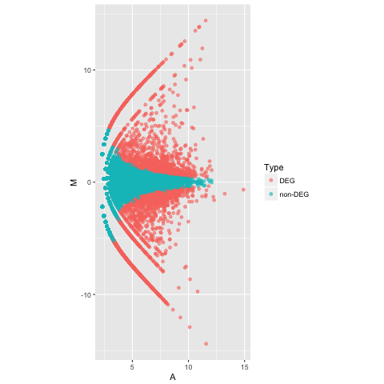
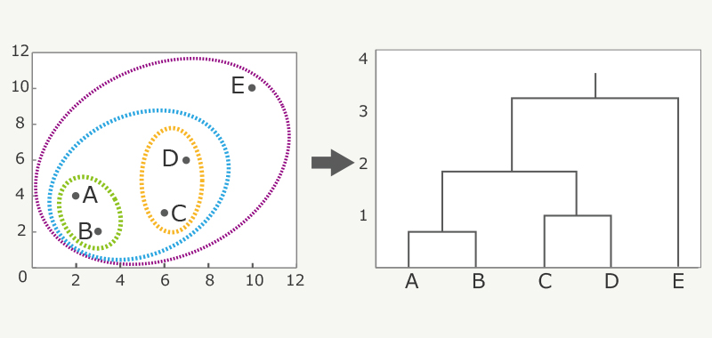
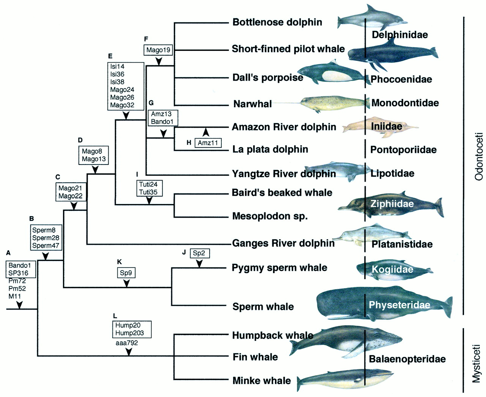
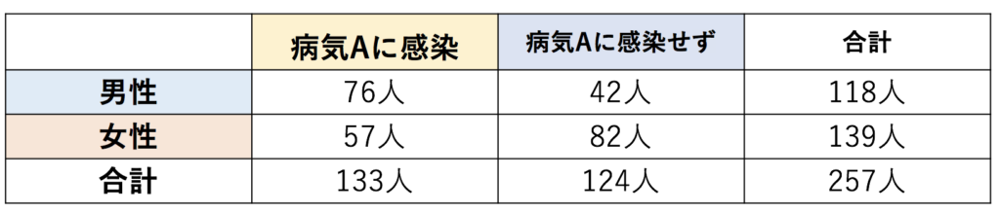

# R入門
## 実習 Part2
さて、Part1で基本的な使い方を一通り学びました。<br>

## パッケージの利用
Rでは前回紹介した様に、三角関数や統計量を求める`sin`,`cos`,`mean`などの便利な関数が標準利用できます。<br>
しかし、より専門的な解析や、論文で発表されたばかりの統計手法などの場合は、もちろん標準では実装されていません。<br>
ただ、そういった場合でも、この様な手法はほとんど「パッケージ」としてまとめられ、公開されています。<br>
よって研究で最新の手法を追う場合や、より複雑な解析を行いたい場合には、パッケージをダウンロードし、Rから利用する形になります。<br>

### パッケージのインストール
パッケージは大抵[CRAN](https://cran.r-project.org)と呼ばれるところで公開されています。<br>
また、生物向けのパッケージは[Bioconductor](http://bioconductor.org)と呼ばれるところで公開されている場合もあります。<br>

#### CRANパッケージのインストール
CRANで公開されているパッケージをインストールするときは`install.packages("パッケージ名")`と打つことで行います。<br>
試しに後に使う予定のggplot2パッケージをインストールしてみて下さい。<br>
`install.packages("ggplot2", dependencies = TRUE)`<br>
dependencies=TRUEにすると、そのパッケージに必要な別のパッケージもまとめてインストールしてくれます。

#### Bioconductorパッケージのインストール
Bioconductorパッケージをインストールする場合は`biocLite`を利用します。<br>
今回は利用する予定はないので、やる必要はないですが、例えば`Biostrings`のインストールは以下の様に行います。
```
source("http://bioconductor.org/biocLite.R")
biocLite("Biostrings")
```

### パッケージの呼び出し
パッケージをインストールした後、利用するには、以下の様にパッケージを呼び出す必要があります。<br>
`library(igraph)`
また、`library()`と打つことでインストールされているパッケージ一覧を表示したり、<br>
`search()`と打つことで、呼び出しているパッケージ一覧を表示することができます。<br>
パッケージの説明やパッケージに含まれている関数を調べたい場合は、`help(package="パッケージ名")`で調べることができます。<br><br>

`library`関数で呼び出したパッケージを消すには`detach(package:パッケージ名)`を利用します。
`detach(package:igraph)`<br><br>

それでは実際にパッケージを利用して行きます。

## グラフ描写
この章では、Rに標準実装されている機能やパッケージを利用してグラフ描写を行っていきます。
### 標準実装されているplot
まずは、パッケージを使わないでグラフを描写する方法を試してみましょう。<br>
Rでもっとも基本的な描写関数は`plot(x軸のデータ, y軸のデータ, オプション)`です。
```
x <- 1:10
y <- c(2, 4, 6, 8, 10, 8, 6, 4, 6, 8)
plot(x, y)                       # 最も簡単な描写

plot(x, y, main="Title Name")    # オプションでタイトルを指定
```
オプションではタイトルやx軸、y軸の設定など様々な設定が行えます。<br>
また、数学関数を指定して、グラフを出力することもできます。<br>
`plot(関数名, 下限, 上限)`
```
plot(sin, -pi, 3*pi)             # sin関数を-π~3πまで描写
```
`persp(x軸データ, y軸データ, z軸データ)`で３次元プロットや、`hist()`と言う関数でヒストグラムを書くことも可能です。<br>
```
x <- 1:10
y <- 1:10
z <- matrix(rnorm(100), 10, 10)  # 正規分布から100個値を抽出し10*10の行列に
persp(x, y, z, theta = 30)       # 3次元グラフを描写

x <- rnorm(50)                   # 一次元データ
hist(x)                          # ヒストグラムを描写
```
このほかに`barplot()`や`boxplot()`、`mosaicplot()`などグラフ描写関数はまだまだたくさんあります。(前回の参考1を見てください。)<br>
しかし、いずれも最低限のグラフ描写のみで、使いこなせれば様々な種類の統計グラフを上手く描写できますが、<br>
綺麗なグラフにするためには、タイトルや色付け・グラフの重ね合わせなど、オプションとなる設定が煩わしいものになっています。<br>
そこで、グラフ描写用のパッケージを利用することで、手軽に綺麗なグラフを描写することが可能となります。
### ggplot2の紹介
グラフ描写系のパッケージとして最もよく利用されていると思われるのが、`ggplot2`です。
まずは基本的な使い方を試してみましょう。
```
library(ggplot2)                                  # パッケージの呼び出し
x <- sort(runif(100, 1, 10))                      # 乱数を利用してサンプルデータを作成
y <- rnorm(100, 50, 10) * sort(runif(100,1, 10))  

df <- data.frame(x=x, y=y)                        # ggplotに代入するためのデータフレームを作成

g <- ggplot(                            
  df,                       # ggplot用のデータ
  aes (
    x = x,                  # x 軸にdf$xを指定
    y = y                   # y 軸にdf$yを指定
  )
)
g <- g +  geom_point()      # 散布図を設定
print(g)                    # ggplotではprint(g)やplot(g)で図を描写します。
```

ggplot2の特徴として、描写レイヤーをどんどん重ねていくという点が挙げられます。<br>
使い方としては、追加したい要素を`g <- g + 追加したい要素()`という形で増やしていく形になります。
例えば、先ほどの散布図にタイトル、x軸ラベル、y軸ラベル、また、近似直線を追加したいとします。その場合
```
library(ggplot2)

x <- sort(runif(1000, 1, 10))
y <- rnorm(1000, 50, 10) * sort(runif(1000,1, 10))
df <- data.frame(x=x, y=y)

g <- ggplot(
  df,                       # ggplot用のデータ
  aes (
    x = x,                  # x 軸に df$x を指定
    y = y                   # y 軸に df$y を指定
  )
)

g <- g +  geom_point(　　　　# 先ほどはgeom_point()と空白でしたが、オプションの設定もできます。
  shape = 20,               # プロットのタイプを指定
  size = 0.8,               # プロットのサイズを指定
  na.rm = TRUE              # 非数値を無視
)

# g <- g + ~~ で近似線、x/y軸ラベル、タイトルを追加します。

g <- g + geom_smooth(       # 近似線
  method = "lm"             # 近似線は回帰法によって求める設定
)
g <- g + xlab("Label X")    # x 軸ラベル
g <- g + ylab("Label Y")    # y 軸ラベル
g <- g + ggtitle("ggplot2") # グラフタイトル

print(g)
```
次はヒストグラムを書いてみましょう。以下のコードが基本となります。<br>
```
library(ggplot2)
df <- data.frame(variable = "CDS", value = rnorm(100, 20, 5))         # 乱数によりデータ生成
g <- ggplot(
  df,
  aes (
    x = value,               # xで数値データを指定
  )
)
g <- g + geom_histogram()    # ヒストグラムを追加
print(g)
```
次に複数のヒストグラムを表示し、密度関数を表示する様に拡張してみましょう。<br>
標準実装されている`hist()`関数で複数のグラフを重ねようとすると非常に手間がかかりますが、ggplotなら楽にできます。
```
library(ggplot2)
data1 <- data.frame(variable = "CDS", value = rnorm(100, 20, 5))      # 乱数によりデータ生成
data2 <- data.frame(variable = "exons", value = rnorm(100, 25, 6))    # 乱数によりデータ生成
data3 <- data.frame(variable = "introns", value = rnorm(100, 45, 6))  # 乱数によりデータ生成
df_sub <- merge(data1, data2, all=T)   # data1,2を結合しています。
df <- merge(df_sub, data3, all=T)      # さらにdata3も結合。          

g <- ggplot(
  df,
  aes (
    x = value,
    y = ..density..,     # 縦軸を密度に設定、..count..にするとヒストグラムに合わせたカウント数に。
    fill = variable,     # fill でカテゴリーごとに分ける
    colour = variable    # 色もカテゴリーごとに変更
  )
)
g <- g + geom_histogram(
  alpha = 0.5,                    # 透明度を 50% にする
  position = "identity"           # カテゴリーごとに描画する
)
g <- g + geom_density(
  alpha = 0                       # 曲線内部の透明度を 100% に
)
print(g)
```
以上、基本的な使い方を紹介しただけですが、使いこなせれば複雑なグラフ描写なども簡単に行うことが可能となります。<br>
今はまだプレゼンやポスター発表等の機会はあまりないかもしれませんが、４回生や修士課程以降に進む予定の方は、<br>
そういった機会も増え、見栄えのするグラフを作成する必要がある機会も増えると思いますので、勉強してみてください。

### 使用例 : MAプロット
RNA-seqを行い得られた遺伝子発現量の可視化に利用されるグラフの一例としてMAプロットがあります。<br>
例）高温条件下で栽培した植物の遺伝子発現量と、対照区で栽培した植物の遺伝子発現量を比較する場合、など。<br>
発現量のデータとして、以下の様なデータを扱うことになります。

| 遺伝子 | 実験群での発現量 | 対照群での発現量 |
|:-----------:|:------------:|:------------:|
| ENSG00000133124 | 0.5517638 | -0.4480722|
| ENSG00000105396 | 0.70196253 | -0.04512949 |
| ENSG00000135144 | 0.5525213 | -0.4353797 |
| : | : | : |
| : | : | : |
| ENSG00000418308 | -0.05246954 | -0.70646699 |

MAプロットというのは、横軸を2グループの発現量の平均値:A値、縦軸を2グループ間の発現量の比:M値として表したもので、<br>
2グループ間における発現量の変動を見ることができます。
```
# https://raw.githubusercontent.com/CropEvol/lecture/develop_sakai/data/L10_rnaseq_data.csvには
# ２グループの発現量データからM, Aを算出したデータが入っている。
library(ggplot2)
x <- read.csv("https://raw.githubusercontent.com/CropEvol/lecture/develop_sakai/data/L10_rnaseq_data.csv", header=TRUE, sep=",")
g <- ggplot(x, aes(x = A, y = M, colour = Type))
g <- g + geom_point(alpha = 0.6)
g <- g + coord_fixed(ratio = 1)
print(g)
```
</div>
### 参考資料
Rのグラフ描写に関しては、R Gpaphical Manualというページが参考になります。<br>
様々なグラフが載っており、使い方やコード例が載っています。<br>
[http://www.imsbio.co.jp/RGM/](http://www.imsbio.co.jp/RGM/)

## 数値解析・統計など
　
### データマイニング
　データマイニングとは、膨大なデータ(鉱山)から意味のあるものを探し出すことを指します。<br>
生物学の世界では、多数の実験要因や様々な条件下で集められたデータを解析する際に用いられる手法となります。<br>
特にゲノムデータの解析では、無数にある遺伝子の中から意味のある遺伝子を選択/効果を予測などする際に、重要な手法と言えます。<br>
　以下一例ですが、パターン認識・階層的クラスタリング・SVM、主成分分析・非負値行列因子分解・潜在意味解析・時系列テンソル解析...etcなどなどたくさん有名な手法があります。各手法扱うにはある程度の数学の知識が前提となるので、今回は図などで見ると分かりやすいと思われる"階層的クラスタリング"について、パッケージを利用して試していこうと思います。

### 階層的クラスタリング
最も似ている組み合わせから順番にまとまり(クラスター)にしていく方法で、最終的に図のような樹形図ができます。<br>
<br>
最初にAからEの中で最も近いAとBをクラスターとする → ABのまとまり+CからEの中で最も近いCとDをクラスターとする→...<br>
このように距離の近いものをクラスターとしてまとめていくことで、特徴のよく似た集団を分類していく手法になります。<br>
マーケティングなどで活用されることも多いですが、何よりも生物学における系統樹が最たる活用例と言えます。
#### 例：系統樹
同一祖先を持っていることを前提としている系統内の個体の子孫関係の推定結果を樹木の枝分岐の形式で示すグラフを系統樹と言います。<br>
生物種や遺伝子などの進化関係を樹木状に表現することによく用いられる。<br>
<br>
(Simon & Schusterら, 1998)<br>
生態学的な研究でも勿論だが、ゲノム解析においても個体間の遺伝子型を系統樹で分類して見ることはよく行われている。<br>
### apeの紹介
系統樹を作成するツールは世の中に数多く存在するが、そのツールによって作成された系統樹は、<br>
あくまでも、ある理論に基づいたもっともらしい推定結果に過ぎない。<br>
今回は生物集団における遺伝子配列データ間の距離に応じて、階層的クラスタリングと同じ手法を用いて系統樹を作成します。<br>
(この手法は距離法と呼ばれており、他に最節約法や最尤法など、様々な手法が存在します。)<br><br>

系統樹を描くときに利用されるパッケージの一つに`ape`があります。<br>
パッケージ`ape`には、`woodmouse`という15個体のアカネズミの塩基配列の一部のデータがサンプルとして用意されています。<br>
今回はこのデータを利用して系統樹を描いてみます。
```
library(ape)                             # ライブラリ読み込む
data(woodmouse)                          # woodmouseデータを読み込む

dist.dna(woodmouse[1:5,], model="K80")   # 個体1~5の遺伝子間距離をモデルK80で求める。
```
ここで`K80`と言うモデルを使用していますが、遺伝子間距離を求める方法では、塩基置換の比率に関して仮定を置く必要があり、<br>
K80やF81,TN93等、幾つかのモデルが存在しています。<br>
このように、数値解析系のパッケージでは、今回の`dist.dna(データ, オプション)`のような形で、パッケージ特有の関数にデータを渡すだけで、計算を行ってくれるという形が多いです。<br><br>
では実際に階層的クラスタリング法を使った系統樹を描いてみましょう。<br>
```
library(ape)
data(woodmouse)

wm.d<-dist.dna(woodmouse, model="K80")   # 全個体間の遺伝子間距離をモデルK80で求める。
wm.hc<-hclust(wm.d, "average")           # 距離に応じてクラスター解析を行う
wm.phy<-as.phylo(wm.hc)                  # クラス分類されたデータを系統樹状に変換
plot(wm.phy)                             # 描写
```
遺伝子間距離を求めるモデルを変更してみて、系統樹がどうなるか試してみてください。
#### 参考
系統樹の描写に関しても、表示の方法やデザインのための関数`tiplabels`や`nodelabels`などがある。
```
library(ape)
data(woodmouse)
wm.d<-dist.dna(woodmouse, model="K80")
wm.hc<-hclust(wm.d, "average")
wm.phy<-as.phylo(wm.hc)
lab<-c(rep(10,3),rep(11,2),rep(12,3), rep(13,7))　#印の番号を作成する
plot(wm.phy, "p", FALSE, font = 1, label.offset = 2,x.lim = 20, no.margin = TRUE)
tiplabels(pch =lab,col =lab, adj = 1.5, cex = 2)
nodelabels(wm.phy$node.label,adj=0, cex=1.3)
```
また、系統樹が大きい場合、一部を切り取って表示する関数`zoom`がある。
```
data(chiroptera)     # 複数種のコウモリの系統樹データ
zoom.p<- list(grep("Plecotus", chiroptera$tip.label),　grep("Dobsonia", chiroptera$tip.label))
zoom(chiroptera, zoom.p, cex=1.5)
```
### その他のデータマイニングの手法について
　系統樹を階層クラスタリングの身近な例として取り上げましたが、その他のデータマイニングの手法に関しても、<br>
複数の実験条件下でどの条件が最も影響しているかを調べる場合(特徴抽出)など、生物実験や生物データ解析に利用される手法はたくさんあります。<br>
ただ、専門性が高く汎用的とは言えないないようになってしまうので、その他の手法に関してはいくつかを紹介程度に参考に載せておきます(※参考2)。

## 特殊なグラフ例：ネットワーク解析
生物学の世界ではネットワーク解析というものが行われることがあります。<br>
複数の遺伝子がどの様に影響しあい、関連を持っているのか調べるための解析です。<br>
遺伝子だけに限らず、アミノ酸同士の関わりやタンパク質のつながりなど、様々な物質のレベルでネットワーク解析は行われています。<br>
今回は遺伝子のネットワーク解析を実際にRで行ってみましょう。
### 遺伝子ネットワーク
遺伝子の解析を行う際に重要な要素として、遺伝子間のつながりが挙げられます。<br>
ex) ある遺伝子が発現するためには他の遺伝子が必要なのか？、ある遺伝子の発現を抑制する遺伝子はあるのか？...etc<br>
遺伝子の間のつながりを表現したものが遺伝子ネットワークとなります。<br>
！！！ここに図！！！<br>

遺伝子間のつながりを調べる方法はいくつもありますが、わかりやすいものとしては、(RNA-seqの結果などの)発現変動の相関です。<br>
遺伝子の発現量を見た時に、遺伝子Aと遺伝子Bの発現が同じように増減している場合、遺伝子AとBは関連のある遺伝子である可能性が高いと言えます。(※共発現解析)<br>
!!!!っこ子に図!!!!!
このような関係を全ての遺伝子の組み合わせで数値化し、グラフを作成します。
### igraphの紹介
こうしたネットワークの様な図を作成するライブラリとしては、`igraph`というものがあります。<br>
まずは遺伝子間の共発現を調べ、その結果をネットワーク図にするという形になります。<br>
```
counts <- read.csv("https://raw.githubusercontent.com/CropEvol/lecture/develop_sakai/data/L10_rnaseq_data2.csv",header=TRUE,row.names=1)

library(reshape2)
cc[upper.tri(cc)] <- NA
diag(cc) <- NA
cc.df <- melt(cc)
cc.df <- cc.df[!is.na(cc.df[,3]), ]

head(cc.df)
```
この様に`igraph`では、一列目と二列目の間の関係(今回は相関係数)を三列目に記入したデータを用います。
```
library(igraph)
cc.df.sig <- cc.df[abs(cc.df[, 3]) > 0.75, ]

g <- graph.data.frame(cc.df.sig[, 1:2], directed = F)

# グラフ描画パラメーターの調整
num.of.v <- length(V(g))
V(g)$size  <- rep(5, num.of.v)
V(g)$color <- rep("#E41A1C", num.of.v)
V(g)$shape <- rep("circle", num.of.v)
V(g)$label <- names(as.list(V(g)))
V(g)$label.cex   <- rep(0.5, num.of.v)
V(g)$label.color <- rep("black", num.of.v)

plot(g)
```

### グラフ理論
こうしたネットワークはグラフ理論というものの応用例です。グラフ理論とは組み合わせの問題を簡潔に記述するための理論になります。<br>
ここで言うグラフとは点(ノード)とそれらを結ぶ線(エッジ)によって表される対象になります。<br>
グラフ理論という分野で大きな１つの研究分野が成り立つほど様々な活用・研究がなされているので、興味のある方は調べてみてください。<br>
！！！！ここに図！！！！
有名な例として、Googleの検索結果で上位に来るものをどの様にして選ぶかという問題で、このグラフ理論によるPageRankが用いられていました。

## PythonとRの連携
これまでPythonとRの基本的な使い方について学んできましたが、これらを連携させることも可能です。最後にその方法を紹介しておきます。<br>
Pythonでデータの整理をして、Rで統計解析を行うといったような使い方をする場合、<br>
Pythonでデータを整理してcsvやtxtファイルで出力 → Rから出力したファイルを読み込み解析、という手順でも良いですが、<br>
Pythonでデータを整理し、PythonからRのコードを動かし処理することで、余分な作業を減らすことができます。
```

```
## 参考

### <参考1> 統計検定・解析
Rでは統計検定や解析をとても簡単に行うことができます。みなさんがの統計学的な知識がどの程度かは人それぞれだと思いますので、<br>
今回は参考という形で載せておきます。<br>
(※ただしどの様な理論のもと検定などが行われているかを理解しておくのは非常に重要です。)<br>

統計解析に関するパッケージは起動時に既にいくつかインストールされています。<br>
また行いたい検定や解析があればGoogleなどで、"R xx検定" の様に調べれば大抵実行方法が載っているので調べてみましょう。<br>

以下幾つかの例を載せておきます。
#### 例1) 平均値の差の検定 : t検定
2群間の平均値の差を検定したい場合、`t.test(A群, B群, 等分散性)`の関数によって検定を行う。
```
x <- c(20.5, 5.3, 12.4, 2.9, 12.3, 6.7, 2.1, 13.1)
y <- c(2.4, 16.1, 21.0, 10.9, 20.6, 25.7, 24.2, 18.0)

t.test(x, y, var.equal = TRUE)
```

#### 例2) 単回帰分析
`lm`関数によって目的変数yと説明変数xに関してy = βx + eとなる回帰係数βを計算。またβ=0のt検定も行う。
```
y <- c(1,3,4,10,5,1,3,14,21)
x <- c(10,20,10,40,50,10,10,20,70)
ans <- lm(y~x)
summary(ans)
```

#### 例3) 重回帰分析
`lm(目的変数~説明変数１+説明変数2+説明変数３...)`という形で重回帰分析は行います。
```
df <- read.csv("https://raw.githubusercontent.com/CropEvol/lecture/develop_sakai/data/L10_mouse_data.csv",header=T,row.names=1)
head(df)                             # データの確認
# 年齢 血圧 肺活量 性別 病気 体重
# 1    2  110   4300    M    1   79
# 2    3  128   4500    M    1   65
# 3    4  104   3900    F    0   53
# 4    2  112   3000    F    0   45
# 5    2  108   4800    M    0   80
# 6    2  126   3800    F    0   50
ans <- lm(df$肺活量~df$血圧+df$体重)
summary(ans)
```

#### 例4) 独立性の検定 : カイ二乗検定
例:病気Aと性別の間に関連性はあるか？ → 性別と病気Aの独立性を検定<br>
<br>
```
x = matrix(c(76,42,57,82),2,2)  # aという行列を作成
chisq.test(x)                   # カイ二乗検定を実施
```

### <参考2> データマイニング手法の紹介
