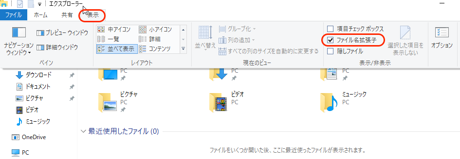
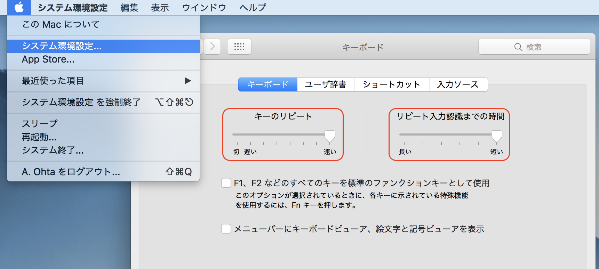

# 解析環境セットアップ
1. [パソコンのスペック確認](#section1)
1. [パソコンの設定変更](#section2)
1. [Python本体のインストール](#section3)
1. [Pythonパッケージのインストール](#section4)
1. [テキストエディタのインストール](#section5)

---
<a name="#section1"></a>
## 1. パソコンのスペック確認
### Windows 10 / 8.1 / 8  
- 確認方法:  
    スタートボタン > 設定 > システム > バージョン情報
- 確認項目:  
    システムの種類：32ビット / 64ビット

### Windows 7  
- 確認方法:  
    スタートボタン > コンピュータを右クリック > プロパティ
- 確認項目:  
    システムの種類：32ビット / 64ビット

<div style="margin-bottom: 5px;">  </div>

### Mac
- 確認方法: メニューバーのアップルロゴ > このMacについて
- 確認項目: とくに確認する必要はありません。

---

<div style="page-break-before:always"></div>

<a name="#section2"></a>
## 2. パソコンの設定変更

　Windowsパソコンの場合、ファイル拡張子（.txtなど）が表示されるように変更します。Macパソコンの場合、ターミナル等でカーソル移動速度が早くなるように変更します。

### Windows 10 / 8.1 / 8  
1. 適当なフォルダを開きます
1. 「表示」タブ > 「ファイル名拡張子」にチェック

### Windows 7
1. 適当なフォルダを開きます
1. 左上付近にある「整理」
1. フォルダと検索のオプション
1. 表示
1. 「登録されている拡張子は表示しない」のチェックを外します

<div style="margin-bottom: 5px;"></div>
</div>

### Mac

1. システム環境設定 > キーボード > 以下変更
1. 「キーのリピート」を"速い"
1. 「リピート入力認識までの時間」を"短い"

<div style="margin-bottom: 5px;"></div>

---

<div style="page-break-before:always"></div>

<a name="#section3"></a>
## 3. Python3のインストール
　Miniconda3と呼ばれるものをパソコンにインストールすることで、Python3がインストールできます。

### Windows
1. Miniconda3のインストーラをダウンロード
    [https://conda.io/miniconda.html](https://conda.io/miniconda.html)
    * 旧バージョンをインストールしたい場合  
    [https://repo.continuum.io/miniconda/](https://repo.continuum.io/miniconda/)
2. ダウンロードしたファイル（.exe）を実行
3. Advanced Optionの1箇所以外はとくに変更せず、インストール
    * <span style="color: red; ">「Add Anaconda to my PATH environment variable」にチェックを入れてください。</span>
    * インストールフォルダを選択する画面から先に進めない場合は、ひとつ前の選択肢に戻り、「All Users」を選んでください。

<div style="margin-bottom: 5px;"></div>  


### Mac
　Macには元々Python2がインストールされていますが、Python3をインストールします。初期から入っているPython2を残しつつ新たにPython3をインストールするために、まずpyenvというものをインストールします。その後、Python3 (Miniconda3)をインストールします。

　_Python3をインストールするなら、Python2は不要じゃないか、と思うかもしれませんが、ゲノム解析にはPython2も必要です。現在でも広く使われているゲノム解析用ソフトのいくつかは、Python2でのみ動作します。_  
　_pyenvは、異なるバージョンのPythonをインストールおよび切り替えをおこなえるようにするバージョン管理ツールです。詳細は調べてください。_

　コマンドで、Homebrew > pyenv > Miniconda3 の順にインストールしていきます。

1. ターミナル起動
1. Homebrewがインストール済みか確認  
    `brew --version`
    * Homebrew 1.3.2のようにバージョン情報が出る場合は、5へ進んでください。
1. Homebrewをインストール
    このWebページ（[https://brew.sh/index_ja.html](https://brew.sh/index_ja.html)）の一行をコピーして、貼り付けてください。  
1. Homebrewをアップデート  
    `brew update --force && brew upgrade`
1. pyenvをインストール  
    `brew install pyenv`
1. 以下3行を入力（<span style="color: red; ">一字一句間違わないように！</span>）

```bash
echo 'export PYENV_ROOT="$HOME/.pyenv"' >> ~/.bash_profile
echo 'export PATH="$PYENV_ROOT/bin:$PATH"' >> ~/.bash_profile
echo 'eval "$(pyenv init -)"' >> ~/.bash_profile
```

7. 一度ターミナルを閉じて、再びターミナルを起動

7. インストール可能なMiniconda3を確認
    `pyenv install --list | grep 'miniconda3'`
7. 最新のMiniconda3のインストール
    `pyenv install miniconda3-4.3.11`
    （2017年11月11日現在）
7. Miniconda3を使用可能にする
    `pyenv global miniconda3-4.3.11`

---

<div style="page-break-before:always"></div>

<a name="#section4"></a>
## 4. Pythonパッケージのインストール
　よく使うパッケージをインストールします。WindowsとMacどちらでもコマンドは同じです。

### Windows
- スタートボタン > Miniconda3 > Anaconda Prompt > 右クリック > <span style="color: red;">管理者として実行</span>
- 以下のコマンドを入力してください。

### Mac
- ターミナル起動
- 以下のコマンドを入力してください。

```bash
conda install -y pip
conda install -y numpy
conda install -y scipy
conda install -y pandas
conda install -y scikit-learn
conda install -y matplotlib
conda install -y seaborn
conda install -y ipython
conda install -y jupyter
conda install -y Biopython
```

パッケージをアンインストールするときは、

```bash
conda uninstall <パッケージ名>
```

---

<div style="page-break-before:always"></div>

<a name="#section5"></a>
## 5. テキストエディタのインストール
　ゲノム解析やプログラミングでは、軽量なテキストエディタがあると、何かと役立ちます。Windowsではサクラエディタを、Macではmiをインストールします。

### Windows
1. サクラエディタ公式ページ  
    [http://sakura-editor.sourceforge.net/download.html](http://sakura-editor.sourceforge.net/download.html)
1. V2(Unicode版)をダウンロード
1. ダウンロードしたファイル（.exe）を実行
1. 特に何も変更せず進み、インストール
    - 途中のオプション選択で以下の項目にチェックを入れておくと便利です。
        - デスクトップにアイコンを作成
        - 「SAKURAで開く」メニューの追加


<div style="margin-bottom: 5px;"></div>
</div>

### Mac
1. miのダウンロードページ  
[https://www.mimikaki.net/download/index.html](https://www.mimikaki.net/download/index.html)
1. 最新版をダウンロード
1. ダウンロードしたファイルをダブルクリック
1. miアイコンをApplicationsにドラッグして移す

  
</div>

---

## データのダウンロード
1. 以下のページにいってください  
[https://github.com/Serulab/Py4Bio](https://github.com/Serulab/Py4Bio)
1. Clone or Download
1. Download Zip
1. ダウンロードしたファイルを解凍（展開）してください
1. 解凍後のフォルダをデスクトップに移してください

---

[Jupyter Notebookの使い方](./M02_JupyterNotebook.md) へ
