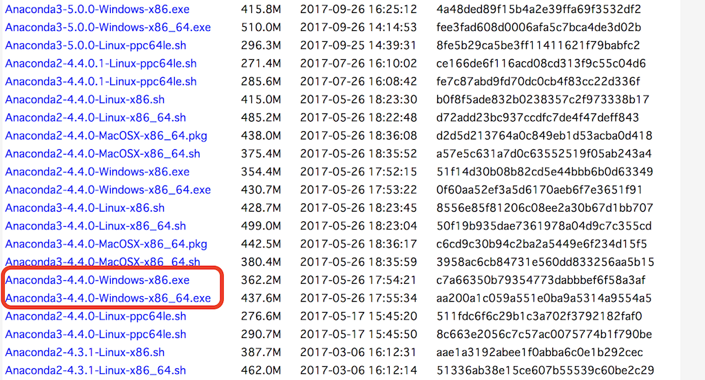
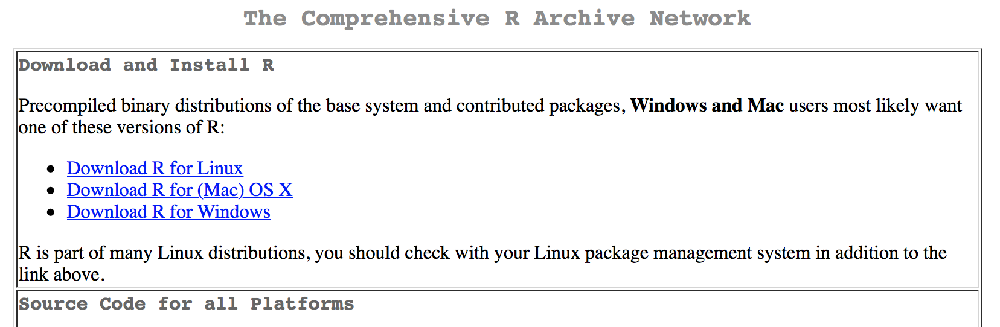
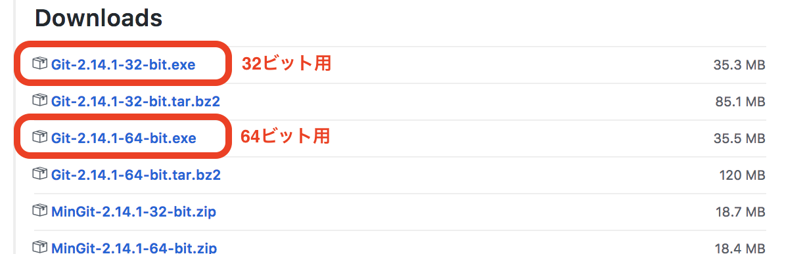
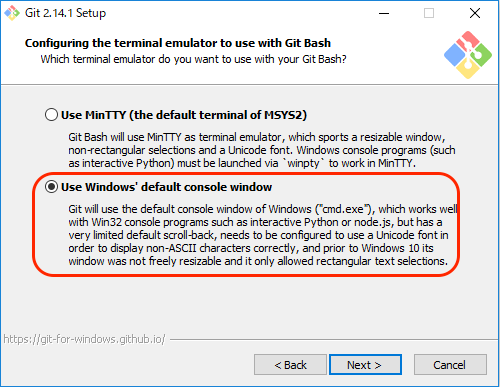
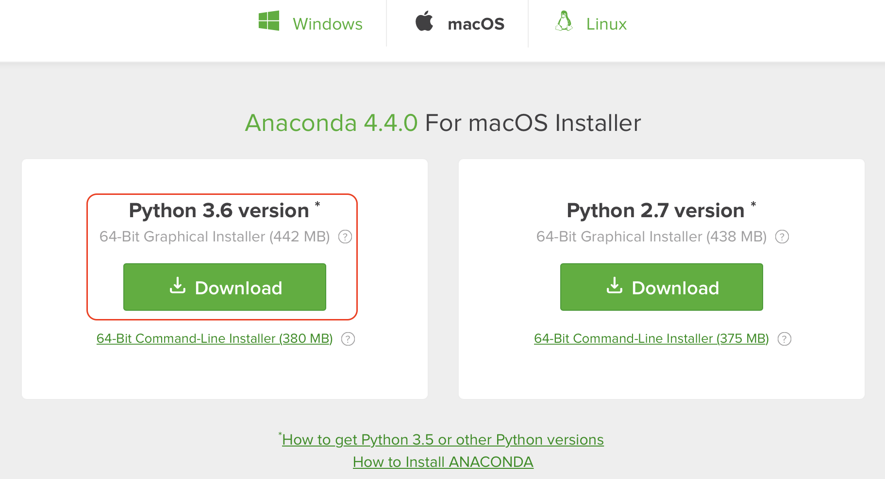

# 01. ゲノム情報解析入門の準備
　次世代シークエンサーで研究対象の生物のゲノム配列を読んだ場合、シークエンサーからは大量のデータが得られます。そのデータを扱うためには、UNIXと呼ばれるパソコン操作やプログラミングがどうしても必要になってきます。本講義の演習では、各自のパソコンを使って、ゲノム解析の基盤となる知識や技術を勉強していきます。これから学ぶこと（とくにプログラミング）は、研究などの様々な場面でも、みなさんを助けてくれるでしょう。  

---
　はじめに、演習で使うソフトウェアのインストールをしていきます。

◯ Windows  <span style="color: red;">（Windows 7以降を想定しています）</span>
1. [パソコンの情報確認](#section1)
1. [パソコンの設定変更](#section2)
1. [テキストエディタのインストール](#section3)  
1. [Pythonのインストール](#section4)  
1. [Rのインストール](#section5)
1. [UNIX風環境のインストール](#section6)
1. [講義用フォルダの作成](#section7)

◯ Mac
1. [パソコンの情報確認](#section8)
1. [パソコンの設定変更](#section9)
1. [テキストエディタのインストール](#section10)  
1. [Pythonのインストール](#section11)  
1. [Rのインストール](#section12)
1. [講義用フォルダの作成](#section13)

◯ [Pythonプログラミング用ノートブックの起動](#section14)  

◯ [課題](#section15)

<div style="page-break-before:always"></div>

---
## ◯ Windowsの場合
### <a name="section1">1. パソコンの情報確認</a>
　自身のパソコンの情報を確認しましょう。

<div style="padding: 10px; margin-bottom: 10px; border: 1px solid #333333; border-radius: 10px;">
<p>パソコン情報の確認</p>

[Windows 10 / 8.1 / 8]  
<ol>
<li>スタートボタン（左下のWindowsロゴ）</li>
<li>設定</li>
<li>システム</li>
<li>バージョン情報</li>
</ol>

[Windows 7]  
<ol>
<li>スタートボタン（左下のWindowsロゴ）</li>
<li>コンピュータを右クリック</li>
<li>プロパティ</li>
</ol>

パソコンの情報画面が開いたら、次の項目を確認しましょう。
<ul>
<li>Windowsのエディション：Windows 10 / 8.1 / 8 / 7 など</li>
<li>システムの種類：32ビット / 64ビット</li>
<li>メモリ（RAM）：？GB</li>
</ul>

<div style="margin-bottom: 5px;"></div>

<div style="margin-bottom: 5px;"></div>

<div style="margin-bottom: 5px;"></div>
</div>

<div style="page-break-before:always"></div>

### <a name="section2">2. パソコンの設定変更</a>
　パソコンの設定を一部変更します。

<div style="padding: 10px; margin-bottom: 10px; border: 1px solid #333333; border-radius: 10px;">
<p>ファイル拡張子（.txtなど）の表示設定</p>

[Windows 10 / 8.1 / 8]  
<ol>
<li>適当なフォルダを開きます。</li>
<li>上部にある「表示」タブ</li>
<li>ファイル名拡張子にチェックを入れます</li>
</ol>

[Windows 7]
<ol>
<li>適当なフォルダを開きます</li>
<li>左上付近にある「整理」</li>
<li>フォルダと検索のオプション</li>
<li>表示</li>
<li>「登録されている拡張子は表示しない」のチェックを外します</li>
</ol>

<div style="margin-bottom: 5px;"></div>
</div>

<div style="page-break-before:always"></div>

### <a name="section3">3. テキストエディタのインストール</a>
　テキストエディタとは、文字を書くことに特化したソフトウェアです。プログラムを書く時に使います。すでに何らかのエディタをインストール済みの場合は、慣れているエディタを使ってください  
<span style="color: red;">* Microsoft Wordやメモ帳、ワードパッドはプログラミングには不向きです。それらしかない場合、ここでテキストエディタをインストールしてください。</span>  

<div style="padding: 10px; margin-bottom: 10px; border: 1px solid #333333; border-radius: 10px;">
<p>サクラエディタのインストール</p>
<ol>
<li>サクラエディタ公式ページ（<a href="http://sakura-editor.sourceforge.net/download.html">http://sakura-editor.sourceforge.net/download.html</a>）へ</li>
<li>V2(Unicode版)をダウンロード</li>
<li>ダウンロードしたファイル（.exe）をダブルクリック</li>
<li>特に何も変更せず進み、インストール</li>
※「追加タスクの選択」で  『デスクトップにアイコンを作成』 と 『「SAKURAで開く」メニューの追加』 にチェックを入れておくと便利です。
<li>完了</li>
</ol>
<div style="margin-bottom: 5px;"></div>
</div>

<div style="padding: 10px; margin-bottom: 10px; border: 1px solid #333333; border-radius: 10px;">
サクラエディタ以外のテキストエディタ
<li> TeraPad（<a href="http://www5f.biglobe.ne.jp/~t-susumu/library/tpad.html">http://www5f.biglobe.ne.jp/~t-susumu/library/tpad.html</a>）</li>
<li> Notepad++（<a href="https://notepad-plus-plus.org/">https://notepad-plus-plus.org/</a>）</li>
<li> Atom（<a href="https://atom.io/">https://atom.io/</a>）※ 動作は重いが高機能</li>
</div>

<div style="page-break-before:always"></div>

### <a name="section4">4. Pythonのインストール</a>
　講義では、プログラミング言語として「Python」を使います。  
　ここではAnacondaとよばれるツールを使って、Pythonをインストールします。

<div style="padding: 10px; margin-bottom: 10px; border: 1px solid #333333; border-radius: 10px;">
<p>Pythonのインストール</p>
<ol>
<li>Anacondaのダウンロードページ（<a href="https://repo.continuum.io/archive/">https://repo.continuum.io/archive/</a>）へ</li>
<li>「Anaconda3-4.4.0-Windows-x86_64.exe」をダウンロード（64ビットの場合）</li>
※ 32ビットパソコンの場合、「Anaconda3-4.4.0-Windows-x86.exe」をダウンロード  
※ 最新版「5.0.0」よりも「4.4.0」の方が上手くインストールできる場合が多いです。
<li>ダウンロードしたファイル（.exe）をダブルクリック</li>
<li>Advanced Optionの1箇所以外、特に変更せず進み、インストール</li>
※「Add Anaconda to my PATH environment variable」にチェックを入れてください
<li>完了</li>
</ol>

<div style="margin-bottom: 5px;"></div>

<div style="margin-bottom: 5px;"></div>  
</div>

<div style="page-break-before:always"></div>

### <a name="section5">5. Rのインストール</a>
　「R」は統計解析によく使われるソフトウェアおよびプログラミング言語です。

<div style="padding: 10px; margin-bottom: 10px; border: 1px solid #333333; border-radius: 10px;">
<p>Rのインストール</p>
<ol>
<li>Rのダウンロードページ（<a href="https://cloud.r-project.org/">https://cloud.r-project.org/</a>）へ</li>
<li>「Download R for Windows」>「base」>「Download R 3.4.1 for Windows」</li>
<li>ダウンロードしたファイルをダブルクリック</li>
<li>特に何も変更せず進み、インストール</li>
<li>完了</li>
</ol>

<div style="margin-bottom: 5px;"></div>  
</div>

<div style="page-break-before:always"></div>

### <a name="section6">6. UNIX風環境のインストール</a>
　UNIXコマンド練習用に、UNIX風の環境を準備します。  
　UNIX風環境を準備するために、Gitというソフトをインストールします。  
　
<div style="padding: 10px; margin-bottom: 10px; border: 1px solid #333333; border-radius: 10px;">
<p>UNIX風環境のインストール</p>
<ol>
<li>Gitのダウンロードページ（<a href="https://github.com/git-for-windows/git/releases/tag/v2.14.1.windows.1">https://github.com/git-for-windows/git/releases/tag/v2.14.1.windows.1</a>）へ</li>
<li>「Git-X.YY.Z-32-bit.exe」または「Git-X.YY.Z-64-bit.exe」をダウンロード</li>
<span style="color: red;">※ [1. パソコンの情報確認]で調べたシステムの種類（32ビット or 64ビット）に合うものをダウンロードしてください。</span>
<li>ダウンロードしたファイルをダブルクリック</li>
<li>以下を選択してインストール</li>

    - Adjusting your PATH environment  
    Use Git from the Windows Command Prompt（中央の選択肢）

    - Configuring the line ending conversions  
    Checkout as-is, commit Unix-style line endings（中央の選択肢）

    - Configuring the terminal emulator to use with Git Bash  
    Use Windows's default console window（下の選択肢）

    * その他の選択肢は変更しなくても良いです

<li>完了</li>
</ol>

<div style="margin-bottom: 5px;"></div>

<div style="margin-bottom: 5px;"></div>

<div style="margin-bottom: 5px;"></div>

<div style="margin-bottom: 5px;"></div>
</div>

### <a name="section7">7. 講義用フォルダの作成
<div style="padding: 10px; margin-bottom: 10px; border: 1px solid #333333; border-radius: 10px;">
デスクトップ画面に、講義用フォルダを作成してください。  
ここではフォルダ名を「genome」とします。<span style="color: red;">* 半角英数</span>
</div>

[ページの先頭へ](#section0)

<div style="page-break-before:always"></div>

---

## ◯ Macの場合

### <a name="section8">1. パソコンの情報確認</a>

<div style="padding: 10px; margin-bottom: 10px; border: 1px solid #333333; border-radius: 10px;">
<p>パソコン情報の確認</p>
<ol>
<li>メニューバーのアップルロゴ > このMacについて</li>
</ol>

情報画面が開いたら、次の項目を確認しましょう。
<ul>
<li>macOS：Sierra / El Capitan / Yosemite など</li>
<li>バージョン：XX.YY.ZZ</li>
</ul>

<div style="margin-bottom: 5px;"></div>
</div>

<div style="page-break-before:always"></div>

### <a name="section9">2. パソコンの設定変更</a>
<div style="padding: 10px; margin-bottom: 10px; border: 1px solid #333333; border-radius: 10px;">
<p>ターミナルのカーソル移動速度の変更</p>
<ol>
<li>システム環境設定 > キーボード > 以下のように変更（6）</li>
<ul>- 「キーのリピート」を"速い"</ul>
<ul>- 「リピート入力認識までの時間」を"短い"</ul>
</ol>

<div style="margin-bottom: 5px;"></div>
</div>

<div style="page-break-before:always"></div>

### <a name="section10">3. テキストエディタのインストール</a>
<div style="padding: 10px; margin-bottom: 10px; border: 1px solid #333333; border-radius: 10px;">
<p>miのインストール</p>
<ol>
<li>miのダウンロードページ（<a href="https://www.mimikaki.net/download/index.html">https://www.mimikaki.net/download/index.html</a>）へ</li>
<li>最新版をダウンロード</li>
<li>ダウンロードしたファイルをダブルクリック</li>
<li>miアイコンをApplicationsにドラッグ</li>
</ol>

  
</div>

<div style="padding: 10px; margin-bottom: 10px; border: 1px solid #333333; border-radius: 10px;">
mi以外のテキストエディタ
<li>Sublime Text（<a href="http://www.sublimetext.com/">http://www.sublimetext.com/</a>）</li>
<li>CotEditor（<a href="https://coteditor.com/">https://coteditor.com/</a>）</li>
<li>Atom（<a href="https://atom.io/">https://atom.io/</a>）</li>
</div>

<div style="page-break-before:always"></div>

### <a name="section11">4. Pythonのインストール</a>
<div style="padding: 10px; margin-bottom: 10px; border: 1px solid #333333; border-radius: 10px;">
<p>Pythonのインストール 方法1</p>
<ol>
<li>Anacondaのダウンロードページ（<a href="https://www.anaconda.com/download/">https://www.anaconda.com/download/</a>）へ</li>
<li>「Python 3.6 version（64-Bit Graphical Installer）」をダウンロード</li>
<li>ダウンロードしたファイルをダブルクリック</li>
<li>特に何も変更せず進み、インストール</li>
<li>完了</li>
</ol>

  
</div>

<div style="padding: 10px; margin-bottom: 10px; border: 1px solid #333333; border-radius: 10px;">

<p>Pythonのインストール 方法2</p>
<p>* この方法を使ってインストールすれば、anaconda2（Python2）など異なるバージョンのpythonに適宜切り替えることができます。</p>

<ol>
<li>Homebrew公式ページ（<a href="https://brew.sh/index_ja.html">https://brew.sh/index_ja.html</a>）へ</li>
<li>Homebrew公式ページの「このスクリプトをターミナルに貼り付け実行して下さい。」が指すスクリプト一行をコピー</li>

    /usr/bin/ruby -e "$(curl -fsSL https://raw.githubusercontent.com/Homebrew/install/master/install)"

<li>ターミナルを開き、コピーしたスクリプトを貼り付けて、実行します</li>
<li>続いて、ターミナルに次の1行を入力し実行します</li>

    brew install pyenv

<li>ターミナルに次の3行を入力します（1行ずつ実行）</li>

    echo 'export PYENV_ROOT="$HOME/.pyenv"' >> ~/.bash_profile<br>
    echo 'export PATH="$PYENV_ROOT/bin:$PATH"' >> ~/.bash_profile<br>
    echo 'eval "$(pyenv init -)"' >> ~/.bash_profile

<li>ターミナルを一度閉じ、再度開きます</li>
<li>ターミナルに以下を入力し、最新版のanaconda3を確認します（2017年10月10日現在では、anaconda3-4.3.1が最新）</li>

    pyenv install -l | grep anaconda3

<li>ターミナルにを入力しanaconda3をインストールします（インストール完了まで時間がかかります）</li>

    pyenv install anaconda3-4.3.1

<li>最後に、ターミナルに以下を入力して完了です</li>

    pyenv global anaconda3-4.3.1

</ol>

</div>

### <a name="section12">5. Rのインストール</a>
<div style="padding: 10px; margin-bottom: 10px; border: 1px solid #333333; border-radius: 10px;">
<p>Pythonのインストール</p>
<ol>
<li>Rのダウンロードページ（<a href="https://cloud.r-project.org/">https://cloud.r-project.org/</a>）へ</li>
<li>「Download R for (Mac) OS X」> 最新版の「R-X.Y.Z.pkg」</li>
※ 2017年9月10日現在ではR-3.4.1が最新版
<li>ダウンロードしたファイルをダブルクリック</li>
<li>特に何も変更せず進み、インストール</li>
<li>完了</li>
</ol>

<div style="margin-bottom: 5px;"></div>  
</div>

### <a name="section13">6. 講義用フォルダの作成
<div style="padding: 10px; margin-bottom: 10px; border: 1px solid #333333; border-radius: 10px;">
デスクトップ画面に、講義用フォルダを作成してください。  
ここではフォルダ名を「genome」とします。<span style="color: red;">* 半角英数</span>
</div>

[ページの先頭へ](#section0)

<div style="page-break-before:always"></div>

---

## ◯ <a name="section14">Pythonプログラミング用ノートブックの起動</a>
Windows  
1. デスクトップ上のgenomeフォルダを開きます
1. 右クリックで「Git Bash Here」を選びます。  
背景が黒い画面（ここでは「ターミナル」と呼びます）が開きます
1. 開いたターミナル上に `jupyter notebook` と入力し、Enterキーを押します
1. Jupyter Notebookのホーム画面が開きます
1. ホーム画面右上で「New > Python」を選ぶと、Python用ノートブックが開きます

Mac  
1. ターミナルを開きます
1. `cd Desktop` と入力し、Enterキーを押します
1. `jupyter notebook` と入力し、Enterキーを押します
1. Jupyter Notebookのホーム画面が開きます
1. ホーム画面右上で New > Python3 を選ぶと、Python用のノートブック開きます

Jupyter Notebookを閉じるとき  
1. ブラウザで開いているノートブックを閉じます
1. ターミナルで `Ctrl + C` を入力します  
（閉じるかどうか聞かれる場合は「y」を入力する）
1. ターミナルを閉じます

[ページの先頭へ](#section0)

<div style="page-break-before:always"></div>

---

## ◯ 課題
<span style="color: red;">* 課題の提出は不要です。</span>
1. デスクトップ上のgenomeフォルダで、ターミナルを開いてください。
1. genomeフォルダ上で「Jupyter Notebook」を起動してください。
1. Python用ノートブックに`print('Hello, Python')`を入力し、Shift + Enterを押してください。その実行結果を確認してください。
1. Python用ノートブックに下記のプログラムを書き、Shift + Enterを押してください。その実行結果を確認・考察してください。

```python
A = 2
print('A')
print(A)
print('A + 3')
print(A + 3)

B = 'Kyoto'
print('B')
print(B)
print('B + Daigaku')
print(B + 'Daigaku')
```

[ページの先頭へ](#section0)

---

講義テキストURL: [https://github.com/CropEvol/lecture](https://github.com/CropEvol/lecture)

Copyright&copy; 2017 [Crop Evolution Lab., Kyoto Univ.](http://www.crop-evolution.kais.kyoto-u.ac.jp/) All rights reserved.
