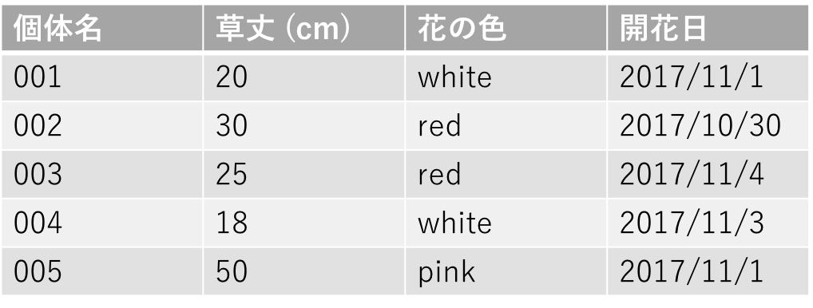
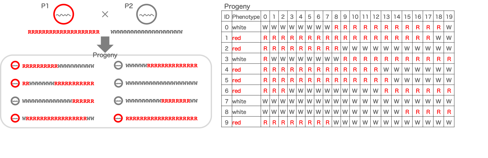
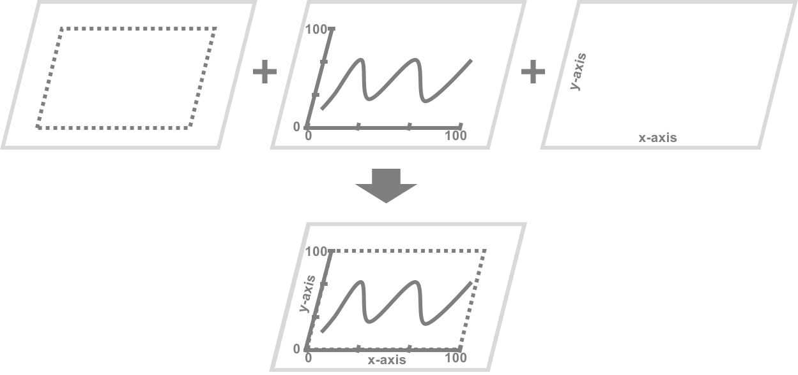

# 大規模データ解析入門2

## Pythonを使ったデータ解析
　今回は、Pandasと呼ばれる便利なライブラリ（拡張パッケージみたいなもの）を使って、テキストファイルを読み込み、データ解析します。最後にはグラフも描画します。

- [Pandasについて](#section1)
- [取り扱うデータ](#section2)
- [演習](#section3)

<a name="section1"></a>
### Pandasについて
　Pandasは、図のようなテーブルの取り扱いを得意としたライブラリです。図では、一行に１個体分のデータがあり、各列にはその列名に関するデータが並んでいます。  このような構造のデータを、Pandasでは __データフレーム__ と呼んでいます。

<div style="margin-bottom: 5px;"></div>

　Pandasを使うと、次のような処理が可能になります。

- for文を使わずに列同士の演算や、列の値の集計ができます。
- if文を使わずに条件に合うデータのみを抽出できます。

Pandasは高速処理されるように設計されているため、自身でfor文やif文を書いたコードよりも、Pandasを使ったコードの方がデータ処理速度は早いです(*1)。また、上のような処理が一行のコードでできるため、書くコードの量も少なくて済みます。  

_*1 Pandasが苦手とするような処理（時間がかかる処理）もあります。_

<div style="page-break-before:always"></div>

<a name="section2"></a>
### 取り扱うデータ
　今回は仮想の生物のゲノム解析で得られたデータを扱います。この仮想生物は染色体を1本だけもつ一倍体生物で、赤色と白色の個体がいます（このような違いを __多型__ といいます）。  
　色の違う2個体のゲノムを調べたところ、ゲノム上に等間隔で分布する50箇所の塩基に違いが見られました。ここでは、A,T,G,Cを用いずに、赤色個体の塩基を`R`（以下、`Rアリル`）、白色個体の塩基を`W`（以下、`Wアリル`）と一律に表記すると、2個体は下図左上のように表現できます。この50箇所の塩基（以下、遺伝子座）のうち、どれか1つが色に関わっている塩基であり、その塩基がどれかを特定するのが今回の解析です。

　50遺伝子座が異なる2個体ではどれが色に関わる塩基なのか特定できないので、50遺伝子座が様々な組合せになった個体群を用意する必要があります。そこで、赤色個体と白色個体を交配し、染色体の様々な領域に組換えが生じた子孫集団200個体を作成しました（下図左下）。  

　この子孫集団について、表現型（赤色か白色か）と各遺伝子座の遺伝子型（どちらの親由来のアリルを持っているか）を調べました。表にすると下図右のようになります。  
　もし色に関わる遺伝子座であれば、子孫集団の赤色個体はすべて`Rアリル`であり、白色個体はすべて`Wアリル`になっているはずです。赤色個体に`Wアリル`が見られたり、白色個体に`Rアリル`が見られる遺伝子座は、色に無関係な遺伝子座です。

<div style="margin-bottom: 5px;"></div>

　条件に合う遺伝子座を見つけるために、子孫集団を赤色個体グループと白色個体グループに分け、両グループで各遺伝子座のアリル数をカウントしました。その結果をまとめたのが今回使う2つのデータです。  
　この演習のデータは以下のURLにあります。
(1) 子孫集団赤色個体における各遺伝子座のアリル数 `L07_allele_in_red.txt`  
[https://raw.githubusercontent.com/CropEvol/lecture/master/data/L07_allele_in_red.txt](https://raw.githubusercontent.com/CropEvol/lecture/master/data/L07_allele_in_red.txt)
(2) 子孫集団白色個体における各遺伝子座のアリル数 `L07_allele_in_white.txt`  
[https://raw.githubusercontent.com/CropEvol/lecture/master/data/L07_allele_in_white.txt](https://raw.githubusercontent.com/CropEvol/lecture/master/data/L07_allele_in_white.txt)

<div style="page-break-before:always"></div>

<a name="section3"></a>
### 演習:データ解析
　まずPandasデータフレームの扱い方を勉強した後、データ解析をしていきます。勉強する内容は次のとおりです。

1. [ファイルの読み込み](#section3_1)
1. [任意の行のデータ抽出](#section3_2)
1. [任意の列のデータ抽出](#section3_3)
1. [任意セルのデータ抽出](#section3_4)
1. [データ解析](#section3_5)
1. [グラフ描画](#section3_6)

<a name="section3_1"></a>
#### 1. ファイルの読み込み
　ファイルを読み込んでみましょう。今回もタブ区切りテキストファイルです。

```python
import pandas as pd     # pandasライブラリの読み込み

# タブ区切りテキストの読み込み
df_r = pd.read_csv('L07_allele_in_red.txt', sep='\t', header=0)
df_w = pd.read_csv('L07_allele_in_white.txt', sep='\t', header=0)

df_r    # 表示

######## メモ ########
# ----------------------
# import ライブラリ名 (as 省略名)
# ----------------------
# ライブラリの読み込み
# import pandas as pd では、
# pandasライブラリをpdという名前で使えるようにしています。
#
# ----------------------
# pd.read_csv()
# ----------------------
# ファイルをpandasデータフレームとして読み込む関数
# 読み込むファイルは第一引数に指定。
# sepオプションで区切り文字を指定。
#   sep='\t' はタブ区切り
#   sep=','  はカンマ区切り
# headerオプションでヘッダー行（列名の行;）の行番号を指定。
#   行番号は0スタートであるため、
#   header=0 は一番上の行がヘッダー行であることを示す
#   header=-1 で「ヘッダー行なし」を指定
#
# ----------------------
# 表示について
# ----------------------
# Jupyter Notebookでは、
# 変数名のみをコードの最後に書くことで、
# print関数を使わず、出力することができます。
#
# この出力方法は、1セルにつき1つ、
# かつ、コードの最後に書いた変数に有効です。
# コード途中の変数名のみの行は出力されません。
#
# ----------------------
# データフレームの見方
# ----------------------
# 先頭の太字の行   => 列名（ヘッダー行）
# 一番左の太字の列 => 行名（行番号; インデックス）
# これらは任意の列や行を抜き出す時に使います
```

<a name="section3_2"></a>
#### 2. 任意の行のデータ抽出
　任意の行のデータを抽出してみましょう。抽出方法はいくつかありますが、今回は行番号を指定して抜き出します。 __行番号は0行目から始まることに注意してください。__

```python
import pandas as pd     # pandasライブラリの読み込み

# タブ区切りテキストの読み込み
df_r = pd.read_csv('L07_allele_in_red.txt', sep='\t', header=0)
df_w = pd.read_csv('L07_allele_in_white.txt', sep='\t', header=0)

# 0行目を表示
df_r.iloc[0]

######## メモ ########
# ----------------------
# データフレーム名.iloc[行番号]
# ----------------------
# 行番号で任意の行を抽出する
# 行番号は0行目から始まる
# df_r.iloc[5]   => 5行目のみ、df[5]は不可
# df_r.iloc[:]   => すべての行、df[:]でも可
# df_r.iloc[5:]  => 5行目以降、df[5:]でも可
# df_r.iloc[:6]  => 0行目から5行目まで、df[:6]でも可
# df_r.iloc[1:6] => 1行目から5行目まで、df[1:6]でも可
#
# ilocではなくlocを使うことで、
# 行名を指定して任意の行を抽出することも可能です。
# 今回の場合、行番号と行名が同じなのでどちらもで良い。
# df_r.loc[1:6]  => "1"の行から"5"の行
```

<div style="page-break-before:always"></div>

<a name="section3_3"></a>
#### 3. 任意の列のデータ抽出
　任意の行のデータを抽出してみましょう。こちらも抽出方法はいくつかありますが、今回は列名を指定して抜き出します。

```python
import pandas as pd     # pandasライブラリの読み込み

# タブ区切りテキストの読み込み
df_r = pd.read_csv('L07_allele_in_red.txt', sep='\t', header=0)
df_w = pd.read_csv('L07_allele_in_white.txt', sep='\t', header=0)

# 'R_in_red'列のみ表示
df_r['R_in_red']

######## メモ ########
# ----------------------
# データフレーム名[列名]
# ----------------------
# 任意の列を抽出する
# df_r['Locus'] => Locus列
# df_r[['Locus', 'R_in_red']] => Locus列とR_in_red列
#
# locを使うことで、同様の操作が可能。
# ただし、すべての行を抽出するための :（コロン）が必要。
# df_r.loc[:,'Locus'] => Locus列
# df_r.loc[:,['Locus', 'R_in_red']] => Locus列とR_in_red列
#
# ilocを使うことで、列番号を指定して任意の列を抽出可能。
# 列番号は0列目から始まる
# df_r.iloc[:,0]   => 0列目（Locus列）
# df_r.iloc[:,0:2] => 0列目〜1列名（Locus列とR_in_red列）
```

<a name="section3_4"></a>
#### 4. 任意セルのデータ抽出
　任意のセルのデータを抽出してみましょう。ここでは行番号と列番号で任意セルの座標を指定してデータを取り出します。

```python
import pandas as pd     # pandasライブラリの読み込み

# タブ区切りテキストの読み込み
df_r = pd.read_csv('L07_allele_in_red.txt', sep='\t', header=0)
df_w = pd.read_csv('L07_allele_in_white.txt', sep='\t', header=0)

# 3行1列のセル
df_r.iloc[3,1]

######## メモ ########
# ----------------------
# データフレーム名.iloc[行番号,列番号]
# ----------------------
# 任意のセルを抽出する
# 連続する複数のセルを抽出する場合、次のように指定する。
# df_r.iloc[3:8,0:2]
#
# locを使うことで、行名と列名で任意セルを抽出することも可能。
# df_r.loc[3:8,['Locus','R_in_red']]
```

<a name="section3_5"></a>
#### 5. データ解析
　本格的にデータ解析をおこなっていきます。  
　まずは、2つのデータフレームを結合して、ひとつのデータフレームにしましょう。

```python
import pandas as pd     # pandasライブラリの読み込み

# タブ区切りテキストの読み込み
df_r = pd.read_csv('L07_allele_in_red.txt', sep='\t', header=0)
df_w = pd.read_csv('L07_allele_in_white.txt', sep='\t', header=0)

# データフレームを結合する
df = df_r.merge(df_w, on='Locus', how='inner')

# 表示
df

######## メモ ########
# ----------------------
# df1.merge(df2)
# ----------------------
# df1にdf2を結合する
#
# onオプションで、結合時に紐付けする列名を指定します。
# これにより、どの行同士を結合するか、プログラムが判断できます。
#
# howオプションは結合の方法です。
# 'inner' => 内部結合: 両方に共通なデータのみ残す。
# 'outer' => 外部結合: すべてのデータ残す。
# 'left'  => 左外部結合: df1側にあるデータのみ残す。
# 'right' => 右外部結合: df2側にあるデータのみ残す。
# 詳細は割愛します。
```

　次にデータフレーム内の2つの列を使って、各遺伝子座のアリル頻度を計算し、新しい列を作りましょう。
- `R_freq_in_red` = R_in_red / (R_in_red + W_in_red)
- `W_freq_in_white` = W_in_white / (R_in_white + W_in_white)

```python
import pandas as pd     # pandasライブラリの読み込み

# タブ区切りテキストの読み込み
df_r = pd.read_csv('L07_allele_in_red.txt', sep='\t', header=0)
df_w = pd.read_csv('L07_allele_in_white.txt', sep='\t', header=0)

# データフレームを結合する
df = df_r.merge(df_w, on='Locus', how='inner')

# アリル頻度計算
df['R_freq_in_red'] = df['R_in_red']/(df['R_in_red'] + df['W_in_red'])
df['W_freq_in_white'] = df['W_in_white']/(df['R_in_white'] + df['W_in_white'])

# 表示
df

######## メモ ########
# ----------------------
# df[新しい列名] = リスト状のデータ
# ----------------------
# データフレームに新しい列を追加
#
# ----------------------
# df[列A] + df[列B]
# ----------------------
# 行毎に列Aと列Bを足し算する
```

　`R_freq_in_red`列が1.0、かつ、`W_freq_in_white`列が1.0の行を抜き出しましょう。

```python
import pandas as pd     # pandasライブラリの読み込み

# タブ区切りテキストの読み込み
df_r = pd.read_csv('L07_allele_in_red.txt', sep='\t', header=0)
df_w = pd.read_csv('L07_allele_in_white.txt', sep='\t', header=0)

# データフレームを結合する
df = df_r.merge(df_w, on='Locus', how='inner')

# アリル頻度計算
df['R_freq_in_red'] = df['R_in_red']/(df['R_in_red'] + df['W_in_red'])
df['W_freq_in_white'] = df['W_in_white']/(df['R_in_white'] + df['W_in_white'])

# 条件抽出
ans = df[(df['R_freq_in_red']==1.0) & (df['W_freq_in_white']==1.0)]
#ans = df[(df['R_freq_in_red']==1.0) | (df['W_freq_in_white']==1.0)]

# 表示
#df
ans

######## メモ ########
# ----------------------
# df[(条件)]
# ----------------------
# 条件を満たすデータを抽出する
# df[(条件A) & (条件B)]  =>  AND条件（AかつB）
# df[(条件A) | (条件B)]  =>  OR条件（AまたはB）
```

<a name="section3_6"></a>
#### 6. グラフ描画
　Pythonでできることは、計算やファイルの読み書きだけではありません。折れ線グラフや棒グラフ、その他各種グラフの描画もできます。

- Pythonパッケージ「Matplotlib」で描けるグラフ例  
[https://matplotlib.org/gallery/index.html](https://matplotlib.org/gallery/index.html)

- Pythonパッケージ「Seaborn」で描けるグラフ例  
[http://seaborn.pydata.org/examples/](http://seaborn.pydata.org/examples/)

　横軸に`Locus`列、縦軸にアリル頻度（`R_freq_in_red`列と`W_freq_in_white`列）をとり、2本の折れ線グラフを描いてみましょう。

```python
import pandas as pd     # pandasライブラリの読み込み
%matplotlib inline

# タブ区切りテキストの読み込み
df_r = pd.read_csv('L07_allele_in_red.txt', sep='\t', header=0)
df_w = pd.read_csv('L07_allele_in_white.txt', sep='\t', header=0)

# データフレームを結合する
df = df_r.merge(df_w, on='Locus', how='inner')

# アリル頻度計算
df['R_freq_in_red'] = df['R_in_red']/(df['R_in_red'] + df['W_in_red'])
df['W_freq_in_white'] = df['W_in_white']/(df['R_in_white'] + df['W_in_white'])

# 条件抽出
#ans = df[(df['R_freq_in_red']==1.0) & (df['W_freq_in_white']==1.0)]
ans = df[(df['R_freq_in_red']==1.0) | (df['W_freq_in_white']==1.0)]

# グラフ描画
df.plot(
    x='Locus',
    y=['R_freq_in_red', 'W_freq_in_white'],
    color=['red', 'gray'],
    figsize=(8,6)
)

# 表示
#df
ans

######## メモ ########
# ----------------------
# %matplotlib inline
# ----------------------
# Jupyter Notebookにグラフを表示するために必要
# Jupyter Notebookの「マジックコマンド」と呼ばれるもので、
# Pythonコードではありません。
#
# ----------------------
# df.plot(x, y)
# ----------------------
# pandasデータフレームからグラフ描画をする関数
#
# xオプションでx軸に使う列名を指定
# yオプションでy軸に使う列名を指定
#
# colorオプションで線に使う色を指定
# figsizeオプションでグラフの大きさを指定
#
# kindオプションで他の種類のグラフも指定可能
#   kind='bar'  =>  棒グラフ
#   kind='hist' =>  ヒストグラム
#
# df[行番号開始:行番号終点].plot()を指定することで、
# 任意のx軸領域を抽出して表示可能
#   例: df[20:30].plot(...)
```

　Pythonには、グラフ描画方法がいくつかあります。今回はPandasの描画機能を使いました。他には __Matplotlib__ と呼ばれるライブラリを使う方法もあります（補足参照; Pandasのplot関数も内部ではMatplotlibが使われています）。Matplotlibの詳細な使い方は、多くのウェブサイトで紹介されているので、興味があれば調べてみてください。

---

<div style="page-break-before:always"></div>

## 補足

### Matplotlibライブラリを使ったグラフ描画
　本講義では、Pandasデータフレームを使って、解析＆グラフ描画しました。グラフを描く方法には、より汎用性の高いものとして、Matplotlibライブラリを使った方法があります。この方法は、Pandasライブラリを使っていない解析でも使用可能です。

　以下のコードは、データの読み込みにPandasを使っていますが、グラフ描画にはMatplotlibを使っています。

```python
# pandasを読み込み
import pandas as pd

# matplotlib内のpyplotを読み込み
import matplotlib.pyplot as plt
%matplotlib inline

# タブ区切りテキストの読み込み
df_r = pd.read_csv('L07_allele_in_red.txt', sep='\t', header=0)
df_w = pd.read_csv('L07_allele_in_white.txt', sep='\t', header=0)

# データフレームを結合する
df = df_r.merge(df_w, on='Locus', how='inner')

# アリル頻度計算＆リストに格納
R_freq_in_red   = list(df['R_in_red']/(df['R_in_red'] + df['W_in_red']))
W_freq_in_white = list(df['W_in_white']/(df['R_in_white'] + df['W_in_white']))

# グラフのX軸にするLocus番号のリストを取得
Locus = df.index    

# グラフ描画
plt.figure(figsize=(8, 6))
# 折れ線グラフの描画
plt.plot(Locus, R_freq_in_red,   color='red', label='R freq in Red')
plt.plot(Locus, W_freq_in_white, color='gray', label='W freq in White')
# 凡例を追加（自動でベストな位置にする）
plt.legend(loc='best')
```

<div style="page-break-before:always"></div>

### グラフ描画の基本
　Pythonのグラフ描画は基本的に、レイヤーと呼ばれる平面図を数枚重ねることで、一つのグラフを描いています（下図）。  

<div style="margin-bottom: 5px;"></div>

　「Matplotlibライブラリを使ったグラフ描画」で例に挙げているコードでは、4つのレイヤーを重ねています。
1. グラフエリア（枠組み）
2. 赤色個体グループのRアリル頻度の折れ線グラフ  
    （X軸,Y軸とそれらラベルも同時に追加）
3. 白色個体グループのRアリル頻度の折れ線グラフ
4. 凡例

　このようなグラフ描画作業をひとつの関数にまとめて便利にしたものが、Pandasライブラリのplot関数やSeabornライブラリの各種関数です。

---

<div style="page-break-before:always"></div>

## サンプルデータ
　演習データとより大規模なデータはこちらにあります。

- 「50遺伝子座・子孫集団200個体」のデータ [演習データ]  
    - 赤色個体グループにおける各遺伝子座のアリル数 https://raw.githubusercontent.com/CropEvol/lecture/master/data/L07_allele_in_red.txt  
    - 白色個体グループにおける各遺伝子座のアリル数 https://raw.githubusercontent.com/CropEvol/lecture/master/data/L07_allele_in_white.txt  
    - 子孫集団の表現型と遺伝子型データセット https://raw.githubusercontent.com/CropEvol/lecture/master/data/L07_dataset.txt  

- 「100遺伝子座・子孫集団200個体」のデータ  
    - 赤色個体グループにおける各遺伝子座のアリル数 https://raw.githubusercontent.com/CropEvol/lecture/master/data/L07_allele_in_red_L100P200.txt  
    - 白色個体グループにおける各遺伝子座のアリル数 https://raw.githubusercontent.com/CropEvol/lecture/master/data/L07_allele_in_wihte_L100P200.txt  
    - 子孫集団の表現型と遺伝子型データセット https://raw.githubusercontent.com/CropEvol/lecture/master/data/L07_dataset_L100P200.txt  

- 「500遺伝子座・子孫集団1000個体」のデータ  
    - 赤色個体グループにおける各遺伝子座のアリル数 https://raw.githubusercontent.com/CropEvol/lecture/master/data/L07_allele_in_red_L500P1000.txt  
    - 白色個体グループにおける各遺伝子座のアリル数 https://raw.githubusercontent.com/CropEvol/lecture/master/data/L07_allele_in_white_L500P1000.txt  
    - 子孫集団の表現型と遺伝子型データセット https://raw.githubusercontent.com/CropEvol/lecture/master/data/L07_dataset_L500P1000.txt  

- 以下をクリックすれば、まとめてダウンロードできます。
[https://github.com/CropEvol/lecture/raw/master/data/L07_samples.zip](https://github.com/CropEvol/lecture/raw/master/data/L07_samples.zip)

## 課題
- Web版（[課題ページ](./07_Problem.md) へ）
- 配布プリント（13〜14ページ）
