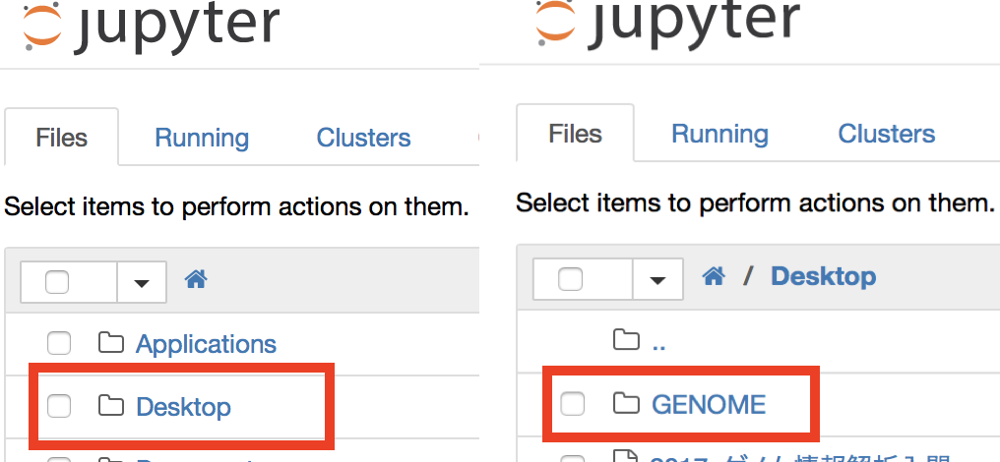
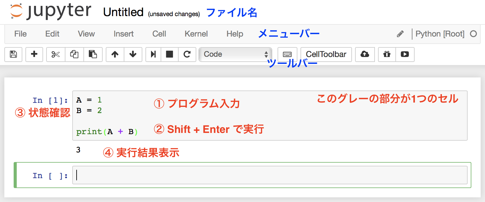

# Jupyter Notebookの使い方
1. [Jupyter Notebookの起動](#section1)
1. [Python用ノートブックの起動](#section2)
1. [Python用ノートブックの使い方](#section3)

---

## 1. Jupyter Notebookの起動
### Windows
1. スタートボタン > Miniconda3 > Jupyter Notebook
1. しばらくするとJupyter Notebookのトップページが開きます

### Mac
1. ターミナルを起動
1. `jupyter notebook`と入力してエンターキーを押す
1. しばらくするとJupyter Notebookのトップページが開きます

---

## 2. Python用ノートブックの起動
　この作業はWindowsとMacで共通です。「[解析環境セットアップ](./M02_Install.md)」で作成した授業用フォルダ`GENOME`内で、Python用のノートブックを開きます。
1. `Desktop` > `GENOME`（授業用フォルダ）
1. 右上の`New` > `Python3`
    - GENOMEフォルダに、`Untitled.ipynb`という名前のファイルが作成されます。
    - `New` > `Text File`でJupyter Notebookのテキストエディタも開けます。
    - `New` > `Folder`で新しいフォルダを作成できます。

 

## 3. Python用ノートブックの使い方

### 基本操作
1. セルにプログラムを書きます。
2. `Shift + Enter`でプログラムを実行します。
3. セルの左の表示が、`In[]:` → `In[*]:` → `In[1]:`に変わります。プログラムが正常に実行されたことを表しています。
4. print()関数などがプログラムにあった場合、結果がセルのすぐ下に表示されます。

　プログラムはセル単位で実行可能です。実行セルに記述した変数や関数は、他のセルからも呼び出し可能です。

### よく使う機能
- プログラムを実行: `Shift + Enter`または`Ctrl + Enter`  
    - `Shift + Enter`: プログラム実行に加え、下のセルに移動します。  
    - `Ctrl + Enter`: プログラム実行のみで、セル移動はありません。

- 新しいセルを追加: ツールバー > ➕アイコン  
    _選択中のセルの下に新しいセルが追加されます。_

- 選択中のセルを削除: ツールバー > ハサミアイコン  
    _セルの`In[]:`と表示されているあたりをクリックして、`D`キーを2回押してもセルを削除できます。_

- ファイル名を変更: メニューバー > Files > Rename  
    _新しいノートブックを起動すると、初期のファイル名は`Untitled.ipynb`です。適宜変更してください。_

- 選択中のセルの行番号を表示: `ESC`キーを押した後、`L`キー  

### よく使うショートカットキー

|| Windowsの場合 | Macの場合 |
|:---|:---|:---|
| コピー   | Ctrl + C | command + C |
| ペースト | Ctrl + V | command + V |
| カット   | Ctrl + X | command + X |
| すべて選択 | Ctrl + A | command + A |
| ひとつ前に戻す | Ctrl + Z | command + Z |
| やり直す | Ctrl + Y | command + Y |
| 上書き保存 | Ctrl + S | command + S |

Jupyter Notebookに特有のショートカットキーもあります。  
　メニューバー > Help > Keyboard Shortcuts  
で確認できます。

### よく使う特殊文字

|| Windowsの場合 | Macの場合 |
|:---|:---|:---|
| 改行文字 | ¥n | \n |
| タブ文字 | ¥t | \t |
* [Mac] `\`（バックスラッシュ）は`option + ¥`で入力できます。
* [Windows] `¥`キーで`¥`が入力できます。パソコンの機種によっては`\` が表示されることもあります。その場合は、`\n`のようにバックスラッシュを使用してください。

---

[解析環境セットアップ](./M02_Install.md) へ
[演習データ](./M02_Data.md) へ
[Jupyter Notebookの使い方](./M02_JupyterNotebook.md) へ
[目次](../README.md#section2) へ
