# Jupyter Notebook ファイルの確認方法
ダウンロードしたJupyter Notebook ファイル(.ipynb)は次のどれかの方法で、内容を確認可能です。

- ipynb形式に対応
	- [解析環境にアップロード](#env)（編集可能） __推奨__
	- [Webページ（nbviewer.js）にドラッグ&ドロップ](#nbviewer)（表示のみ）  
nbviewer.js: https://kokes.github.io/nbviewer.js/viewer.html

- ipynb形式に非対応
	- [テキストエディタで開く](#text-editor)（編集可能）
	- [Webブラウザにドラッグ&ドロップ](#browser)（表示のみ）

---

## 解析環境にアップロード

1. 解析環境を開く
1. 左上の「jupyterロゴ」をクリック
1. ダッシュボードページの右側にある「Upload」をクリック
1. ファイルを選択する
1. アップロードされたファイルをクリック
1. ファイル内容を確認

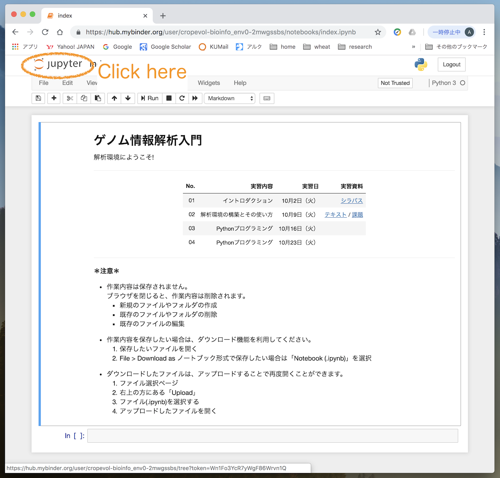

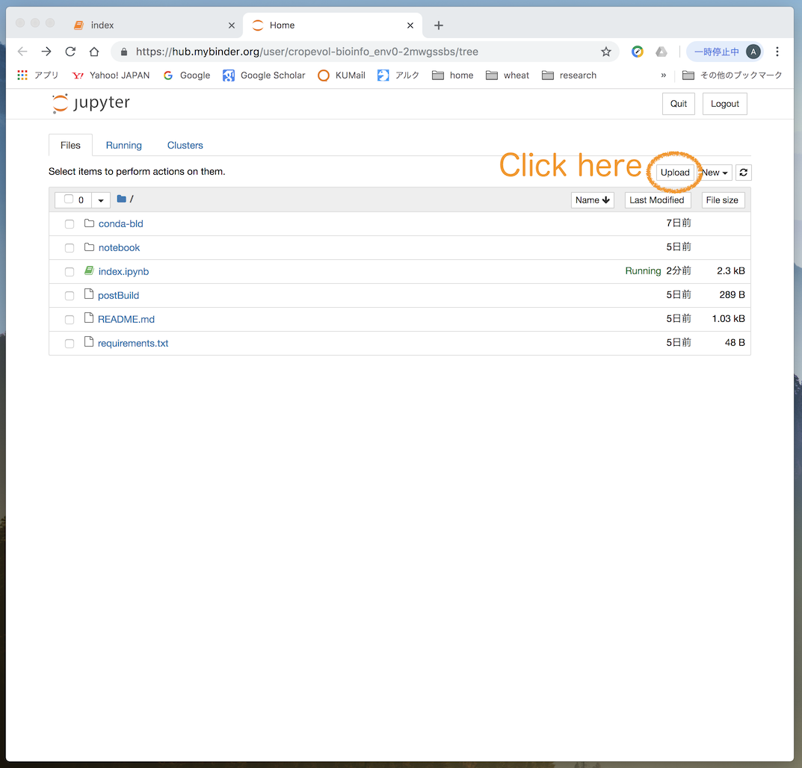

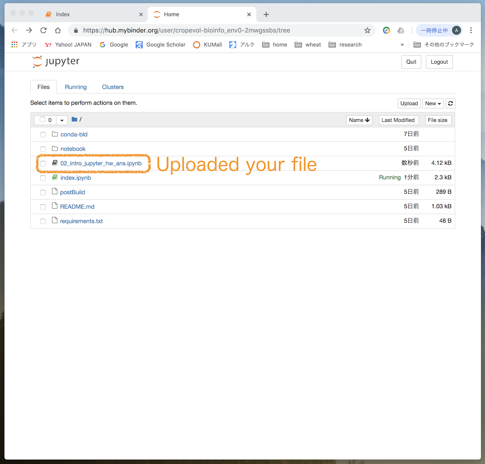

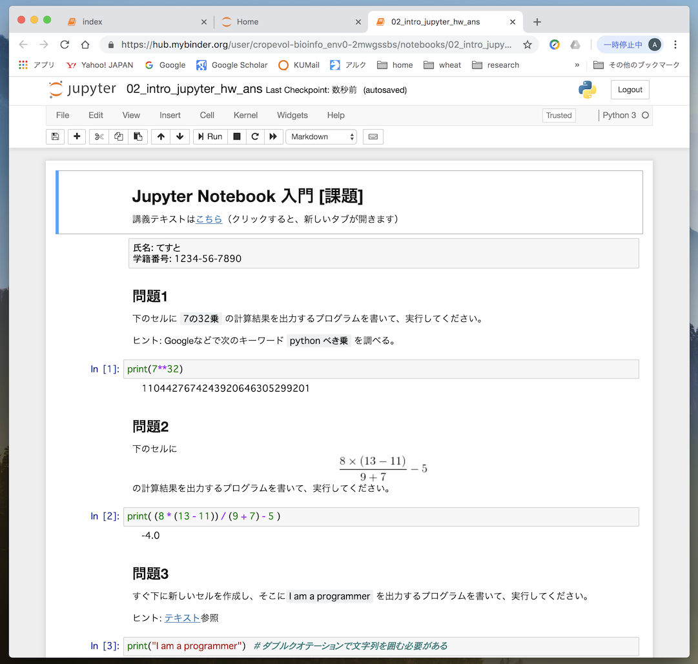

## Webページ（nbviewer.js）にドラッグ&ドロップ
__編集不可（表示のみ）__
__rawテキストセルは表示されない__

1. [nbviewer.js](https://kokes.github.io/nbviewer.js/viewer.html)のページを開く
1. ファイルをドラッグ＆ドロップ
1. ファイル内容を確認

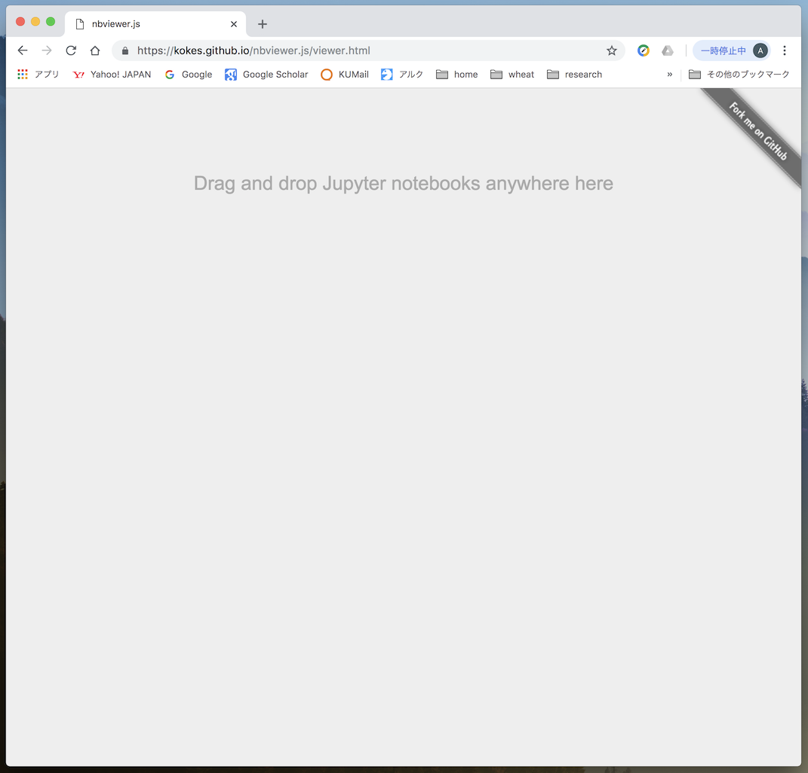

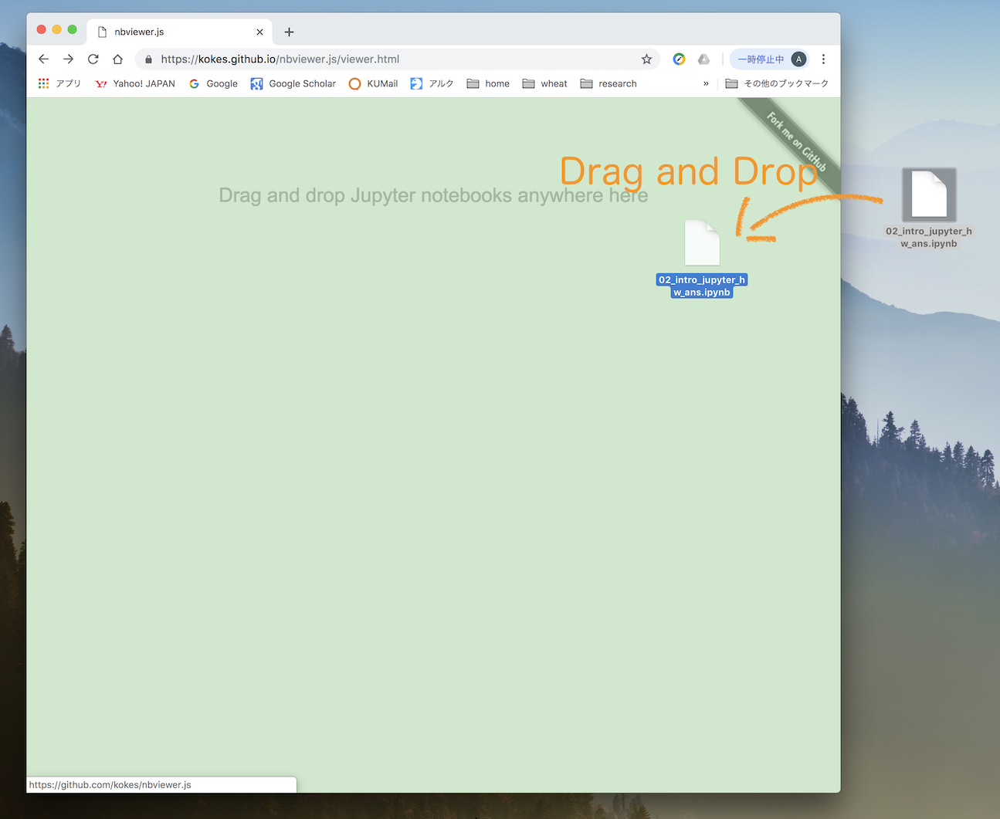

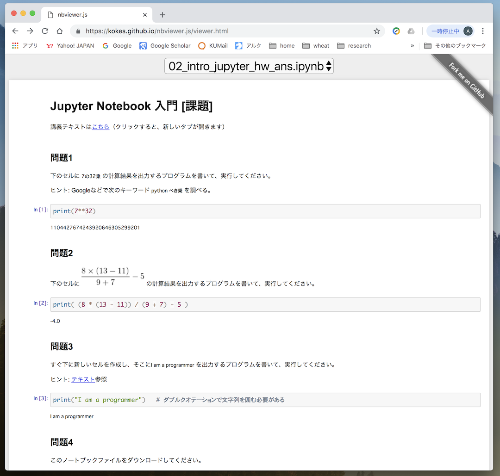

## テキストエディタで開く
__『テキストエディタ』と呼ばれるソフトウェアが必要__
__ipynb形式には対応していないため、グラフィカルな表示ではない__
__編集可能。ただし、ipynb形式（実際にはJSON形式）を壊さないように注意が必要__

### Windows
1. ファイルを右クリック > プログラムから開く
1. テキストエディタを選択する
1. ファイル内容を確認

または、

1. テキストエディタのアイコンにファイルをドラッグ＆ドロップ
1. ファイル内容を確認

[主なテキストエディタ]
- メモ帳 (Windows標準搭載)
- [サクラエディタ](https://sakura-editor.github.io/)
- [TeraPad](https://tera-net.com/library/tpad.html)
- [Notepad++](https://notepad-plus-plus.org/)
- [Sublime Text](https://www.sublimetext.com/)
- [Atom](https://atom.io/)

### Mac
1. ファイルを右クリック > 「このアプリケーションで開く」 > 「その他」
1. テキストエディタを選択する
1. ファイル内容を確認

または、

1. テキストエディタのアイコンにファイルをドラッグ＆ドロップ
1. ファイル内容を確認

[主なテキストエディタ]
- TextEdit (Mac標準搭載)
- [mi](https://www.mimikaki.net/)
- [CotEditor](https://coteditor.com/)
- [Text Wrangler](https://itunes.apple.com/jp/app/textwrangler/id404010395)
- [Sublime Text](https://www.sublimetext.com/)
- [Atom](https://atom.io/)

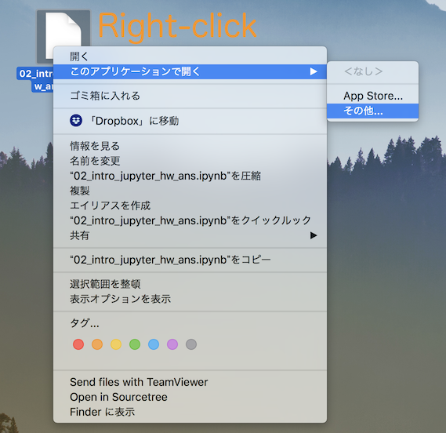

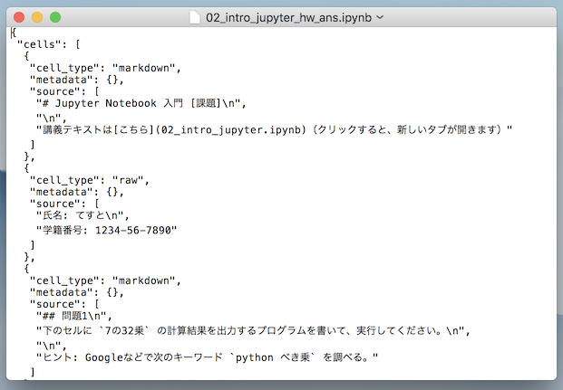

## Webブラウザにドラッグ&ドロップ
__編集不可（表示のみ）__
__ipynb形式には対応していないため、グラフィカルな表示ではない__
1. Webブラウザ（Google Chromeなど）を開く
1. ファイルをドラッグ＆ドロップ
1. ファイル内容を確認

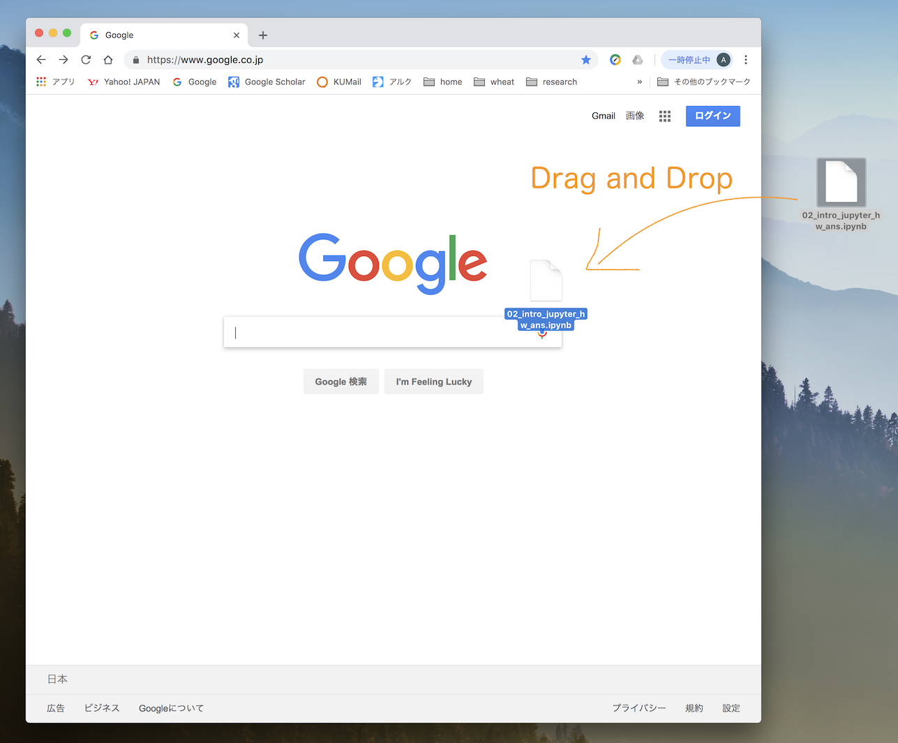

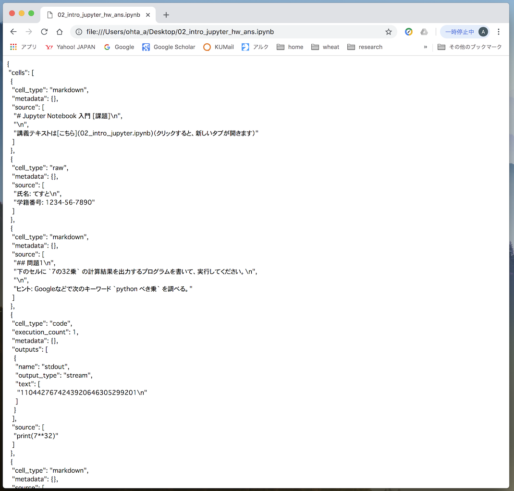

